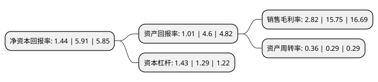

> 本页面由自动化程序生成于 2022年5月20日 01:08
> 内容可能存在错误，如有bug请提交issue至：https://github.com/Eroleice/doc-pi/issues
{.is-warning}

# 上市公司基本情况

## 基本资料

南京科远智慧科技集团股份有限公司（以下简称“科远智慧”）成立于1993年05月27日，南京市。于2010年03月31日在深交所中小板上市。

科远智慧注册资本23,999.165万元，主要产品:主厂房控制系统，辅助车间控制系统，电厂厂级信息监控系统(SIS)和管控一体化信息系统。主营业务:热工自动化和电厂信息化产品研发，生产，销售和服务。以下是详细信息：

- 公司名称: 南京科远智慧科技集团股份有限公司
- 股票代码: 002380.SZ
- 所在地: 江苏 - 南京市
- 成立日期: 1993年05月27日
- 注册资本: 23,999.165万元
- 法定代表人: 刘国耀
- 主营业务: 主要产品:主厂房控制系统，辅助车间控制系统，电厂厂级信息监控系统(SIS)和管控一体化信息系统主营业务:热工自动化和电厂信息化产品研发，生产，销售和服务
- 公司官网: www.sciyon.com
- 公司介绍: 公司是国内领先的工业自动化与信息化技术、产品与解决方案供应商，专注于工业自动化和信息化产品的研发、生产和销售，有SyncBase实时数据库、SY系列智能一体化电动执行机构等产品，提出了诸多优秀行业解决方案。公司先后获得“国家火炬计划重点高新技术企业”、“全国百强优秀民营科技企业”等荣誉称号。公司秉承“让工业充满智慧、让智慧创造价值”的创新理念，致力于帮助企业实现生产过程自动化与信息化。以领先的工业自动化和信息化技术、产品与服务，保障企业的高效运营，积极践行工业4.0、“中国制造2025”等创新理念，推出“智慧电厂”、“智慧化工”、“智慧冶金”、“智能工厂”、“智慧能源”等一系列智慧工业解决方案，成为智能制造的先驱者。

## 股东及高管情况

上市公司第一大股东为刘国耀，持股61,097,400股，占比25.46%，**疑似为**上市公司实际控制人。

截至2022年03月31日，上市公司的前十大股东中，共有9名自然人股东，1个产品账户，其中5%以上大股东共有2名。上市公司前十大股东明细如下：

> 未能通过持股比例判定出上市公司实际控制人（持股30%以上）
> 可能存在通过间接持股、联合持股、协议控制等方式拥有实际控制权的主体，具体请参考上市公司定期公告！
{.is-warning}

> 截至2022年03月31日，上市公司前十大股东信息如下：

| 股东名称 | 持股数量（股） | 持股比例 |
| --- | --- | --- |
| 刘国耀 | 61,097,400 | 25.46% |
| 胡歙眉 | 52,689,000 | 21.95% |
| 刘建耀 | 8,750,000 | 3.65% |
| 曹瑞峰 | 3,933,600 | 1.64% |
| 王中波 | 2,681,402 | 1.12% |
| 张勇 | 2,465,652 | 1.03% |
| 梅建华 | 2,263,725 | 0.94% |
| 胡梓章 | 1,992,202 | 0.83% |
| 南京科远自动化集团股份有限公司-第二期员工持股计划 | 1,653,554 | 0.69% |
| 孟琪 | 1,060,000 | 0.44% |

## 利润表分析

上市公司2021年总收入为11.4亿元，净利润为0.32亿元，实现盈利。

## 杜邦分析

> 数据列示周期：2021年 | 2020年 | 2019年
{.is-info}

上市公司的净资产收益率在近一年有所下降，下降幅度为-75.63%，其变化情况分解如下：
- 上市公司的销售毛利率在近一年下降了-82.1%，可能是生产效率的下降、商品原材料价格上涨或商品价格的下跌所致。
- 上市公司的资产周转率在近一年上升了24.14%，可能是源自于更快的销售回款或库存管理效果提升。
- 上市公司的财务杠杆比率在近一年上升了10.85%，可能是增加负债扩大生产规模。

