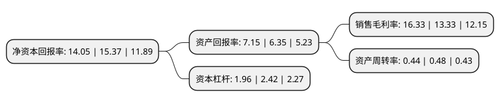

> 本页面由自动化程序生成于 2022年5月20日 01:09
> 内容可能存在错误，如有bug请提交issue至：https://github.com/Eroleice/doc-pi/issues
{.is-warning}

# 上市公司基本情况

## 基本资料

长高电新科技股份公司（以下简称“长高电新”）成立于1998年04月23日，长沙市。于2010年07月20日在深交所中小板上市。

长高电新注册资本62,016.709万元，主要产品:高压隔离开关及接地开关，公司产品覆盖12~1100kV各电压等级，主要是126kV及以上高压隔离开关。主营业务:高压隔离开关及接地开关的生产和销售。以下是详细信息：

- 公司名称: 长高电新科技股份公司
- 股票代码: 002452.SZ
- 所在地: 湖南 - 长沙市
- 成立日期: 1998年04月23日
- 注册资本: 62,016.709万元
- 法定代表人: 马晓
- 主营业务: 主要产品:高压隔离开关及接地开关，公司产品覆盖12~1100kV各电压等级，主要是126kV及以上高压隔离开关主营业务:高压隔离开关及接地开关的生产和销售
- 公司官网: www.changgaogroup.com
- 公司介绍: 公司是一家电力设备制造、工程服务、新能源汽车运营及电力交易运营等产业链齐全的综合型集团。主要生产72.5～252kV组合电器(GIS)、12～252kV断路器、1100kV及以下高压隔离开关和接地开关、40.5kV及以下高低压成套开关设备，12kV高压/低压预装式变电站,12～24电缆分支箱、户外开闭所等，产品遍布全国各地的电站、电厂及大中型工矿企业。公司秉承“一切为了用户”的质量方针，产业以“电”为核心，整合多年来在配电行业的资源和优势，先后为国内外多条特高压交直流输电重大工程提供设备，同时在新能源电站总包、海外电力工程总包以及配电网BOT等方面取得阶段性成果。产品及服务覆盖了发电、电力工程设计、总包、检修、输变电一二次设备及配售电全过程，为用户提供变电站系统化的完整解决方案。公司是我国研制和生产高压电器的骨干企业。中国电器工业协会理事单位、国家电网、南方电网公司集中规模招标合格供应商、国家火炬计划重点高新技术企业和湖南省高新技术企业，公司已通过ISO9001：2008质量体系认证、PCCC产品质量认证。

## 股东及高管情况

上市公司第一大股东为马孝武，持股84,298,440股，占比13.59%，**疑似为**上市公司实际控制人。

截至2022年03月31日，上市公司的前十大股东中，共有6名自然人股东，4个产品账户，其中5%以上大股东共有1名。上市公司前十大股东明细如下：

> 未能通过持股比例判定出上市公司实际控制人（持股30%以上）
> 可能存在通过间接持股、联合持股、协议控制等方式拥有实际控制权的主体，具体请参考上市公司定期公告！
{.is-warning}

> 截至2022年03月31日，上市公司前十大股东信息如下：

| 股东名称 | 持股数量（股） | 持股比例 |
| --- | --- | --- |
| 马孝武 | 84,298,440 | 13.59% |
| 林林 | 31,005,300 | 5% |
| 廖俊德 | 29,203,300 | 4.71% |
| 中国银行股份有限公司-华夏行业景气混合型证券投资基金 | 20,282,983 | 3.27% |
| 中国工商银行股份有限公司-广发多因子灵活配置混合型证券投资基金 | 19,731,000 | 3.18% |
| 马晓 | 14,370,000 | 2.32% |
| 中国工商银行股份有限公司-华夏磐利一年定期开放混合型证券投资基金 | 9,574,468 | 1.54% |
| 易方达基金-中央汇金资产管理有限责任公司-易方达基金-汇金资管单一资产管理计划 | 5,777,700 | 0.93% |
| 陈益智 | 5,684,282 | 0.92% |
| 张常武 | 4,790,589 | 0.77% |

## 利润表分析

上市公司2021年总收入为15.21亿元，净利润为2.48亿元，实现盈利。

## 杜邦分析

> 数据列示周期：2021年 | 2020年 | 2019年
{.is-info}

上市公司的净资产收益率在近一年有所下降，下降幅度为-8.59%，其变化情况分解如下：
- 上市公司的销售毛利率在近一年上升了22.51%，可能是生产效率的提升、商品原材料价格下跌或商品价格的上涨所致。
- 上市公司的资产周转率在近一年下降了-8.33%，可能是源自于更慢的销售回款或库存管理效果下降。
- 上市公司的财务杠杆比率在近一年下降了-19.01%，可能是减少负债降低财务费用。

