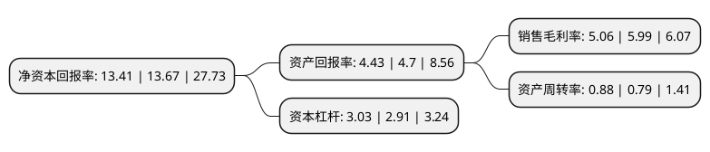

> 本页面由自动化程序生成于 2022年5月20日 01:09
> 内容可能存在错误，如有bug请提交issue至：https://github.com/Eroleice/doc-pi/issues
{.is-warning}

# 上市公司基本情况

## 基本资料

晶澳太阳能科技股份有限公司（以下简称“晶澳科技”）成立于2000年10月20日，邢台市。于2010年08月10日在深交所中小板上市。

晶澳科技注册资本160,010.413万元，主营业务为硅片，太阳能电池片及太阳能电池组件的研发，生产和销售，以及太阳能光伏电站的开发，建设，运营等以下是详细信息：

- 公司名称: 晶澳太阳能科技股份有限公司
- 股票代码: 002459.SZ
- 所在地: 河北 - 邢台市
- 成立日期: 2000年10月20日
- 注册资本: 160,010.413万元
- 法定代表人: 靳保芳
- 主营业务: 主营业务为硅片，太阳能电池片及太阳能电池组件的研发，生产和销售，以及太阳能光伏电站的开发，建设，运营等
- 公司官网: www.jasolar.com
- 公司介绍: 公司是实施产业链一体化战略的全球知名的高性能光伏产品制造商，产业链覆盖硅片、电池、组件及光伏电站。晶澳在全球拥有12个生产基地、20多个分支机构，产品足迹遍布100多个国家和地区，广泛应用于地面光伏电站以及工商业、住宅分布式光伏系统，凭借持续的技术创新、稳健的财务优势和发达的全球销售与服务网络，以及太阳能光伏电站的开发、建设、运营等，是工业与信息化部公布的第一批符合《光伏制造行业规范条件》的企业。

## 股东及高管情况

上市公司第一大股东为宁晋县晶泰福科技有限公司，持股801,177,333股，占比47.84%，为上市公司实际控制人。

截至2022年05月16日，上市公司的前十大股东中，共有6名机构股东，4个产品账户，其中5%以上大股东共有4名。上市公司前十大股东明细如下：

> 截至2022年05月16日，上市公司前十大股东信息如下：

| 股东名称 | 持股数量（股） | 持股比例 |
| --- | --- | --- |
| 宁晋县晶泰福科技有限公司 | 801,177,333 | 47.84% |
| 宁晋县晶泰福科技有限公司 | 801,177,333 | 50.07% |
| 深圳市华建盈富投资企业(有限合伙) | 141,431,000 | 8.4445% |
| 深圳市华建盈富投资企业(有限合伙) | 141,431,000 | 8.84% |
| 南京其昌纽扣电子科技有限公司 | 50,238,600 | 3.14% |
| 深圳博源企业管理中心(有限合伙) | 31,658,806 | 1.98% |
| 上海浦东发展银行股份有限公司-广发高端制造股票型发起式证券投资基金 | 17,640,220 | 1.1% |
| 中国民生银行股份有限公司-广发行业严选三年持有期混合型证券投资基金 | 14,944,854 | 0.93% |
| 中国建设银行股份有限公司-广发科技先锋混合型证券投资基金 | 12,950,844 | 0.81% |
| 中国工商银行股份有限公司-广发双擎升级混合型证券投资基金 | 12,649,398 | 0.79% |

## 利润表分析

上市公司2021年总收入为413.01亿元，净利润为20.88亿元，实现盈利。

## 杜邦分析

> 数据列示周期：2021年 | 2020年 | 2019年
{.is-info}

上市公司的净资产收益率在近一年有所下降，下降幅度为-1.9%，其变化情况分解如下：
- 上市公司的销售毛利率在近一年下降了-15.53%，可能是生产效率的下降、商品原材料价格上涨或商品价格的下跌所致。
- 上市公司的资产周转率在近一年上升了11.39%，可能是源自于更快的销售回款或库存管理效果提升。
- 上市公司的财务杠杆比率在近一年上升了4.12%，可能是增加负债扩大生产规模。

