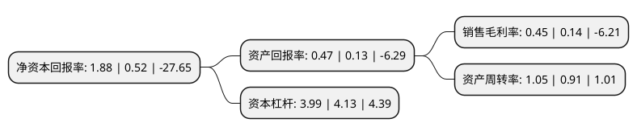

> 本页面由自动化程序生成于 2022年5月20日 01:09
> 内容可能存在错误，如有bug请提交issue至：https://github.com/Eroleice/doc-pi/issues
{.is-warning}

# 上市公司基本情况

## 基本资料

江苏中超控股股份有限公司（以下简称“中超控股”）成立于1996年08月05日，无锡市。于2010年09月10日在深交所中小板上市。

中超控股注册资本126,800万元，主营业务为电线电缆的研发，生产，销售和服务。主要产品为35kV及以下电线电缆，包括电力电缆，电气装备用电线电缆和裸电线三个大类，涉及500多种型号，10，000多种规格。电力电缆主要包括1-6kV聚氯乙烯绝缘电力电缆，1-35kV交联聚乙烯绝缘电力电缆，氟塑料绝缘电力电缆，硅橡胶绝缘电力电缆，架空绝缘电缆及根据用户需求生产的35kV及以下阻燃耐火系列，金属屏蔽，无卤低烟，分支电缆等特种电缆;电器装备用电线电缆主要包括布电线，控制电缆及其特种电缆等。以下是详细信息：

- 公司名称: 江苏中超控股股份有限公司
- 股票代码: 002471.SZ
- 所在地: 江苏 - 无锡市
- 成立日期: 1996年08月05日
- 注册资本: 126,800万元
- 法定代表人: 俞雷
- 主营业务: 主营业务为电线电缆的研发，生产，销售和服务主要产品为35kV及以下电线电缆，包括电力电缆，电气装备用电线电缆和裸电线三个大类，涉及500多种型号，10，000多种规格电力电缆主要包括1-6kV聚氯乙烯绝缘电力电缆，1-35kV交联聚乙烯绝缘电力电缆，氟塑料绝缘电力电缆，硅橡胶绝缘电力电缆，架空绝缘电缆及根据用户需求生产的35kV及以下阻燃耐火系列，金属屏蔽，无卤低烟，分支电缆等特种电缆;电器装备用电线电缆主要包括布电线，控制电缆及其特种电缆等
- 公司官网: www.zcdlgf.com
- 公司介绍: 公司是江苏中超集团控股设立的股份有限公司，是一家专业从事电线电缆的研发、生产、销售和服务的公司。公司产品包括电力电缆、电气装备用电线电缆和裸电线等，涵盖低压、中压、高压、超高压多种型号、规格。公司拥有国内外一流成熟的生产设备、先进的检测手段和高素质的熟练技师、技工、具备技术研发和市场开发能力的工程技术人员。公司坚持走“科技兴企”之路，重视技术创新，和上海电缆研究所、哈尔滨理工大学、中国电科院等科研院校广泛合作开展产品研发、标准编制、试验检测、新材料研制等工作。公司产品先后被评为江苏省著名商标、江苏省名牌产品、江苏高新技术产品、江苏省重点培育和发展的国际知名品牌、无锡名牌产品、无锡市重点培育和发展的国际知名品牌、无锡市知名商号等，公司通过ISO9001质量管理、ISO14001环境管理、OHSAS18001职业健康安全管理体系认证、电能认证和出口产品质量许可认证、3C认证。

## 股东及高管情况

上市公司第一大股东为江苏中超投资集团有限公司，持股220,444,030股，占比17.39%，**疑似为**上市公司实际控制人。

截至2022年03月31日，上市公司的前十大股东中，共有7名自然人股东，1名机构股东，2个产品账户，其中5%以上大股东共有1名。上市公司前十大股东明细如下：

> 未能通过持股比例判定出上市公司实际控制人（持股30%以上）
> 可能存在通过间接持股、联合持股、协议控制等方式拥有实际控制权的主体，具体请参考上市公司定期公告！
{.is-warning}

> 截至2022年03月31日，上市公司前十大股东信息如下：

| 股东名称 | 持股数量（股） | 持股比例 |
| --- | --- | --- |
| 江苏中超投资集团有限公司 | 220,444,030 | 17.39% |
| 陈华 | 35,166,000 | 2.77% |
| 珠海阿巴马资产管理有限公司-阿巴马元享红利69号私募证券投资基金 | 31,750,000 | 2.5% |
| 珠海阿巴马资产管理有限公司-阿巴马元享红利70号私募证券投资基金 | 31,520,000 | 2.49% |
| 张杰 | 21,630,000 | 1.71% |
| 张秀 | 12,556,600 | 0.99% |
| 杨飞 | 10,066,749 | 0.79% |
| 陈丽娟 | 6,783,000 | 0.53% |
| 施敏 | 5,060,250 | 0.4% |
| 季占柱 | 4,518,000 | 0.36% |

## 利润表分析

上市公司2021年总收入为58.79亿元，净利润为0.26亿元，实现盈利。

## 杜邦分析

> 数据列示周期：2021年 | 2020年 | 2019年
{.is-info}

上市公司的净资产收益率在近一年有所上升，上升幅度为261.54%，其变化情况分解如下：
- 上市公司的销售毛利率在近一年上升了221.43%，可能是生产效率的提升、商品原材料价格下跌或商品价格的上涨所致。
- 上市公司的资产周转率在近一年上升了15.38%，可能是源自于更快的销售回款或库存管理效果提升。
- 上市公司的财务杠杆比率在近一年下降了-3.39%，可能是减少负债降低财务费用。

