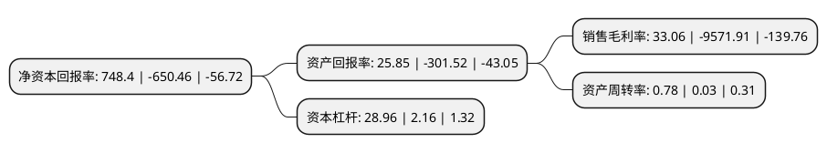

> 本页面由自动化程序生成于 2022年5月20日 01:09
> 内容可能存在错误，如有bug请提交issue至：https://github.com/Eroleice/doc-pi/issues
{.is-warning}

# 上市公司基本情况

## 基本资料

宁波圣莱达电器股份有限公司（以下简称“*ST圣莱”）成立于2004年03月11日，宁波市。于2010年09月10日在深交所中小板上市。

*ST圣莱注册资本16,000万元，主营业务为温控器及电热水壶的研发，生产和销售。主要产品为温控器及电热水壶整机。以下是详细信息：

- 公司名称: 宁波圣莱达电器股份有限公司
- 股票代码: 002473.SZ
- 所在地: 浙江 - 宁波市
- 成立日期: 2004年03月11日
- 注册资本: 16,000万元
- 法定代表人: 张孙立
- 主营业务: 主营业务为温控器及电热水壶的研发，生产和销售主要产品为温控器及电热水壶整机
- 公司官网: www.nbslt.com
- 公司介绍: 公司是全球知名的温控器供应商及高端电热水壶出口高新技术企业。公司主要从事水加热生活电器核心零部件及整机的研发、生产和销售，目前主要产品为温控器及电热水壶整机。公司获得了多项专利，成功打破了温控器市场国外厂商的技术垄断，成为掌握独立知识产权和核心技术的民族企业。公司从事开发、制造并销售可靠、安全、健康的技术产品以及优质服务，是行业内第一批国家高新技术企业、并建有省级高新技术研究开发中心，是《电热水壶性能要求及试验方法》国家标准起草单位、《家电及近似用途的安全液体加热器的特殊要求》国家安全标准改标单位，以及商务部机电商务家电分会理事单位。公司被评为“宁波市出口名牌”称号，“宁波市科学技术进步奖三等奖”，“宁波市专利示范企业”，获“无绳电气连接器”获得专利银奖，获“速热式饮水加热器”获发明专利金奖等。

## 股东及高管情况

上市公司第一大股东为宁波金阳光电热科技有限公司，持股28,015,400股，占比17.51%，**疑似为**上市公司实际控制人。

截至2022年03月31日，上市公司的前十大股东中，共有5名自然人股东，4名机构股东，1个产品账户，其中5%以上大股东共有3名。上市公司前十大股东明细如下：

> 未能通过持股比例判定出上市公司实际控制人（持股30%以上）
> 可能存在通过间接持股、联合持股、协议控制等方式拥有实际控制权的主体，具体请参考上市公司定期公告！
{.is-warning}

> 截至2022年03月31日，上市公司前十大股东信息如下：

| 股东名称 | 持股数量（股） | 持股比例 |
| --- | --- | --- |
| 宁波金阳光电热科技有限公司 | 28,015,400 | 17.51% |
| 深圳市洲际通商投资有限公司 | 25,000,000 | 15.63% |
| 西藏晟新创资产管理有限公司 | 23,843,294 | 14.9% |
| 新时代信托股份有限公司 | 7,952,000 | 4.97% |
| 融通资本-招商银行-华润信托-华润信托·润金76号集合资金信托计划 | 4,004,560 | 2.5% |
| 钟馨 | 2,690,000 | 1.68% |
| 陈飞 | 1,675,500 | 1.05% |
| 张家碧 | 1,393,996 | 0.87% |
| 秦卫华 | 1,340,000 | 0.84% |
| 安淑华 | 1,142,800 | 0.71% |

## 利润表分析

上市公司2021年总收入为1.11亿元，净利润为0.36亿元，实现盈利。

## 杜邦分析

> 数据列示周期：2021年 | 2020年 | 2019年
{.is-info}

上市公司的净资产收益率在近一年有所下降，下降幅度为-215.06%，其变化情况分解如下：
- 上市公司的销售毛利率在近一年下降了-100.35%，可能是生产效率的下降、商品原材料价格上涨或商品价格的下跌所致。
- 上市公司的资产周转率在近一年上升了2500%，可能是源自于更快的销售回款或库存管理效果提升。
- 上市公司的财务杠杆比率在近一年上升了1240.74%，可能是增加负债扩大生产规模。

