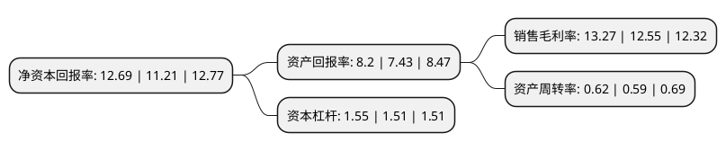

> 本页面由自动化程序生成于 2022年5月20日 01:09
> 内容可能存在错误，如有bug请提交issue至：https://github.com/Eroleice/doc-pi/issues
{.is-warning}

# 上市公司基本情况

## 基本资料

深圳科士达科技股份有限公司（以下简称“科士达”）成立于1993年03月17日，深圳市。于2010年12月07日在深交所中小板上市。

科士达注册资本58,244.539万元，公司主要从事UPS不间断电源，光伏逆变器，配套的阀控式密封铅酸蓄电池以及相关电力电子产品的设计，生产，销售和服务，主导产品UPS，电池以及光伏逆变器，机柜，精密空调等一系列产品。以下是详细信息：

- 公司名称: 深圳科士达科技股份有限公司
- 股票代码: 002518.SZ
- 所在地: 广东 - 深圳市
- 成立日期: 1993年03月17日
- 注册资本: 58,244.539万元
- 法定代表人: 刘程宇
- 主营业务: 公司主要从事UPS不间断电源，光伏逆变器，配套的阀控式密封铅酸蓄电池以及相关电力电子产品的设计，生产，销售和服务，主导产品UPS，电池以及光伏逆变器，机柜，精密空调等一系列产品
- 公司官网: www.kstar.com.cn
- 公司介绍: 公司是国内领先的机房一体化系统集成制造商，领先的新能源电力转换技术创新厂商，UPS产业领导者，高品质阀控式密封铅酸蓄电池专业制造商。公司主要致力于电力电子及新能源领域，产品涵盖UPS不间断电源、逆变电源、阀控式铅酸蓄电池、机房一体化设备、太阳能光伏逆变器等。公司参与国家西气东输二线东段UPS集中采购等国家级重点信息化工程，品牌在国内市场已具有较高的知名度和美誉度。公司获得“UPS服务用户满意度金奖”、“UPS服务用户满意度第一”、“中国计算机用户服务优质企业”、“最佳服务承诺兑现企业”等荣誉称号。

## 股东及高管情况

上市公司第一大股东为舟山科士达股权投资合伙企业(有限合伙)，持股347,933,040股，占比59.74%，为上市公司实际控制人。

截至2022年03月31日，上市公司的前十大股东中，共有4名自然人股东，2名机构股东，3个产品账户，1个海外主体，其中5%以上大股东共有1名。上市公司前十大股东明细如下：

> 截至2022年03月31日，上市公司前十大股东信息如下：

| 股东名称 | 持股数量（股） | 持股比例 |
| --- | --- | --- |
| 舟山科士达股权投资合伙企业(有限合伙) | 347,933,040 | 59.74% |
| 刘玲 | 21,007,350 | 3.61% |
| 林作华 | 18,232,005 | 3.13% |
| 中信证券股份有限公司 | 8,987,472 | 1.54% |
| 王孝安 | 8,113,914 | 1.39% |
| 香港中央结算有限公司(陆股通) | 4,726,823 | 0.81% |
| 中国银行股份有限公司-华泰柏瑞中证光伏产业交易型开放式指数证券投资基金 | 2,850,841 | 0.49% |
| 王君 | 2,700,000 | 0.46% |
| 兴业银行股份有限公司-浦银安盛ESG责任投资混合型证券投资基金 | 1,999,918 | 0.34% |
| 银华鼎利绝对收益股票型养老金产品-中国工商银行股份有限公司 | 1,955,572 | 0.34% |

## 利润表分析

上市公司2021年总收入为28.05亿元，净利润为3.72亿元，实现盈利。

## 杜邦分析

> 数据列示周期：2021年 | 2020年 | 2019年
{.is-info}

上市公司的净资产收益率在近一年有所上升，上升幅度为13.2%，其变化情况分解如下：
- 上市公司的销售毛利率在近一年上升了5.74%，可能是生产效率的提升、商品原材料价格下跌或商品价格的上涨所致。
- 上市公司的资产周转率在近一年上升了5.08%，可能是源自于更快的销售回款或库存管理效果提升。
- 上市公司的财务杠杆比率在近一年上升了2.65%，可能是增加负债扩大生产规模。

