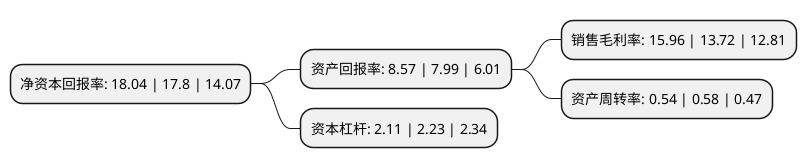

> 本页面由自动化程序生成于 2022年5月20日 01:10
> 内容可能存在错误，如有bug请提交issue至：https://github.com/Eroleice/doc-pi/issues
{.is-warning}

# 上市公司基本情况

## 基本资料

天顺风能(苏州)股份有限公司（以下简称“天顺风能”）成立于2005年01月18日，苏州市。于2010年12月31日在深交所中小板上市。

天顺风能注册资本180,250.906万元，主营业务为风塔及风塔零部件的生产和销售，主要产品是用于1。5MW及以上功率风机的风塔。以下是详细信息：

- 公司名称: 天顺风能(苏州)股份有限公司
- 股票代码: 002531.SZ
- 所在地: 江苏 - 苏州市
- 成立日期: 2005年01月18日
- 注册资本: 180,250.906万元
- 法定代表人: 严俊旭
- 主营业务: 主营业务为风塔及风塔零部件的生产和销售，主要产品是用于15MW及以上功率风机的风塔
- 公司官网: www.titanwind.com.cn
- 公司介绍: 公司已发展成集新能源设备制造、新能源开发、智慧能源系统、金融服务等多元化产业集团公司。公司在太仓、包头、珠海、丹麦等地设有多家生产基地，专业从事兆瓦级大功率风力发电塔架及其相关产品的生产、销售，也是全球最具规模的风力发电塔架专业制造企业之一。公司通过领先的专业制造技术、一流的工艺检测装备和严格的质量管理体系在国际风电塔架市场中建立了巨大竞争优势。公司积极探索多元化发展，进入集中式、分布式风电开发与运营；进入储能管理系统、微网控制系统、在线能源管理系统、新能源汽车等领域，实现公司战略升级。依托新能源设备、新能源开发的优势，全面整合产业资源；金融服务业务涵盖融资租赁、产业投资、母基金管理等。公司秉持“公正、可靠、专业、专注”的价值观，一直致力于绿色清洁能源的发展。

## 股东及高管情况

上市公司第一大股东为上海天神投资管理有限公司，持股530,352,000股，占比29.42%，**疑似为**上市公司实际控制人。

截至2022年03月31日，上市公司的前十大股东中，共有1名自然人股东，2名机构股东，5个产品账户，2个海外主体，其中5%以上大股东共有2名。上市公司前十大股东明细如下：

> 未能通过持股比例判定出上市公司实际控制人（持股30%以上）
> 可能存在通过间接持股、联合持股、协议控制等方式拥有实际控制权的主体，具体请参考上市公司定期公告！
{.is-warning}

> 截至2022年03月31日，上市公司前十大股东信息如下：

| 股东名称 | 持股数量（股） | 持股比例 |
| --- | --- | --- |
| 上海天神投资管理有限公司 | 530,352,000 | 29.42% |
| REAL FUN HOLDINGS LIMITED | 373,248,000 | 20.71% |
| 香港中央结算有限公司(陆股通) | 86,609,389 | 4.8% |
| 东方证券股份有限公司-中庚价值先锋股票型证券投资基金 | 29,297,667 | 1.63% |
| 昆山新长征投资中心(有限合伙) | 23,490,015 | 1.3% |
| 全国社保基金一零一组合 | 17,127,141 | 0.95% |
| 中国建设银行股份有限公司-东方红启东三年持有期混合型证券投资基金 | 14,719,392 | 0.82% |
| 严俊旭 | 13,346,746 | 0.74% |
| 中信建投证券股份有限公司-建信新能源行业股票型证券投资基金 | 12,400,067 | 0.69% |
| 天顺风能(苏州)股份有限公司-第一期员工持股计划 | 11,359,948 | 0.63% |

## 利润表分析

上市公司2021年总收入为81.72亿元，净利润为13.03亿元，实现盈利。

## 杜邦分析

> 数据列示周期：2021年 | 2020年 | 2019年
{.is-info}

上市公司的净资产收益率在近一年有所上升，上升幅度为1.35%，其变化情况分解如下：
- 上市公司的销售毛利率在近一年上升了16.33%，可能是生产效率的提升、商品原材料价格下跌或商品价格的上涨所致。
- 上市公司的资产周转率在近一年下降了-6.9%，可能是源自于更慢的销售回款或库存管理效果下降。
- 上市公司的财务杠杆比率在近一年下降了-5.38%，可能是减少负债降低财务费用。

