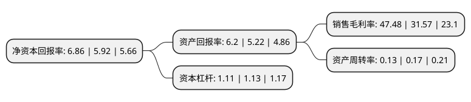

> 本页面由自动化程序生成于 2022年5月20日 01:10
> 内容可能存在错误，如有bug请提交issue至：https://github.com/Eroleice/doc-pi/issues
{.is-warning}

# 上市公司基本情况

## 基本资料

南京新联电子股份有限公司（以下简称“新联电子”）成立于2003年09月25日，南京市。于2011年02月11日在深交所中小板上市。

新联电子注册资本83,404.91万元，主营业务为用电信息采集系统的软，硬件研发，生产，销售及服务。主要产品为主站系统，230M专网终端和公网终端。以下是详细信息：

- 公司名称: 南京新联电子股份有限公司
- 股票代码: 002546.SZ
- 所在地: 江苏 - 南京市
- 成立日期: 2003年09月25日
- 注册资本: 83,404.91万元
- 法定代表人: 胡敏
- 主营业务: 主营业务为用电信息采集系统的软，硬件研发，生产，销售及服务主要产品为主站系统，230M专网终端和公网终端
- 公司官网: www.xldz.com
- 公司介绍: 公司是国内主要的用电信息采集系统厂家之一。公司主要从事用电信息采集系统的软、硬件研发、生产、销售及服务，是国内最早进入用电信息采集领域的企业之一，也是目前国内为数不多的能够提供用电信息采集系统从主站软件、230M无线组网、终端采集设备到电能计量设备的全系列产品和解决方案的厂家之一。历经多年的快速发展，形成用电信息采集、智慧能源云服务、智能配电设备及系统、低压成套、电力通信检测等业务领域，专注于向电网企业和企业用户提供能源综合服务及解决方案。公司用服务电网的专家技术服务企业用户，创新商业模式，发展新业务——智慧能源云平台，线上为客户提供水、电、气、热等能源监测服务，线下对接用户需求，提供配电房监测系统、配电运维系统、需求侧管理系统三大基础业务和空调管理、园区抄表、需求响应、能源管理、光伏监测等增值业务系统。公司获得工业领域电力需求侧管理服务机构一级资质、教育部工程实践教育中心、江苏省科学技术进步奖等多项荣誉。

## 股东及高管情况

上市公司第一大股东为南京新联创业园管理有限公司，持股311,368,918股，占比37.33%，为上市公司实际控制人。

截至2022年03月31日，上市公司的前十大股东中，共有7名自然人股东，2名机构股东，1个海外主体，其中5%以上大股东共有2名。上市公司前十大股东明细如下：

> 截至2022年03月31日，上市公司前十大股东信息如下：

| 股东名称 | 持股数量（股） | 持股比例 |
| --- | --- | --- |
| 南京新联创业园管理有限公司 | 311,368,918 | 37.33% |
| 胡敏 | 43,736,000 | 5.24% |
| 金放生 | 11,660,250 | 1.4% |
| 褚云 | 7,028,000 | 0.84% |
| 中国国际金融香港资产管理有限公司-客户资金2 | 4,738,240 | 0.57% |
| 何晓波 | 4,655,000 | 0.56% |
| 范美萍 | 4,200,000 | 0.5% |
| JPMORGAN CHASE BANK,NATIONAL ASSOCIATION | 2,958,228 | 0.35% |
| 张国华 | 2,706,823 | 0.32% |
| 李明元 | 2,600,000 | 0.31% |

## 利润表分析

上市公司2021年总收入为4.64亿元，净利润为2.2亿元，实现盈利。

## 杜邦分析

> 数据列示周期：2021年 | 2020年 | 2019年
{.is-info}

上市公司的净资产收益率在近一年有所上升，上升幅度为15.88%，其变化情况分解如下：
- 上市公司的销售毛利率在近一年上升了50.4%，可能是生产效率的提升、商品原材料价格下跌或商品价格的上涨所致。
- 上市公司的资产周转率在近一年下降了-23.53%，可能是源自于更慢的销售回款或库存管理效果下降。
- 上市公司的财务杠杆比率在近一年下降了-1.77%，可能是减少负债降低财务费用。

