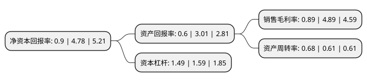

> 本页面由自动化程序生成于 2022年5月20日 01:10
> 内容可能存在错误，如有bug请提交issue至：https://github.com/Eroleice/doc-pi/issues
{.is-warning}

# 上市公司基本情况

## 基本资料

河南通达电缆股份有限公司（以下简称“通达股份”）成立于2002年03月26日，洛阳市。于2011年03月03日在深交所中小板上市。

通达股份注册资本52,867.367万元，主营业务:电线电缆的生产，销售;航空零部件的精密加工。以下是详细信息：

- 公司名称: 河南通达电缆股份有限公司
- 股票代码: 002560.SZ
- 所在地: 河南 - 洛阳市
- 成立日期: 2002年03月26日
- 注册资本: 52,867.367万元
- 法定代表人: 马红菊
- 主营业务: 主营业务:电线电缆的生产，销售;航空零部件的精密加工
- 公司官网: www.hntddl.com
- 公司介绍: 公司是一家高新技术企业，主营电线电缆和航空零部件精密加工。公司研发出了国内最高水平的应用于特高压的钢芯铝绞线等线缆，近年来又研发出了用于高铁、城轨的承力索、接触线；公司作为国内第一家成功引进世界最先进的德国智能化柔性生产线的民企，与国内主要军用飞机主机厂、分承制厂在复杂曲面零部件的高精度精密加工等方面建立起了广泛而深入的合作关系。未来公司将坚持“立足主业、深耕军工”发展战略，继续巩固和发展公司在电线电缆领域的领先优势，深化和拓展公司在军用飞行器领域的服务能力。公司的电线电缆产品不仅成功地配套了目前国内的特高压线路，还广泛出口于南美、中东、欧洲、东南亚、非洲等百余个国家和地区；公司的航空零部件产品涵盖了国内主要的多款军用机型。

## 股东及高管情况

上市公司第一大股东为史万福，持股87,199,577股，占比16.49%，**疑似为**上市公司实际控制人。

截至2022年03月31日，上市公司的前十大股东中，共有9名自然人股东，1个海外主体，其中5%以上大股东共有2名。上市公司前十大股东明细如下：

> 未能通过持股比例判定出上市公司实际控制人（持股30%以上）
> 可能存在通过间接持股、联合持股、协议控制等方式拥有实际控制权的主体，具体请参考上市公司定期公告！
{.is-warning}

> 截至2022年03月31日，上市公司前十大股东信息如下：

| 股东名称 | 持股数量（股） | 持股比例 |
| --- | --- | --- |
| 史万福 | 87,199,577 | 16.49% |
| 马红菊 | 74,047,488 | 14.01% |
| 曲洪普 | 22,131,003 | 4.19% |
| 任健 | 6,800,888 | 1.29% |
| 周宇光 | 3,064,000 | 0.58% |
| 张多贵 | 2,400,000 | 0.45% |
| 连阳阳 | 1,955,900 | 0.37% |
| 林建花 | 1,590,000 | 0.3% |
| 高华-汇丰-GOLDMAN, SACHS & CO.LLC | 1,372,600 | 0.26% |
| 陈达良 | 1,188,800 | 0.22% |

## 利润表分析

上市公司2021年总收入为23.63亿元，净利润为0.2亿元，实现盈利。

## 杜邦分析

> 数据列示周期：2021年 | 2020年 | 2019年
{.is-info}

上市公司的净资产收益率在近一年有所下降，下降幅度为-81.17%，其变化情况分解如下：
- 上市公司的销售毛利率在近一年下降了-81.8%，可能是生产效率的下降、商品原材料价格上涨或商品价格的下跌所致。
- 上市公司的资产周转率在近一年上升了11.48%，可能是源自于更快的销售回款或库存管理效果提升。
- 上市公司的财务杠杆比率在近一年下降了-6.29%，可能是减少负债降低财务费用。

