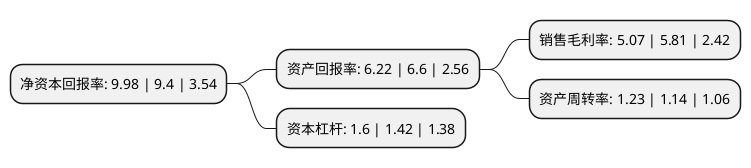

> 本页面由自动化程序生成于 2022年5月20日 01:10
> 内容可能存在错误，如有bug请提交issue至：https://github.com/Eroleice/doc-pi/issues
{.is-warning}

# 上市公司基本情况

## 基本资料

江苏通达动力科技股份有限公司（以下简称“通达动力”）成立于1988年06月24日，南通市。于2011年04月28日在深交所中小板上市。

通达动力注册资本16,510万元，主营业务:电机定转子冲片和铁心的研发，生产，销售和服务，其产品为电动机和发电机的核心部件，主要应用于中小型电机。以下是详细信息：

- 公司名称: 江苏通达动力科技股份有限公司
- 股票代码: 002576.SZ
- 所在地: 江苏 - 南通市
- 成立日期: 1988年06月24日
- 注册资本: 16,510万元
- 法定代表人: 魏少军
- 主营业务: 主营业务:电机定转子冲片和铁心的研发，生产，销售和服务，其产品为电动机和发电机的核心部件，主要应用于中小型电机
- 公司官网: www.tdchina.com
- 公司介绍: 公司是全国最大的电动机、发电机定转子冲片和铁芯的专业生产企业之一。主要产品有750KW~3.5MW的风力发电机、Y(YB)、Y2(YB2)、Y3系列(中心高80－450)；Y、YKK、YKS、YRKK等系列高压电机(中心高355－800)以及YZR(YZ)、YD、YH系列；扇形片等特殊规格电机的定转子冲片和铁芯,年冲制硅钢片能力强。公司实力雄厚，经营规模处于行业领先地位。公司配备了6.3吨－500吨冲床、高速单槽冲、定子压装、转子铸铝等设备多台。公司先后通过了了ISO/FDIS09001：2008质量体系认证、ISO14001：2004环境管理体系和GB/T28001-2011职业健康安全管理体系认证，产品销往全国多个省市，得到ABB、SIEMENS、WEG、GAMESA、佳木斯电机、南防电机、南车集团、东方电机、湘潭电机等国内国际大中型电机生产企业和风力发电机生产企业的一致认可和好评，被多家评为“优秀供应商”。公司先后获得“高新技术企业”和“信用等级AAA”等荣誉证书，并已经申请和获得多项国内先进技术和产品的专利。

## 股东及高管情况

上市公司第一大股东为南通奕达企业管理咨询有限公司，持股25,840,000股，占比15.65%，**疑似为**上市公司实际控制人。

截至2022年05月09日，上市公司的前十大股东中，共有6名自然人股东，2名机构股东，1个产品账户，1个海外主体，其中5%以上大股东共有2名。上市公司前十大股东明细如下：

> 未能通过持股比例判定出上市公司实际控制人（持股30%以上）
> 可能存在通过间接持股、联合持股、协议控制等方式拥有实际控制权的主体，具体请参考上市公司定期公告！
{.is-warning}

> 截至2022年05月09日，上市公司前十大股东信息如下：

| 股东名称 | 持股数量（股） | 持股比例 |
| --- | --- | --- |
| 南通奕达企业管理咨询有限公司 | 25,840,000 | 15.65% |
| 天津鑫达瑞明企业管理咨询中心(有限合伙) | 24,139,000 | 14.62% |
| 羌志培 | 4,847,048 | 2.94% |
| 王岳 | 3,752,413 | 2.27% |
| 滕荣松 | 1,399,300 | 0.85% |
| YU NAN | 1,385,300 | 0.84% |
| 上海银行股份有限公司-广发瑞轩三个月定期开放混合型发起式证券投资基金 | 1,369,300 | 0.83% |
| 汪红梅 | 1,269,200 | 0.77% |
| 言骅 | 912,995 | 0.55% |
| 汪波 | 680,000 | 0.41% |

## 利润表分析

上市公司2021年总收入为20.08亿元，净利润为1.01亿元，实现盈利。

## 杜邦分析

> 数据列示周期：2021年 | 2020年 | 2019年
{.is-info}

上市公司的净资产收益率在近一年有所上升，上升幅度为6.17%，其变化情况分解如下：
- 上市公司的销售毛利率在近一年下降了-12.74%，可能是生产效率的下降、商品原材料价格上涨或商品价格的下跌所致。
- 上市公司的资产周转率在近一年上升了7.89%，可能是源自于更快的销售回款或库存管理效果提升。
- 上市公司的财务杠杆比率在近一年上升了12.68%，可能是增加负债扩大生产规模。

