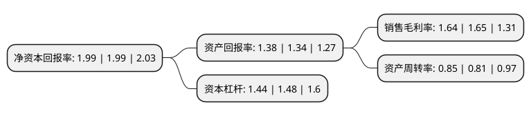

> 本页面由自动化程序生成于 2022年5月20日 01:10
> 内容可能存在错误，如有bug请提交issue至：https://github.com/Eroleice/doc-pi/issues
{.is-warning}

# 上市公司基本情况

## 基本资料

山东圣阳电源股份有限公司（以下简称“圣阳股份”）成立于1998年08月20日，济宁市。于2011年05月06日在深交所中小板上市。

圣阳股份注册资本45,386.899万元，主营业务:公司是国内最早自主研发和生产阀控密封式铅酸蓄电池的企业之一，专业从事吸附式(AGM)，胶体(GEL)等新型阀控密封式铅酸蓄电池的研发，制造和销售。公司主要产品为“圣阳”，“ABT”，“赛耐克”牌高容量阀控密封式铅酸蓄电池。以下是详细信息：

- 公司名称: 山东圣阳电源股份有限公司
- 股票代码: 002580.SZ
- 所在地: 山东 - 济宁市
- 成立日期: 1998年08月20日
- 注册资本: 45,386.899万元
- 法定代表人: 李伟
- 主营业务: 主营业务:公司是国内最早自主研发和生产阀控密封式铅酸蓄电池的企业之一，专业从事吸附式(AGM)，胶体(GEL)等新型阀控密封式铅酸蓄电池的研发，制造和销售公司主要产品为“圣阳”，“ABT”，“赛耐克”牌高容量阀控密封式铅酸蓄电池
- 公司官网: www.sacredsun.cn
- 公司介绍: 公司是国内最早自主研发和生产阀控密封式铅酸蓄电池的企业之一，公司专业从事吸附式(AGM)、胶体(GEL)等新型阀控密封式铅酸蓄电池的研发、制造和销售。公司主要产品为“圣阳”、“ABT”、“赛耐克”牌高容量阀控密封式铅酸蓄电池，包括固定型GFM类、中小型SP类、前置端子FT类、动力型DM类、胶体类等五大类二十一个系列四百多个品种，广泛应用于通信、新能源储能、车用动力、电力、计算机后备电源、轨道交通等领域。公司为国际先进铅酸蓄电池联合会(ALABC)成员、中国电池工业协会常务理事单位、中国化学与物理电源行业协会常务理事单位、中国电器工业协会铅酸蓄电池分会理事单位、中国照明学会新能源照明专委会会员、中国电源学会会员等。公司为山东省第一批高新技术企业，拥有山东省人民政府认定的企业技术中心和山东省科技厅认定的高能环保铅酸蓄电池工程技术研究中心，拥有多项核心技术。

## 股东及高管情况

上市公司第一大股东为山东国惠投资有限公司，持股104,738,998股，占比23.08%，**疑似为**上市公司实际控制人。

截至2022年03月31日，上市公司的前十大股东中，共有7名自然人股东，3名机构股东，其中5%以上大股东共有2名。上市公司前十大股东明细如下：

> 未能通过持股比例判定出上市公司实际控制人（持股30%以上）
> 可能存在通过间接持股、联合持股、协议控制等方式拥有实际控制权的主体，具体请参考上市公司定期公告！
{.is-warning}

> 截至2022年03月31日，上市公司前十大股东信息如下：

| 股东名称 | 持股数量（股） | 持股比例 |
| --- | --- | --- |
| 山东国惠投资有限公司 | 104,738,998 | 23.08% |
| 宋斌 | 25,704,287 | 5.66% |
| 中民新能电力投资有限公司 | 17,755,800 | 3.91% |
| 隋延波 | 4,818,545 | 1.06% |
| 青岛融实创力股权投资管理企业(有限合伙) | 4,458,886 | 0.98% |
| 高运奎 | 3,949,908 | 0.87% |
| 孔德龙 | 3,647,193 | 0.8% |
| 李恕华 | 3,114,146 | 0.69% |
| 冯亚珍 | 2,272,500 | 0.5% |
| 杨玉清 | 2,220,870 | 0.49% |

## 利润表分析

上市公司2021年总收入为20.9亿元，净利润为0.34亿元，实现盈利。

## 杜邦分析

> 数据列示周期：2021年 | 2020年 | 2019年
{.is-info}

上市公司的净资产收益率在近一年有所下降，下降幅度为0%，其变化情况分解如下：
- 上市公司的销售毛利率在近一年下降了-0.61%，可能是生产效率的下降、商品原材料价格上涨或商品价格的下跌所致。
- 上市公司的资产周转率在近一年上升了4.94%，可能是源自于更快的销售回款或库存管理效果提升。
- 上市公司的财务杠杆比率在近一年下降了-2.7%，可能是减少负债降低财务费用。

