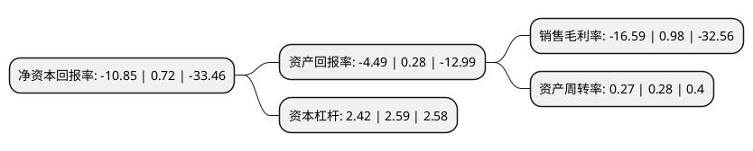

> 本页面由自动化程序生成于 2022年5月20日 01:10
> 内容可能存在错误，如有bug请提交issue至：https://github.com/Eroleice/doc-pi/issues
{.is-warning}

# 上市公司基本情况

## 基本资料

江苏爱康科技股份有限公司（以下简称“爱康科技”）成立于2006年03月09日，无锡市。于2011年08月15日在深交所中小板上市。

爱康科技注册资本447,953.252万元，主营业务为生产和销售光伏行业产品配件，包括太阳能边框，EVA胶膜，安装支架。产品主要包括太阳能边框，EVA胶膜以及安装支架。以下是详细信息：

- 公司名称: 江苏爱康科技股份有限公司
- 股票代码: 002610.SZ
- 所在地: 江苏 - 无锡市
- 成立日期: 2006年03月09日
- 注册资本: 447,953.252万元
- 法定代表人: 邹承慧
- 主营业务: 主营业务为生产和销售光伏行业产品配件，包括太阳能边框，EVA胶膜，安装支架产品主要包括太阳能边框，EVA胶膜以及安装支架
- 公司官网: www.akcome.com
- 公司介绍: 公司是一家专注于新能源电力投资运营及提供一站式光伏配件的高新技术企业，是江苏省重点发展和培育的国际知名品牌，中国新能源行业龙头企业之一。公司已累计运维的并网清洁能源电站约1GW，处在国内同行业民营企业的前列。其传统业务——光伏配件制造，涵盖太阳能电池铝边框、光伏安装支架、光伏焊带等产品，常年保持行业领先的发展态势。同时，其能源互联网业务，布局新能源电站维护、检测、评级、售电和碳资产开发、新能源汽车及充电桩运营等业务，全方位打通能源生产到消费的产业链。除此之外，在产业转型升级的大形势下，公司在金属加工产品领域开发新品，发展了索尼、丰田通商、住友商社、飞利浦、博世、三洋、海信等优质的客户群，帮助制造业资产质量升级；依托产学研合作、无锡市院士工作站、江苏省工程技术中心等研发平台，坚持“客户至上、持续创新、拥抱变化、以贡献者为本”的发展理念开展技术的实用性研究和前瞻性开发。

## 股东及高管情况

上市公司第一大股东为江苏爱康实业集团有限公司，持股364,870,700股，占比8.15%，**疑似为**上市公司实际控制人。

截至2022年03月31日，上市公司的前十大股东中，共有3名自然人股东，3名机构股东，3个产品账户，1个海外主体，其中5%以上大股东共有1名。上市公司前十大股东明细如下：

> 未能通过持股比例判定出上市公司实际控制人（持股30%以上）
> 可能存在通过间接持股、联合持股、协议控制等方式拥有实际控制权的主体，具体请参考上市公司定期公告！
{.is-warning}

> 上市公司第一大股东持股不超过10%，请检查是否存在公司控制权风险！
{.is-danger}

> 截至2022年03月31日，上市公司前十大股东信息如下：

| 股东名称 | 持股数量（股） | 持股比例 |
| --- | --- | --- |
| 江苏爱康实业集团有限公司 | 364,870,700 | 8.15% |
| 邹承慧 | 121,846,200 | 2.72% |
| 中国银行股份有限公司-华泰柏瑞中证光伏产业交易型开放式指数证券投资基金 | 44,669,400 | 1% |
| 中信建投证券股份有限公司-天弘中证光伏产业指数型发起式证券投资基金 | 31,881,684 | 0.71% |
| 江阴爱康投资有限公司 | 26,640,006 | 0.59% |
| 银河德睿资本管理有限公司 | 21,990,000 | 0.49% |
| 香港中央结算有限公司(陆股通) | 19,468,350 | 0.43% |
| 陈楗 | 19,391,800 | 0.43% |
| 邱利华 | 16,705,000 | 0.37% |
| 铸锋资产管理(北京)有限公司-铸锋赤霄2号私募证券投资基金 | 14,690,000 | 0.33% |

## 利润表分析

上市公司2021年总收入为25.31亿元，净利润为-4.2亿元，**未实现盈利**。

## 杜邦分析

> 数据列示周期：2021年 | 2020年 | 2019年
{.is-info}

上市公司的净资产收益率在近一年有所下降，下降幅度为-1606.94%，其变化情况分解如下：
- 上市公司的销售毛利率在近一年下降了-1792.86%，可能是生产效率的下降、商品原材料价格上涨或商品价格的下跌所致。
- 上市公司的资产周转率在近一年下降了-3.57%，可能是源自于更慢的销售回款或库存管理效果下降。
- 上市公司的财务杠杆比率在近一年下降了-6.56%，可能是减少负债降低财务费用。

