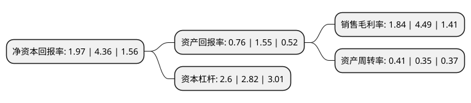

> 本页面由自动化程序生成于 2022年5月20日 01:10
> 内容可能存在错误，如有bug请提交issue至：https://github.com/Eroleice/doc-pi/issues
{.is-warning}

# 上市公司基本情况

## 基本资料

露笑科技股份有限公司（以下简称“露笑科技”）成立于1989年05月24日，绍兴市。于2011年09月20日在深交所中小板上市。

露笑科技注册资本160,367.133万元，主要从事电磁线产品的设计，研发，生产及销售。主要产品包括铜芯，铝芯电磁线两大类，其中铜芯电磁线产品又可分为耐高温复合电磁线和微细电子线材两类，铝芯电磁线产品主要是耐高温复合铝电磁线。以下是详细信息：

- 公司名称: 露笑科技股份有限公司
- 股票代码: 002617.SZ
- 所在地: 浙江 - 绍兴市
- 成立日期: 1989年05月24日
- 注册资本: 160,367.133万元
- 法定代表人: 鲁永
- 主营业务: 主要从事电磁线产品的设计，研发，生产及销售主要产品包括铜芯，铝芯电磁线两大类，其中铜芯电磁线产品又可分为耐高温复合电磁线和微细电子线材两类，铝芯电磁线产品主要是耐高温复合铝电磁线
- 公司官网: www.roshowtech.com
- 公司介绍: 公司是专业的节能电机、电磁线、涡轮增压器、蓝宝长晶片研发、生产、销售于一体的企业，公司系国家重点高新技术企业，国家火炬项目、国家振兴产业项目承担企业。拥有省级企业研究院、省级企业技术中心、博士后工作站、为浙江省最具成长力企业之一。公司主要产品有各类铜、铝芯电磁线、超微细电磁线、小家电节能电机、无刷电机、数控电机、涡轮增压器和蓝宝石长晶设备等产品。是国内主要电磁线产品供应商之一，也是国内最大的铝芯电磁线和超微细电磁线产品生产基地之一。露笑品牌已成为行业内具有较高知名度的品牌，品牌和客户资源已是公司最重要的无形资产之一。露笑牌漆包线被评为“浙江名牌”，露笑商标被认定为“浙江省著名商标”，主要客户有三星、LG、恩布拉科、艾默生、美的、正泰、长虹、海尔、钱江制冷等国内外知名企业。公司先后通过ISO9001、ISO10012、ISO14001、TS16949、ISO17025体系认证、美国UL安全认证以及欧盟RoHS检测。

## 股东及高管情况

上市公司第一大股东为深圳东方创业投资有限公司，持股259,915,384股，占比16.21%，**疑似为**上市公司实际控制人。

截至2022年03月31日，上市公司的前十大股东中，共有5名自然人股东，3名机构股东，1个产品账户，1个海外主体，其中5%以上大股东共有2名。上市公司前十大股东明细如下：

> 未能通过持股比例判定出上市公司实际控制人（持股30%以上）
> 可能存在通过间接持股、联合持股、协议控制等方式拥有实际控制权的主体，具体请参考上市公司定期公告！
{.is-warning}

> 截至2022年03月31日，上市公司前十大股东信息如下：

| 股东名称 | 持股数量（股） | 持股比例 |
| --- | --- | --- |
| 深圳东方创业投资有限公司 | 259,915,384 | 16.21% |
| 露笑集团有限公司 | 182,751,210 | 11.4% |
| 屠文斌 | 55,226,666 | 3.44% |
| 鲁小均 | 53,640,000 | 3.34% |
| 鲁永 | 42,069,522 | 2.62% |
| 青岛乾瀛投资中心(有限合伙) | 27,400,000 | 1.71% |
| 施玉庆 | 22,120,794 | 1.38% |
| 董彪 | 18,565,384 | 1.16% |
| 中国银行股份有限公司-华泰柏瑞中证光伏产业交易型开放式证券投资基金 | 13,245,100 | 0.83% |
| 香港中央结算有限公司(陆股通) | 8,890,019 | 0.55% |

## 利润表分析

上市公司2021年总收入为35.53亿元，净利润为0.65亿元，实现盈利。

## 杜邦分析

> 数据列示周期：2021年 | 2020年 | 2019年
{.is-info}

上市公司的净资产收益率在近一年有所下降，下降幅度为-54.82%，其变化情况分解如下：
- 上市公司的销售毛利率在近一年下降了-59.02%，可能是生产效率的下降、商品原材料价格上涨或商品价格的下跌所致。
- 上市公司的资产周转率在近一年上升了17.14%，可能是源自于更快的销售回款或库存管理效果提升。
- 上市公司的财务杠杆比率在近一年下降了-7.8%，可能是减少负债降低财务费用。

