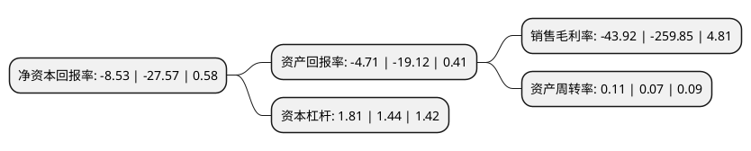

> 本页面由自动化程序生成于 2022年5月20日 01:10
> 内容可能存在错误，如有bug请提交issue至：https://github.com/Eroleice/doc-pi/issues
{.is-warning}

# 上市公司基本情况

## 基本资料

融钰集团股份有限公司（以下简称“融钰集团”）成立于1998年11月06日，吉林市。于2011年10月18日在深交所中小板上市。

融钰集团注册资本84,000万元，主营业务主要为研发，生产和销售永磁开关产品。产品包括永磁高低压开关，高低压开关成套设备，电子式电能表，高速公路交通设施等。主导产品是永磁高压(12kV和40。5kV)真空断路器和永磁低压交流接触器。以下是详细信息：

- 公司名称: 融钰集团股份有限公司
- 股票代码: 002622.SZ
- 所在地: 吉林 - 吉林市
- 成立日期: 1998年11月06日
- 注册资本: 84,000万元
- 法定代表人: 陆璐
- 主营业务: 主营业务主要为研发，生产和销售永磁开关产品产品包括永磁高低压开关，高低压开关成套设备，电子式电能表，高速公路交通设施等主导产品是永磁高压(12kV和405kV)真空断路器和永磁低压交流接触器
- 公司官网: www.royalholding.cn
- 公司介绍: 公司是中国永磁高低压电气开关产品重要的研发和最大的生产基地。公司主要从事永磁开关及高低压开关成套设备产品的研发、生产和销售，有高低压永磁断路器、接触器，高低压成套设备，检测、控制及综合保护产品等百余种产品。目前公司开关业务的营销网络已经遍布全国多个省市，能够为客户提供集“售前、售中、售后”为一体的系统化服务。公司永磁开关系列产品已经实现在冶金、石油、化工、电力、造纸、制药、食品、交通、环保等行业中的销售业绩。并与国内众多电力钢铁大中型企业建立了友好合作关系。

## 股东及高管情况

上市公司第一大股东为广州汇垠日丰投资合伙企业(有限合伙)，持股200,000,000股，占比23.81%，**疑似为**上市公司实际控制人。

截至2022年03月31日，上市公司的前十大股东中，共有7名自然人股东，2名机构股东，1个产品账户，其中5%以上大股东共有1名。上市公司前十大股东明细如下：

> 未能通过持股比例判定出上市公司实际控制人（持股30%以上）
> 可能存在通过间接持股、联合持股、协议控制等方式拥有实际控制权的主体，具体请参考上市公司定期公告！
{.is-warning}

> 截至2022年03月31日，上市公司前十大股东信息如下：

| 股东名称 | 持股数量（股） | 持股比例 |
| --- | --- | --- |
| 广州汇垠日丰投资合伙企业(有限合伙) | 200,000,000 | 23.81% |
| 陕西省国际信托股份有限公司-陕国投·鑫鑫向荣78号证券投资集合资金信托计划 | 32,263,200 | 3.84% |
| 青岛鑫汇合投资管理有限公司 | 15,060,966 | 1.79% |
| 王存斌 | 13,859,080 | 1.65% |
| 俞娥 | 11,103,400 | 1.32% |
| 陆其康 | 7,020,400 | 0.84% |
| 李越 | 5,889,100 | 0.7% |
| 朱丽娜 | 5,831,760 | 0.69% |
| 刘庆芳 | 5,286,100 | 0.63% |
| 郏森茂 | 5,203,400 | 0.62% |

## 利润表分析

上市公司2021年总收入为1.68亿元，净利润为-0.74亿元，**未实现盈利**。

## 杜邦分析

> 数据列示周期：2021年 | 2020年 | 2019年
{.is-info}

上市公司的净资产收益率在近一年有所下降，下降幅度为-69.06%，其变化情况分解如下：
- 上市公司的销售毛利率在近一年下降了-83.1%，可能是生产效率的下降、商品原材料价格上涨或商品价格的下跌所致。
- 上市公司的资产周转率在近一年上升了57.14%，可能是源自于更快的销售回款或库存管理效果提升。
- 上市公司的财务杠杆比率在近一年上升了25.69%，可能是增加负债扩大生产规模。

