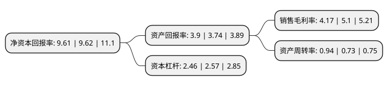

> 本页面由自动化程序生成于 2022年5月20日 01:11
> 内容可能存在错误，如有bug请提交issue至：https://github.com/Eroleice/doc-pi/issues
{.is-warning}

# 上市公司基本情况

## 基本资料

茂硕电源科技股份有限公司（以下简称“茂硕电源”）成立于2006年03月27日，深圳市。于2012年03月16日在深交所中小板上市。

茂硕电源注册资本27,432.771万元，公司的主营业务为开关电源的研发，生产及销售，主营产品包括消费类电子产品和大功率LED照明设备配套所需的驱动电源。以下是详细信息：

- 公司名称: 茂硕电源科技股份有限公司
- 股票代码: 002660.SZ
- 所在地: 广东 - 深圳市
- 成立日期: 2006年03月27日
- 注册资本: 27,432.771万元
- 法定代表人: 王浩涛
- 主营业务: 公司的主营业务为开关电源的研发，生产及销售，主营产品包括消费类电子产品和大功率LED照明设备配套所需的驱动电源
- 公司官网: www.mosopower.com
- 公司介绍: 公司是集产品研发、制造、销售及服务于一体，已在美国、日本、韩国、新加坡、欧洲、中国香港、中国台湾等国家或地区设有分公司或办事处，能够为国内外客户提供迅捷的专业服务。优秀的人才，先进的技术，科学的管理，以及务实、进取的创业精神使得茂硕电源能够持续处于行业领先地位，是茂硕电源真正的核心竞争力。自成立以来，以立足发展主业、持续稳健经营为前提，全面拓展新能源、互联网领域。公司着眼于以下几个方面进行发展：开关电源、LED智能驱动、FPC、光伏逆变器、智能充电桩、新能源光伏电站投资、新能源汽车充电运营、投资并购。通过外延式发展方式积极培育新的利润增长点，成立以互联网+为基础的孵化基地，兴建投资超过3000万元的国家级第三方检测中心，通过技术与互联网应用相结合，将为用户提供高效、智能、安全的产品和系统解决方案。

## 股东及高管情况

上市公司第一大股东为济南产发融盛股权投资有限公司，持股72,696,842股，占比26.5%，**疑似为**上市公司实际控制人。

截至2022年03月31日，上市公司的前十大股东中，共有8名自然人股东，2名机构股东，其中5%以上大股东共有2名。上市公司前十大股东明细如下：

> 未能通过持股比例判定出上市公司实际控制人（持股30%以上）
> 可能存在通过间接持股、联合持股、协议控制等方式拥有实际控制权的主体，具体请参考上市公司定期公告！
{.is-warning}

> 截至2022年03月31日，上市公司前十大股东信息如下：

| 股东名称 | 持股数量（股） | 持股比例 |
| --- | --- | --- |
| 济南产发融盛股权投资有限公司 | 72,696,842 | 26.5% |
| 顾永德 | 22,990,358 | 8.38% |
| 李胜军 | 2,712,400 | 0.99% |
| 齐旭东 | 2,440,800 | 0.89% |
| 方笑求 | 2,059,803 | 0.75% |
| 廖原 | 1,724,200 | 0.63% |
| 张和平 | 1,341,200 | 0.49% |
| 苏云 | 1,051,413 | 0.38% |
| 华泰证券股份有限公司 | 1,007,513 | 0.37% |
| 李刚 | 974,000 | 0.36% |

## 利润表分析

上市公司2021年总收入为16.25亿元，净利润为0.67亿元，实现盈利。

## 杜邦分析

> 数据列示周期：2021年 | 2020年 | 2019年
{.is-info}

上市公司的净资产收益率在近一年有所下降，下降幅度为-0.1%，其变化情况分解如下：
- 上市公司的销售毛利率在近一年下降了-18.24%，可能是生产效率的下降、商品原材料价格上涨或商品价格的下跌所致。
- 上市公司的资产周转率在近一年上升了28.77%，可能是源自于更快的销售回款或库存管理效果提升。
- 上市公司的财务杠杆比率在近一年下降了-4.28%，可能是减少负债降低财务费用。

