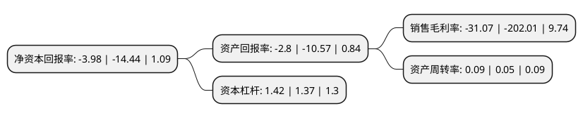

> 本页面由自动化程序生成于 2022年5月20日 01:11
> 内容可能存在错误，如有bug请提交issue至：https://github.com/Eroleice/doc-pi/issues
{.is-warning}

# 上市公司基本情况

## 基本资料

首航高科能源技术股份有限公司（以下简称“首航高科”）成立于2001年07月06日，酒泉市。于2012年03月27日在深交所中小板上市。

首航高科注册资本253,872.074万元，主要产品:电站空冷系统成套设备，主要用于火电站的乏汽冷凝。主营业务:空冷系统的研发，设计，生产和销售。以下是详细信息：

- 公司名称: 首航高科能源技术股份有限公司
- 股票代码: 002665.SZ
- 所在地: 甘肃 - 酒泉市
- 成立日期: 2001年07月06日
- 注册资本: 253,872.074万元
- 法定代表人: 黄文博
- 主营业务: 主要产品:电站空冷系统成套设备，主要用于火电站的乏汽冷凝主营业务:空冷系统的研发，设计，生产和销售
- 公司官网: www.sh-ihw.com
- 公司介绍: 公司是专业从事空冷技术研发和冷却设备制造的企业。主营业务为空冷系统的研发、设计、生产和销售，主导产品是电站空冷系统成套设备，公司客户为华润电力、大唐集团、国电集团、神华集团等国内知名企业。公司生产的“直接空冷系统”通过“电能(北京)产品认证中心”进行审核及产品认证，荣获北京市科委等部门联合认定颁发的“北京市自主创新产品”称号。公司是北京市高新技术企业、中关村园区高新技术企业，承担了国家科技部“1000MW超临界机组火电厂直接空气冷凝汽器”火炬计划项目。

## 股东及高管情况

上市公司第一大股东为金城资本管理有限公司-甘肃省并购(纾困)基金(有限合伙)，持股251,212,748股，占比9.9%，**疑似为**上市公司实际控制人。

截至2022年03月31日，上市公司的前十大股东中，共有4名自然人股东，2名机构股东，4个产品账户，其中5%以上大股东共有1名。上市公司前十大股东明细如下：

> 未能通过持股比例判定出上市公司实际控制人（持股30%以上）
> 可能存在通过间接持股、联合持股、协议控制等方式拥有实际控制权的主体，具体请参考上市公司定期公告！
{.is-warning}

> 上市公司第一大股东持股不超过10%，请检查是否存在公司控制权风险！
{.is-danger}

> 截至2022年03月31日，上市公司前十大股东信息如下：

| 股东名称 | 持股数量（股） | 持股比例 |
| --- | --- | --- |
| 金城资本管理有限公司-甘肃省并购(纾困)基金(有限合伙) | 251,212,748 | 9.9% |
| 浙江浙企投资管理有限公司-杭州东方邦信赤孝股权投资基金合伙企业(有限合伙) | 93,008,124 | 3.66% |
| 黄文佳 | 75,089,261 | 2.96% |
| 长安国际信托股份有限公司-长安信托-民生定增1号单一资金信托 | 50,165,819 | 1.98% |
| 北信瑞丰基金-渤海银行-华润深国投信托-华润信托·增利40号单一资金信托 | 41,994,570 | 1.65% |
| 黄卿乐 | 39,971,431 | 1.57% |
| 国盛证券有限责任公司 | 31,654,925 | 1.25% |
| 岑岗崎 | 18,465,594 | 0.73% |
| 李能 | 16,775,100 | 0.66% |
| 海通证券资管-海通证券股份有限公司-证券行业支持民企发展系列之海通证券资管1号FOF单一资产管理计划 | 13,942,887 | 0.55% |

## 利润表分析

上市公司2021年总收入为7.18亿元，净利润为-2.24亿元，**未实现盈利**。

## 杜邦分析

> 数据列示周期：2021年 | 2020年 | 2019年
{.is-info}

上市公司的净资产收益率在近一年有所下降，下降幅度为-72.44%，其变化情况分解如下：
- 上市公司的销售毛利率在近一年下降了-84.62%，可能是生产效率的下降、商品原材料价格上涨或商品价格的下跌所致。
- 上市公司的资产周转率在近一年上升了80%，可能是源自于更快的销售回款或库存管理效果提升。
- 上市公司的财务杠杆比率在近一年上升了3.65%，可能是增加负债扩大生产规模。

