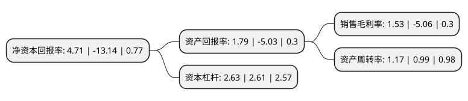

> 本页面由自动化程序生成于 2022年5月20日 01:11
> 内容可能存在错误，如有bug请提交issue至：https://github.com/Eroleice/doc-pi/issues
{.is-warning}

# 上市公司基本情况

## 基本资料

远程电缆股份有限公司（以下简称“ST远程”）成立于2001年02月20日，无锡市。于2012年08月08日在深交所中小板上市。

ST远程注册资本71,814.6万元，公司所处行业为电线电缆行业，主要从事电线电缆产品的设计，研发，生产与销售，公司的主要产品为35kv及以下电力电缆，特种电缆，裸导线，电气装备用电线电缆四大类，拥有两百多个品种，10，000多种规格的电线电缆产品，广泛应用在国家电网建设改造，五大发电企业和核电，冶金，石化，高校，市政工程等重大项目中。以下是详细信息：

- 公司名称: 远程电缆股份有限公司
- 股票代码: 002692.SZ
- 所在地: 江苏 - 无锡市
- 成立日期: 2001年02月20日
- 注册资本: 71,814.6万元
- 法定代表人: 汤兴良
- 主营业务: 公司所处行业为电线电缆行业，主要从事电线电缆产品的设计，研发，生产与销售，公司的主要产品为35kv及以下电力电缆，特种电缆，裸导线，电气装备用电线电缆四大类，拥有两百多个品种，10，000多种规格的电线电缆产品，广泛应用在国家电网建设改造，五大发电企业和核电，冶金，石化，高校，市政工程等重大项目中
- 公司官网: www.yccable.cn
- 公司介绍: 公司是专业从事电线电缆设计开发、生产、销售与服务的高新技术企业，拥有省级工程技术研究中心，并引进了国外先进的生产和检测设备。公司“远程”牌电线电缆享有“全国用户满意产品”、“江苏省名牌产品”、“江苏省重点保护产品”、“江苏省著名商标”等荣誉称号。公司主要从事电线电缆产品的设计、研发、生产与销售，公司的主要产品为500kV及以下电力电缆、特种电缆、裸导线、电气装备用电线电缆四大类。公司拥有ISO9001:2008质量管理体系、ISO14001:2004环境管理体系以及GB/T28001-2011职业健康安全管理体系认证证书。公司产品通过了国家强制性认证产品CCC认证；公司拥有自主进出口权，是“全国用户满意企业”、“江苏省计量保证确认单位”、“重合同守信用单位”、“AAA级资信企业”。公司产品除被国家电网公司及其关联企业采购以外，还先后被中国石油天然气管道管理局、铁道工程交易中心、中国化工集团、中材国际、中国建筑、兴澄特钢、常州机场、北京地铁、上海地铁等许可销售。

## 股东及高管情况

上市公司第一大股东为无锡苏新产业优化调整投资合伙企业(有限合伙)，持股130,091,326股，占比18.11%，**疑似为**上市公司实际控制人。

截至2022年04月11日，上市公司的前十大股东中，共有4名自然人股东，6名机构股东，其中5%以上大股东共有7名。上市公司前十大股东明细如下：

> 未能通过持股比例判定出上市公司实际控制人（持股30%以上）
> 可能存在通过间接持股、联合持股、协议控制等方式拥有实际控制权的主体，具体请参考上市公司定期公告！
{.is-warning}

> 截至2022年04月11日，上市公司前十大股东信息如下：

| 股东名称 | 持股数量（股） | 持股比例 |
| --- | --- | --- |
| 无锡苏新产业优化调整投资合伙企业(有限合伙) | 130,091,326 | 18.11% |
| 无锡苏新产业优化调整投资合伙企业(有限合伙) | 130,091,326 | 18.11% |
| 无锡联信资产管理有限公司 | 75,814,714 | 10.56% |
| 无锡联信资产管理有限公司 | 75,814,714 | 10.56% |
| 杭州秦商体育文化有限公司 | 40,605,100 | 5.65% |
| 杭州秦商体育文化有限公司 | 40,605,100 | 5.65% |
| 杨小明 | 36,406,444 | 5.07% |
| 俞国平 | 24,870,060 | 3.46% |
| 许磊 | 18,700,000 | 2.6% |
| 汪素香 | 13,434,100 | 1.87% |

## 利润表分析

上市公司2021年总收入为30.01亿元，净利润为0.45亿元，实现盈利。

## 杜邦分析

> 数据列示周期：2021年 | 2020年 | 2019年
{.is-info}

上市公司的净资产收益率在近一年有所下降，下降幅度为-135.84%，其变化情况分解如下：
- 上市公司的销售毛利率在近一年下降了-130.24%，可能是生产效率的下降、商品原材料价格上涨或商品价格的下跌所致。
- 上市公司的资产周转率在近一年上升了18.18%，可能是源自于更快的销售回款或库存管理效果提升。
- 上市公司的财务杠杆比率在近一年上升了0.77%，可能是增加负债扩大生产规模。

