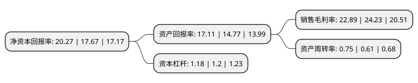

> 本页面由自动化程序生成于 2022年5月20日 01:12
> 内容可能存在错误，如有bug请提交issue至：https://github.com/Eroleice/doc-pi/issues
{.is-warning}

# 上市公司基本情况

## 基本资料

杭州微光电子股份有限公司（以下简称“微光股份”）成立于2009年11月25日，杭州市。于2016年06月22日在深交所中小板上市。

微光股份注册资本22,963.2万元，主要产品:冷柜电机，外转子风机及ECM电机。主营业务:本公司专业从事应用于HVAC(采暖，通风，空调，制冷)领域微电机，风机的研发，生产和销售。以下是详细信息：

- 公司名称: 杭州微光电子股份有限公司
- 股票代码: 002801.SZ
- 所在地: 浙江 - 杭州市
- 成立日期: 2009年11月25日
- 注册资本: 22,963.2万元
- 法定代表人: 何平
- 主营业务: 主要产品:冷柜电机，外转子风机及ECM电机主营业务:本公司专业从事应用于HVAC(采暖，通风，空调，制冷)领域微电机，风机的研发，生产和销售
- 公司官网: www.wgmotor.com
- 公司介绍: 公司专业从事微电机、风机的研发、生产和销售，是全球冷柜电机、外转子风机的主要制造商之一。主要产品为应用于HVAC(采暖、通风、空调与制冷)领域的冷柜电机、外转子风机及ECM电机。公司先后获得国家火炬计划重点高新技术企业、中国电子元件百强企业、浙江省专利示范企业、浙江省标准创新型企业、浙江省绿色企业、浙江省安全生产标准化示范企业。产品荣获浙江名牌、浙江出口名牌。注册商标“微光电机WEIGUANG”被国家工商总局商标局认定为“驰名商标”。公司检测中心通过国家实验室认可，企业研发中心被确认为省级研发(技术)中心、省级研究院。参与国家标准“精密外转子轴流风机通用规范”的制订。

## 股东及高管情况

上市公司第一大股东为何平，持股90,417,600股，占比39.38%，为上市公司实际控制人。

截至2022年03月31日，上市公司的前十大股东中，共有7名自然人股东，1名机构股东，2个产品账户，其中5%以上大股东共有2名。上市公司前十大股东明细如下：

> 截至2022年03月31日，上市公司前十大股东信息如下：

| 股东名称 | 持股数量（股） | 持股比例 |
| --- | --- | --- |
| 何平 | 90,417,600 | 39.38% |
| 邵国新 | 58,125,600 | 25.31% |
| 杭州微光投资合伙企业(有限合伙) | 10,764,000 | 4.69% |
| 张为民 | 6,458,400 | 2.81% |
| 胡雅琴 | 3,229,200 | 1.41% |
| 何思昀 | 3,229,200 | 1.41% |
| 招商银行股份有限公司-富国科创主题3年封闭运作灵活配置混合型证券投资基金 | 1,225,900 | 0.53% |
| 秦永水 | 1,028,447 | 0.45% |
| 刘中国 | 1,000,076 | 0.44% |
| 光大证券资管-光大银行-光大阳光添利债券型集合资产管理计划 | 973,020 | 0.42% |

## 利润表分析

上市公司2021年总收入为11.11亿元，净利润为2.54亿元，实现盈利。

## 杜邦分析

> 数据列示周期：2021年 | 2020年 | 2019年
{.is-info}

上市公司的净资产收益率在近一年有所上升，上升幅度为14.71%，其变化情况分解如下：
- 上市公司的销售毛利率在近一年下降了-5.53%，可能是生产效率的下降、商品原材料价格上涨或商品价格的下跌所致。
- 上市公司的资产周转率在近一年上升了22.95%，可能是源自于更快的销售回款或库存管理效果提升。
- 上市公司的财务杠杆比率在近一年下降了-1.67%，可能是减少负债降低财务费用。

