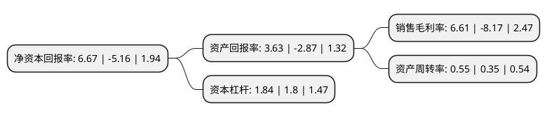

> 本页面由自动化程序生成于 2022年5月20日 01:12
> 内容可能存在错误，如有bug请提交issue至：https://github.com/Eroleice/doc-pi/issues
{.is-warning}

# 上市公司基本情况

## 基本资料

山东丰元化学股份有限公司（以下简称“丰元股份”）成立于2000年08月23日，枣庄市。于2016年07月07日在深交所中小板上市。

丰元股份注册资本17,793.221万元，主营业务:草酸生产，销售;硝酸，硝酸钠生产，销售;经营进出口业务。主要产品:工业草酸和精制草酸。以下是详细信息：

- 公司名称: 山东丰元化学股份有限公司
- 股票代码: 002805.SZ
- 所在地: 山东 - 枣庄市
- 成立日期: 2000年08月23日
- 注册资本: 17,793.221万元
- 法定代表人: 赵光辉
- 主营业务: 主营业务:草酸生产，销售;硝酸，硝酸钠生产，销售;经营进出口业务主要产品:工业草酸和精制草酸
- 公司官网: www.fengyuanhuaxue.com
- 公司介绍: 公司是由枣庄丰元化工有限公司整体变更而来，是亚洲草酸行业最大的生产企业之一。公司主要致力于草酸系列产品、硝酸、硝酸钠的生产和销售，草酸系列产品包括工业草酸、精制草酸及草酸盐三大子系列产品，其中工业草酸与精制草酸为公司主导产品。公司已形成完整的上下游产业链和行业内最完整的草酸系列产品结构，并具备循环经济优势，具有很强的市场应变能力，同时公司具备了显著的行业地位优势、技术领先优势、完整的产业链和循环经济优势、节能减排和环保优势、成本优势和区位优势。公司已建立完善的质量保证体系和质量评估体系，被评为山东省“重合同、守信用”企业。

## 股东及高管情况

上市公司第一大股东为赵光辉，持股59,617,113股，占比33.51%，为上市公司实际控制人。

截至2022年03月31日，上市公司的前十大股东中，共有2名自然人股东，8个产品账户，其中5%以上大股东共有2名。上市公司前十大股东明细如下：

> 截至2022年03月31日，上市公司前十大股东信息如下：

| 股东名称 | 持股数量（股） | 持股比例 |
| --- | --- | --- |
| 赵光辉 | 59,617,113 | 33.51% |
| 安徽金通新能源汽车二期基金合伙企业(有限合伙) | 10,853,835 | 6.1% |
| 上海浦东发展银行股份有限公司-中欧创新未来18个月封闭运作混合型证券投资基金 | 3,708,100 | 2.08% |
| 中国建设银行股份有限公司-华夏能源革新股票型证券投资基金 | 3,581,450 | 2.01% |
| 山东新业股权投资管理有限公司-枣庄财金新旧动能转换基金管理合伙企业(有限合伙) | 2,088,108 | 1.17% |
| 招商银行股份有限公司-中欧科创主题3年封闭运作灵活配置混合型证券投资基金 | 1,650,350 | 0.93% |
| 上海阿杏投资管理有限公司-阿杏延安24号私募证券投资基金 | 1,174,418 | 0.66% |
| 钭耀琦 | 1,122,350 | 0.63% |
| 中国光大银行股份有限公司-华夏磐益一年定期开放混合型证券投资基金 | 1,038,279 | 0.58% |
| 上海银行股份有限公司-中欧产业前瞻混合型证券投资基金 | 800,000 | 0.45% |

## 利润表分析

上市公司2021年总收入为8.03亿元，净利润为0.53亿元，实现盈利。

## 杜邦分析

> 数据列示周期：2021年 | 2020年 | 2019年
{.is-info}

上市公司的净资产收益率在近一年有所下降，下降幅度为-229.26%，其变化情况分解如下：
- 上市公司的销售毛利率在近一年下降了-180.91%，可能是生产效率的下降、商品原材料价格上涨或商品价格的下跌所致。
- 上市公司的资产周转率在近一年上升了57.14%，可能是源自于更快的销售回款或库存管理效果提升。
- 上市公司的财务杠杆比率在近一年上升了2.22%，可能是增加负债扩大生产规模。

