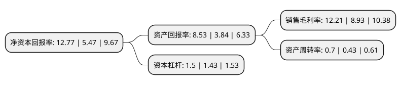

> 本页面由自动化程序生成于 2022年5月20日 01:12
> 内容可能存在错误，如有bug请提交issue至：https://github.com/Eroleice/doc-pi/issues
{.is-warning}

# 上市公司基本情况

## 基本资料

深圳市科达利实业股份有限公司（以下简称“科达利”）成立于1996年09月20日，深圳市。于2017年03月02日在深交所中小板上市。

科达利注册资本23,292.045万元，主要产品:便携式锂电池精密结构件，动力及储能锂电池精密结构件，汽车结构件三大类。主营业务:以锂电池精密结构件业务为核心，汽车结构件业务为重要构成的国内领先精密结构件产品研发及制造商。以下是详细信息：

- 公司名称: 深圳市科达利实业股份有限公司
- 股票代码: 002850.SZ
- 所在地: 广东 - 深圳市
- 成立日期: 1996年09月20日
- 注册资本: 23,292.045万元
- 法定代表人: 励建立
- 主营业务: 主要产品:便携式锂电池精密结构件，动力及储能锂电池精密结构件，汽车结构件三大类主营业务:以锂电池精密结构件业务为核心，汽车结构件业务为重要构成的国内领先精密结构件产品研发及制造商
- 公司官网: www.kedali.com.cn
- 公司介绍: 公司系以锂电池精密结构件业务为核心、汽车结构件业务为重要构成的国内领先精密结构件产品研发及制造商。凭借着强大的技术优势和深厚的优质客户资源积累，公司成功先发进入新能源汽车动力锂电池精密结构件领域，并已占据了有利的市场地位。公司产品主要分为便携式锂电池精密结构件、动力及储能锂电池精密结构件、汽车结构件三大类，广泛应用于便携式通讯及电子产品、汽车及新能源汽车、电动工具、储能电站等众多行业领域。

## 股东及高管情况

上市公司第一大股东为励建立，持股78,698,885股，占比33.79%，为上市公司实际控制人。

截至2022年03月31日，上市公司的前十大股东中，共有2名自然人股东，2名机构股东，5个产品账户，1个海外主体，其中5%以上大股东共有2名。上市公司前十大股东明细如下：

> 截至2022年03月31日，上市公司前十大股东信息如下：

| 股东名称 | 持股数量（股） | 持股比例 |
| --- | --- | --- |
| 励建立 | 78,698,885 | 33.79% |
| 励建炬 | 24,964,401 | 10.72% |
| 深圳市宸钜投资有限公司 | 7,000,000 | 3.01% |
| 中国工商银行股份有限公司-农银汇理新能源主题灵活配置混合型证券投资基金 | 6,920,541 | 2.97% |
| 云南大业盛德企业管理有限公司 | 6,164,933 | 2.65% |
| 香港中央结算有限公司(陆股通) | 5,978,074 | 2.57% |
| 基本养老保险基金一二零六组合 | 3,661,848 | 1.57% |
| 中国工商银行股份有限公司-嘉实智能汽车股票型证券投资基金 | 1,948,391 | 0.84% |
| 招商银行股份有限公司-工银瑞信圆丰三年持有期混合型证券投资基金 | 1,880,075 | 0.81% |
| 招商银行股份有限公司-银华心怡灵活配置混合型证券投资基金 | 1,766,800 | 0.76% |

## 利润表分析

上市公司2021年总收入为44.67亿元，净利润为5.45亿元，实现盈利。

## 杜邦分析

> 数据列示周期：2021年 | 2020年 | 2019年
{.is-info}

上市公司的净资产收益率在近一年有所上升，上升幅度为133.46%，其变化情况分解如下：
- 上市公司的销售毛利率在近一年上升了36.73%，可能是生产效率的提升、商品原材料价格下跌或商品价格的上涨所致。
- 上市公司的资产周转率在近一年上升了62.79%，可能是源自于更快的销售回款或库存管理效果提升。
- 上市公司的财务杠杆比率在近一年上升了4.9%，可能是增加负债扩大生产规模。

