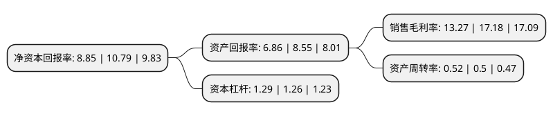

> 本页面由自动化程序生成于 2022年5月20日 01:12
> 内容可能存在错误，如有bug请提交issue至：https://github.com/Eroleice/doc-pi/issues
{.is-warning}

# 上市公司基本情况

## 基本资料

长缆电工科技股份有限公司（以下简称“长缆科技”）成立于1997年12月23日，长沙市。于2017年07月07日在深交所中小板上市。

长缆科技注册资本19,310.764万元，主要产品:超高压电缆附件，高压电缆附件，中低压电缆附件等，包括输电线路用附件，通讯电缆用附件，电力金具，电缆接续金具，电工器材，电缆敷设成套机械，绝缘材料及制品，特种电线电缆制品的研发，生产和销售。主要业务:电力电缆附件及配套产品的研发，生产，销售及服务。以下是详细信息：

- 公司名称: 长缆电工科技股份有限公司
- 股票代码: 002879.SZ
- 所在地: 湖南 - 长沙市
- 成立日期: 1997年12月23日
- 注册资本: 19,310.764万元
- 法定代表人: 俞涛
- 主营业务: 主要产品:超高压电缆附件，高压电缆附件，中低压电缆附件等，包括输电线路用附件，通讯电缆用附件，电力金具，电缆接续金具，电工器材，电缆敷设成套机械，绝缘材料及制品，特种电线电缆制品的研发，生产和销售电力电缆附件及配套产品的研发，生产，销售及服务
- 公司官网: www.csdlfj.com
- 公司介绍: 公司是长沙国家高新技术开发区重点企业、国家级“守合同、重信用”企业、国家火炬计划重点高新技术企业、湖南省级企业技术中心、湖南省工程技术研究中心、湖南省明星科技企业，在国内电缆附件行业中处于领先地位。公司系专业从事电力电缆附件及配套产品的研发、生产、销售及服务的企业，拥有近几十年的电缆附件生产经验，具备500kV及以下各电压等级交直流全规格超高压、高压及中低压电缆附件及配套产品的生产能力。作为国内电缆附件行业的骨干企业，公司拥有完整的产品线，主要产品涵盖超高压电缆附件、高压电缆附件、中低压电缆附件等。公司始终把“技术创新”作为企业发展的原动力，积累了材料配方、橡胶混炼、橡胶成型、环氧浇注等关键工序的成功经验，采用国际标准和先进技术，产品不断推陈出新，已形成了生产、开发、规划的良性循环。同时，公司是中国标准化协会理事单位，持续关注并研究国外最新的标准动态，积极参与国家和行业有关标准的制定和推动，引领行业的发展方向。

## 股东及高管情况

上市公司第一大股东为俞正元，持股65,604,035股，占比33.97%，为上市公司实际控制人。

截至2022年03月31日，上市公司的前十大股东中，共有6名自然人股东，4个产品账户，其中5%以上大股东共有1名。上市公司前十大股东明细如下：

> 截至2022年03月31日，上市公司前十大股东信息如下：

| 股东名称 | 持股数量（股） | 持股比例 |
| --- | --- | --- |
| 俞正元 | 65,604,035 | 33.97% |
| 长缆电工科技股份有限公司-第一期员工持股计划 | 9,415,100 | 4.88% |
| 唐陕湖 | 4,058,792 | 2.1% |
| 罗兵 | 3,000,013 | 1.55% |
| 中国农业银行股份有限公司-大成高新技术产业股票型证券投资基金 | 2,945,948 | 1.53% |
| 吴蓉翔 | 2,890,300 | 1.5% |
| 大成基金管理有限公司-社保基金17011组合 | 2,719,563 | 1.41% |
| 薛奇 | 2,598,741 | 1.35% |
| 基本养老保险基金一零零三组合 | 2,443,100 | 1.27% |
| 张建纯 | 2,298,735 | 1.19% |

## 利润表分析

上市公司2021年总收入为10.57亿元，净利润为1.4亿元，实现盈利。

## 杜邦分析

> 数据列示周期：2021年 | 2020年 | 2019年
{.is-info}

上市公司的净资产收益率在近一年有所下降，下降幅度为-17.98%，其变化情况分解如下：
- 上市公司的销售毛利率在近一年下降了-22.76%，可能是生产效率的下降、商品原材料价格上涨或商品价格的下跌所致。
- 上市公司的资产周转率在近一年上升了4%，可能是源自于更快的销售回款或库存管理效果提升。
- 上市公司的财务杠杆比率在近一年上升了2.38%，可能是增加负债扩大生产规模。

