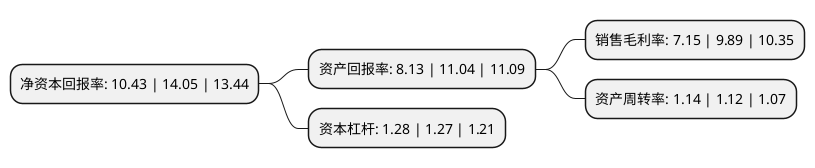

> 本页面由自动化程序生成于 2022年5月20日 01:13
> 内容可能存在错误，如有bug请提交issue至：https://github.com/Eroleice/doc-pi/issues
{.is-warning}

# 上市公司基本情况

## 基本资料

科力尔电机集团股份有限公司（以下简称“科力尔”）成立于2010年09月08日，永州市。于2017年08月17日在深交所中小板上市。

科力尔注册资本22,500.967万元，主要产品:单相罩极电机(含贯流风机)，串激电机，步进电机，直流无刷电机。主营业务:从事微特电机的开发，生产与销售。以下是详细信息：

- 公司名称: 科力尔电机集团股份有限公司
- 股票代码: 002892.SZ
- 所在地: 湖南 - 永州市
- 成立日期: 2010年09月08日
- 注册资本: 22,500.967万元
- 法定代表人: 聂鹏举
- 主营业务: 主要产品:单相罩极电机(含贯流风机)，串激电机，步进电机，直流无刷电机主营业务:从事微特电机的开发，生产与销售
- 公司官网: www.kelimotor.com
- 公司介绍: 公司是我国最大的微电机制造商和出口商之一，一直专注于微特电机的开发、生产与销售，同时以电机技术、材料技术、控制技术、微电子技术、电力电子技术、传感技术等为基础，依托优秀的设计研发能力和强大的生产制造能力，所生产的微特电机广泛应用在家用电器、办公自动化、安防监控、医疗器械、工业自动化与机器人等多个领域。公司主要产品包括单相罩极电机(含贯流风机)、串激电机、步进电机、直流无刷电机、伺服电机，产品远销美国，德国，意大利，西班牙，波兰，澳大利亚，土耳其，叙利亚等国家，与伊莱克斯，惠而浦，通用电气，Acelik，松下等全球知名家电品牌建立了稳定的合作关系。公司作为全球高端家电客户的微特电机供应商，一直高度重视产品品质的提升，先后通过了中国CCC认证、美国UL认证、德国VDE和TUV认证，以及ISO9001质量体系认证、ISO14001环境体系认证。同时，公司产品通过了诸多国际知名电器生产企业的产品检测及验证。

## 股东及高管情况

上市公司第一大股东为聂鹏举，持股58,364,460股，占比25.94%，**疑似为**上市公司实际控制人。

截至2022年03月31日，上市公司的前十大股东中，共有7名自然人股东，2名机构股东，1个产品账户，其中5%以上大股东共有2名。上市公司前十大股东明细如下：

> 未能通过持股比例判定出上市公司实际控制人（持股30%以上）
> 可能存在通过间接持股、联合持股、协议控制等方式拥有实际控制权的主体，具体请参考上市公司定期公告！
{.is-warning}

> 截至2022年03月31日，上市公司前十大股东信息如下：

| 股东名称 | 持股数量（股） | 持股比例 |
| --- | --- | --- |
| 聂鹏举 | 58,364,460 | 25.94% |
| 聂葆生 | 57,930,320 | 25.75% |
| 唐毅 | 5,086,000 | 2.26% |
| 李伟 | 2,407,900 | 1.07% |
| 深圳市瀚信资产管理有限公司-瀚信6号证券投资基金 | 1,915,400 | 0.85% |
| 毕永涛 | 1,904,760 | 0.85% |
| 国信证券股份有限公司 | 1,700,000 | 0.76% |
| 医美生物科技(海门)有限公司 | 1,582,800 | 0.7% |
| 刘文华 | 1,520,000 | 0.68% |
| 蒋鼎文 | 1,344,000 | 0.6% |

## 利润表分析

上市公司2021年总收入为14.34亿元，净利润为1.02亿元，实现盈利。

## 杜邦分析

> 数据列示周期：2021年 | 2020年 | 2019年
{.is-info}

上市公司的净资产收益率在近一年有所下降，下降幅度为-25.77%，其变化情况分解如下：
- 上市公司的销售毛利率在近一年下降了-27.7%，可能是生产效率的下降、商品原材料价格上涨或商品价格的下跌所致。
- 上市公司的资产周转率在近一年上升了1.79%，可能是源自于更快的销售回款或库存管理效果提升。
- 上市公司的财务杠杆比率在近一年上升了0.79%，可能是增加负债扩大生产规模。

