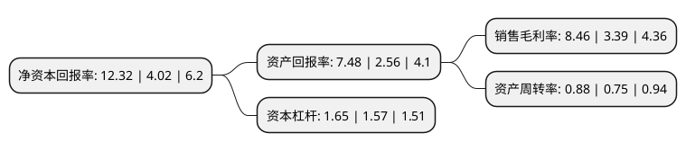

> 本页面由自动化程序生成于 2022年5月20日 01:13
> 内容可能存在错误，如有bug请提交issue至：https://github.com/Eroleice/doc-pi/issues
{.is-warning}

# 上市公司基本情况

## 基本资料

伊戈尔电气股份有限公司（以下简称“伊戈尔”）成立于1999年10月15日，佛山市。于2017年12月29日在深交所中小板上市。

伊戈尔注册资本29,632.046万元，主要产品:照明电源，工业控制用变压器，新能源用变压器等。主营业务:消费及工业领域用电源及电源组件产品的研发，生产及销售。以下是详细信息：

- 公司名称: 伊戈尔电气股份有限公司
- 股票代码: 002922.SZ
- 所在地: 广东 - 佛山市
- 成立日期: 1999年10月15日
- 注册资本: 29,632.046万元
- 法定代表人: 肖俊承
- 主营业务: 主要产品:照明电源，工业控制用变压器，新能源用变压器等主营业务:消费及工业领域用电源及电源组件产品的研发，生产及销售
- 公司官网: www.eaglerise.com
- 公司介绍: 公司是一家致力于向全球市场提供变压器产品、成套电源产品及变压器铁芯组件的专业供应商，专注于消费及工业领域用电源及电源组件产品的研发、生产及销售。公司产品可广泛应用于消费及工业领域的各类电子电器、电气设备，目前产品主要集中应用于节能、高效、前景广的照明、工业自动化及清洁能源行业。公司产品均为自主研发，以市场、客户需求为导向，开展技术研发和新产品开发，不断获得性能优异、成本较低的技术、工艺，并及时推出高附加值的新产品。目前公司拥有几十项专利，鉴于公司优秀的技术研发能力，被广东省科学技术厅、财政厅等单位认定为“高新技术企业”，被广东省经济和信息化委、财政厅认定为“省级企业技术中心”。同时，公司通过了ISO9001：2015质量管理体系认证，ISO14001：2015环境管理体系认证和IECQ QC080000：2012有害物质过程管理体系认证并根据产品销售区域的要求，相关产品分别通过多种国际、国内质量与安全认证，公司质量管理贯穿产品研发、原材料采购、生产、储存、运输全过程。

## 股东及高管情况

上市公司第一大股东为佛山市麦格斯投资有限公司，持股93,272,771股，占比31.477%，为上市公司实际控制人。

截至2022年05月10日，上市公司的前十大股东中，共有9名自然人股东，1名机构股东，其中5%以上大股东共有1名。上市公司前十大股东明细如下：

> 截至2022年05月10日，上市公司前十大股东信息如下：

| 股东名称 | 持股数量（股） | 持股比例 |
| --- | --- | --- |
| 佛山市麦格斯投资有限公司 | 93,272,771 | 31.477% |
| 王一龙 | 9,157,744 | 3.09% |
| 肖俊承 | 5,569,207 | 1.88% |
| 张泽学 | 4,039,000 | 1.36% |
| 郑红炎 | 3,114,528 | 1.05% |
| 田卫红 | 2,190,000 | 0.74% |
| 张铁镭 | 1,719,773 | 0.58% |
| 崔健 | 1,505,000 | 0.51% |
| 肖羽程 | 1,480,762 | 0.5% |
| 王美圆 | 1,436,360 | 0.48% |

## 利润表分析

上市公司2021年总收入为22.3亿元，净利润为1.88亿元，实现盈利。

## 杜邦分析

> 数据列示周期：2021年 | 2020年 | 2019年
{.is-info}

上市公司的净资产收益率在近一年有所上升，上升幅度为206.47%，其变化情况分解如下：
- 上市公司的销售毛利率在近一年上升了149.56%，可能是生产效率的提升、商品原材料价格下跌或商品价格的上涨所致。
- 上市公司的资产周转率在近一年上升了17.33%，可能是源自于更快的销售回款或库存管理效果提升。
- 上市公司的财务杠杆比率在近一年上升了5.1%，可能是增加负债扩大生产规模。

