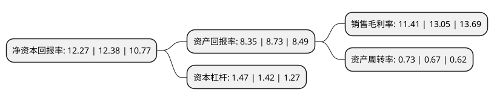

> 本页面由自动化程序生成于 2022年5月20日 01:13
> 内容可能存在错误，如有bug请提交issue至：https://github.com/Eroleice/doc-pi/issues
{.is-warning}

# 上市公司基本情况

## 基本资料

贵州泰永长征技术股份有限公司（以下简称“泰永长征”）成立于2008年11月07日，遵义市。于2018年02月23日在深交所中小板上市。

泰永长征注册资本22,335.56万元，主要产品:PC级双电源自动转换开关及CB级双电源自动转换开关产品，万能式断路器，塑料外壳式断路器系列低压配电电器元器件产品，小型断路器和浪涌保护器系列低压电器元器件产品，接触器，隔离开关及控制与保护开关电器产品。主营业务:从事低压断路器，双电源自动转换开关，工控自动化产品等低压电器元器件及其系统集成成套设备的研发，生产和销售。以下是详细信息：

- 公司名称: 贵州泰永长征技术股份有限公司
- 股票代码: 002927.SZ
- 所在地: 贵州 - 遵义市
- 成立日期: 2008年11月07日
- 注册资本: 22,335.56万元
- 法定代表人: 黄正乾
- 主营业务: 主要产品:PC级双电源自动转换开关及CB级双电源自动转换开关产品，万能式断路器，塑料外壳式断路器系列低压配电电器元器件产品，小型断路器和浪涌保护器系列低压电器元器件产品，接触器，隔离开关及控制与保护开关电器产品主营业务:从事低压断路器，双电源自动转换开关，工控自动化产品等低压电器元器件及其系统集成成套设备的研发，生产和销售
- 公司官网: www.tyt.net
- 公司介绍: 公司是中国低压电器行业的领军企业，是中国电器工业最具影响力品牌之一。公司成立至今一直从事低压断路器、双电源自动转换开关、工控自动化产品等低压电器元器件及其系统集成成套设备的研发、生产和销售，始终专注于国内低压电器行业的中高端市场。公司通过自主研发掌握了多项低压电器核心专利技术，能够提供多种完善的低压电器产品和解决方案，并一直致力于打造国内低压电器行业领先的民族品牌，在低压电器行业中高端市场中树立了良好的品牌形象。公司研发、生产及销售的低压断路器及双电源自动转换开关系列产品技术先进、品种齐全、规格全面，广泛应用于各类对配电可靠性和低压电器性能要求较高的领域，曾服务于中国移动数据中心、上海轨道交通、深圳证券交易中心等多个国家级、省市级重大项目。通过多年努力，公司获得了“数据中心优秀产品应用奖”、“十大电气创新产品”、第十届轨道交通与城市国家峰会“松睿奖”最佳轨道交通供电品牌奖等荣誉。

## 股东及高管情况

上市公司第一大股东为深圳市泰永科技股份有限公司，持股121,328,480股，占比54.32%，为上市公司实际控制人。

截至2022年03月31日，上市公司的前十大股东中，共有6名自然人股东，3名机构股东，1个产品账户，其中5%以上大股东共有2名。上市公司前十大股东明细如下：

> 截至2022年03月31日，上市公司前十大股东信息如下：

| 股东名称 | 持股数量（股） | 持股比例 |
| --- | --- | --- |
| 深圳市泰永科技股份有限公司 | 121,328,480 | 54.32% |
| 长园科技集团股份有限公司 | 21,816,179 | 9.77% |
| 泰安天裕企业管理咨询合伙企业(有限合伙) | 5,118,800 | 2.29% |
| 姚冲峰 | 645,014 | 0.29% |
| 中信银行股份有限公司-博时专精特新主题混合型证券投资基金 | 532,100 | 0.24% |
| 张鹏 | 531,000 | 0.24% |
| 阮寿国 | 516,600 | 0.23% |
| 吴云霞 | 464,838 | 0.21% |
| 石召兰 | 440,000 | 0.2% |
| 朱涵 | 421,600 | 0.19% |

## 利润表分析

上市公司2021年总收入为9.53亿元，净利润为1.08亿元，实现盈利。

## 杜邦分析

> 数据列示周期：2021年 | 2020年 | 2019年
{.is-info}

上市公司的净资产收益率在近一年有所下降，下降幅度为-0.89%，其变化情况分解如下：
- 上市公司的销售毛利率在近一年下降了-12.57%，可能是生产效率的下降、商品原材料价格上涨或商品价格的下跌所致。
- 上市公司的资产周转率在近一年上升了8.96%，可能是源自于更快的销售回款或库存管理效果提升。
- 上市公司的财务杠杆比率在近一年上升了3.52%，可能是增加负债扩大生产规模。

