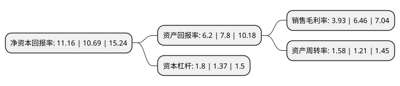

> 本页面由自动化程序生成于 2022年5月20日 01:13
> 内容可能存在错误，如有bug请提交issue至：https://github.com/Eroleice/doc-pi/issues
{.is-warning}

# 上市公司基本情况

## 基本资料

广东日丰电缆股份有限公司（以下简称“日丰股份”）成立于2009年12月17日，中山市。于2019年05月09日在深交所中小板上市。

日丰股份注册资本24,338.276万元，主要从事电气设备和特种装备配套电缆的研发，生产和销售，产品主要包括空调连接线组件，小家电配线组件，特种装备电缆和其他电缆四大类，并广泛应用于家用电器，机器人，风力发电，海洋工程，港口机械，建筑机械，造船业，电动工具，仪器仪表，汽车，照明，户外设备等领域。以下是详细信息：

- 公司名称: 广东日丰电缆股份有限公司
- 股票代码: 002953.SZ
- 所在地: 广东 - 中山市
- 成立日期: 2009年12月17日
- 注册资本: 24,338.276万元
- 法定代表人: 冯就景
- 主营业务: 主要从事电气设备和特种装备配套电缆的研发，生产和销售，产品主要包括空调连接线组件，小家电配线组件，特种装备电缆和其他电缆四大类，并广泛应用于家用电器，机器人，风力发电，海洋工程，港口机械，建筑机械，造船业，电动工具，仪器仪表，汽车，照明，户外设备等领域
- 公司官网: www.rfcable.com.cn
- 公司介绍: 公司成立于2009年12月17日，是一家自主研发并专业制造橡套类电线电缆的企业，主要从事电气设备和特种装备配套电缆的研发、生产和销售，产品主要包括空调连接线组件、小家电配线组件、特种装备电缆和其他电缆四大类，并广泛应用于家用电器、机器人、风力发电、海洋工程、港口机械、建筑机械、造船业、电动工具、仪器仪表、计算机通讯控制等领域。公司拥有先进的集成生产设备，覆盖众多种类电线电缆的生产制造需要。公司具备优秀研发团队。产品广泛应用于家用电器、电力工程、石油化工、冶金、建筑机械、通信工程、风力发电、环保工程、水坝路堤工程、仪器仪表、计算机通讯控制等领域，客户遍布国内外，获得了业内人士与客户的一致好评。

## 股东及高管情况

上市公司第一大股东为冯就景，持股147,228,059股，占比60.49%，为上市公司实际控制人。

截至2022年03月31日，上市公司的前十大股东中，共有8名自然人股东，2个产品账户，其中5%以上大股东共有1名。上市公司前十大股东明细如下：

> 截至2022年03月31日，上市公司前十大股东信息如下：

| 股东名称 | 持股数量（股） | 持股比例 |
| --- | --- | --- |
| 冯就景 | 147,228,059 | 60.49% |
| 李强 | 7,206,912 | 2.96% |
| 冯宇华 | 4,527,600 | 1.86% |
| 罗永文 | 4,345,426 | 1.79% |
| 王雪茜 | 3,990,266 | 1.64% |
| 孟兆滨 | 2,733,777 | 1.12% |
| 李泳娟 | 1,002,791 | 0.41% |
| 阳光资产-工商银行-主动量化1号资产管理产品 | 851,980 | 0.35% |
| 郭士尧 | 835,658 | 0.34% |
| 中国农业银行股份有限公司-天弘先进制造混合型证券投资基金 | 740,200 | 0.3% |

## 利润表分析

上市公司2021年总收入为32.16亿元，净利润为1.26亿元，实现盈利。

## 杜邦分析

> 数据列示周期：2021年 | 2020年 | 2019年
{.is-info}

上市公司的净资产收益率在近一年有所上升，上升幅度为4.4%，其变化情况分解如下：
- 上市公司的销售毛利率在近一年下降了-39.16%，可能是生产效率的下降、商品原材料价格上涨或商品价格的下跌所致。
- 上市公司的资产周转率在近一年上升了30.58%，可能是源自于更快的销售回款或库存管理效果提升。
- 上市公司的财务杠杆比率在近一年上升了31.39%，可能是增加负债扩大生产规模。

