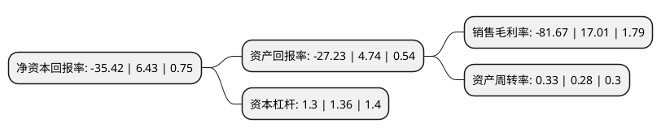

> 本页面由自动化程序生成于 2022年5月20日 01:14
> 内容可能存在错误，如有bug请提交issue至：https://github.com/Eroleice/doc-pi/issues
{.is-warning}

# 上市公司基本情况

## 基本资料

南方风机股份有限公司（以下简称“南风股份”）成立于1999年05月24日，佛山市。于2009年10月30日在深交所创业板上市。

南风股份注册资本47,999.36万元，通风与空气处理系统设计和产品开发，制造与销售以下是详细信息：

- 公司名称: 南方风机股份有限公司
- 股票代码: 300004.SZ
- 所在地: 广东 - 佛山市
- 成立日期: 1999年05月24日
- 注册资本: 47,999.36万元
- 法定代表人: 谭汉强
- 主营业务: 通风与空气处理系统设计和产品开发，制造与销售
- 公司官网: www.ntfan.com
- 公司介绍: 公司一直以来的发展战略目标是立足于通风与空气处理行业，通过对现有产品的技术升级、核心市场深度挖掘、高端市场重点拓展，以及积极参与新材料、新工艺等新兴技术和产业，并择机涉足高端能源装备制造业其他子领域，拓展产业链，努力打造技术一流、产品一流、服务一流的高端装备制造商和综合服务商。控股子公司南方增材自主研发了重型金属构件短流程、绿色、精密、数字化制造新技术—重型金属3D打印技术，并已就该技术与上海核工程研究设计院、中国核动力研究设计院、中广核核电运营有限公司、中国石油天然气集团公司管材研究所等开展技术合作，并实现了重型金属3D打印技术在核电领域的国内首例工程应用；2014年，公司完成了收购中兴装备100%股权事宜，形成了通风与空气处理系统集成业务、能源工程特种管件业务、重型金属3D打印业务协同互补、共同发展的业务模式。

## 股东及高管情况

上市公司第一大股东为广东南海控股投资有限公司，持股123,426,733股，占比25.71%，**疑似为**上市公司实际控制人。

截至2022年03月31日，上市公司的前十大股东中，共有8名自然人股东，2名机构股东，其中5%以上大股东共有5名。上市公司前十大股东明细如下：

> 未能通过持股比例判定出上市公司实际控制人（持股30%以上）
> 可能存在通过间接持股、联合持股、协议控制等方式拥有实际控制权的主体，具体请参考上市公司定期公告！
{.is-warning}

> 截至2022年03月31日，上市公司前十大股东信息如下：

| 股东名称 | 持股数量（股） | 持股比例 |
| --- | --- | --- |
| 广东南海控股投资有限公司 | 123,426,733 | 25.71% |
| 广东南海控股集团有限公司 | 123,426,733 | 25.71% |
| 仇云龙 | 28,316,235 | 5.9% |
| 仇云龙 | 28,316,235 | 5.9% |
| 杨泽文 | 26,133,332 | 5.44% |
| 易华明 | 8,890,800 | 1.85% |
| 刘镇华 | 4,702,358 | 0.98% |
| 陈文健 | 4,060,000 | 0.85% |
| 廖萱 | 3,674,400 | 0.77% |
| 黎健锋 | 3,441,843 | 0.72% |

## 利润表分析

上市公司2021年总收入为8.42亿元，净利润为-6.88亿元，**未实现盈利**。

## 杜邦分析

> 数据列示周期：2021年 | 2020年 | 2019年
{.is-info}

上市公司的净资产收益率在近一年有所下降，下降幅度为-650.86%，其变化情况分解如下：
- 上市公司的销售毛利率在近一年下降了-580.13%，可能是生产效率的下降、商品原材料价格上涨或商品价格的下跌所致。
- 上市公司的资产周转率在近一年上升了17.86%，可能是源自于更快的销售回款或库存管理效果提升。
- 上市公司的财务杠杆比率在近一年下降了-4.41%，可能是减少负债降低财务费用。

