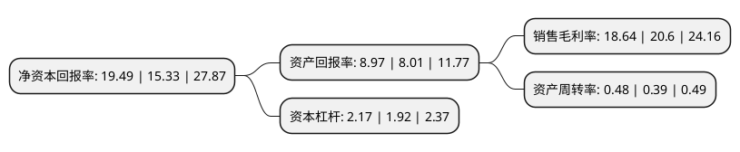

> 本页面由自动化程序生成于 2022年5月20日 01:14
> 内容可能存在错误，如有bug请提交issue至：https://github.com/Eroleice/doc-pi/issues
{.is-warning}

# 上市公司基本情况

## 基本资料

惠州亿纬锂能股份有限公司（以下简称“亿纬锂能”）成立于2001年12月24日，惠州市。于2009年10月30日在深交所创业板上市。

亿纬锂能注册资本189,878.867万元，主营业务:锂原电池和锂离子电池的研发，生产，销售，也以客户需求为导向提供锂电池相关的配套产品和服务。以下是详细信息：

- 公司名称: 惠州亿纬锂能股份有限公司
- 股票代码: 300014.SZ
- 所在地: 广东 - 惠州市
- 成立日期: 2001年12月24日
- 注册资本: 189,878.867万元
- 法定代表人: 刘金成
- 主营业务: 主营业务:锂原电池和锂离子电池的研发，生产，销售，也以客户需求为导向提供锂电池相关的配套产品和服务
- 公司官网: www.evebattery.com
- 公司介绍: 公司是国家级高新技术企业，专注于锂电池的创新发展。经过多年的努力，公司锂亚电池居世界前列，锂原电池居国内领先地位。公司主营业务是锂原电池和锂离子电池的研发、生产、销售，也以客户需求为导向提供锂电池相关的配套产品和服务。近几年，公司聚焦动力、储能市场领域，采用高度自动化与信息化的生产方式，为客户提供一流产品和服务，已形成锂原电池、锂离子电池、电源系统等核心业务，产品覆盖智能电网、智能交通、智能安防，储能，新能源汽车，特种行业等市场。公司以“做世界上最好的锂电池，成为行业领先企业”为愿景，以市场为导向，以世界先进的技术与自动化的生产方式，致力于为社会提供高可靠性的锂电池，同时不断追求卓越，专注创新，致力于打造一流“智慧互联能源”方案提供商。

## 股东及高管情况

上市公司第一大股东为西藏亿纬控股有限公司，持股607,407,917股，占比31.99%，为上市公司实际控制人。

截至2022年03月31日，上市公司的前十大股东中，共有3名自然人股东，1名机构股东，5个产品账户，1个海外主体，其中5%以上大股东共有2名。上市公司前十大股东明细如下：

> 截至2022年03月31日，上市公司前十大股东信息如下：

| 股东名称 | 持股数量（股） | 持股比例 |
| --- | --- | --- |
| 西藏亿纬控股有限公司 | 607,407,917 | 31.99% |
| 香港中央结算有限公司(陆股通) | 117,736,452 | 6.2% |
| 刘金成 | 45,659,434 | 2.4% |
| 汇安基金-华能信托·博远惠诚集合资金信托计划-汇安基金-汇鑫32号单一资产管理计划 | 30,156,662 | 1.59% |
| 中国建设银行股份有限公司-前海开源公用事业行业股票型证券投资基金 | 20,716,112 | 1.09% |
| 中国工商银行股份有限公司-中欧价值智选回报混合型证券投资基金 | 19,999,959 | 1.05% |
| 刘建华 | 19,575,893 | 1.03% |
| 骆锦红 | 19,106,588 | 1.01% |
| 中国建设银行股份有限公司-广发科技先锋混合型证券投资基金 | 14,164,776 | 0.75% |
| 中国工商银行股份有限公司-广发双擎升级混合型证券投资基金 | 13,163,912 | 0.69% |

## 利润表分析

上市公司2021年总收入为168.99亿元，净利润为31.49亿元，实现盈利。

## 杜邦分析

> 数据列示周期：2021年 | 2020年 | 2019年
{.is-info}

上市公司的净资产收益率在近一年有所上升，上升幅度为27.14%，其变化情况分解如下：
- 上市公司的销售毛利率在近一年下降了-9.51%，可能是生产效率的下降、商品原材料价格上涨或商品价格的下跌所致。
- 上市公司的资产周转率在近一年上升了23.08%，可能是源自于更快的销售回款或库存管理效果提升。
- 上市公司的财务杠杆比率在近一年上升了13.02%，可能是增加负债扩大生产规模。

