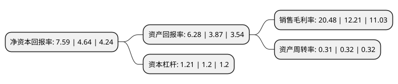

> 本页面由自动化程序生成于 2022年5月20日 01:14
> 内容可能存在错误，如有bug请提交issue至：https://github.com/Eroleice/doc-pi/issues
{.is-warning}

# 上市公司基本情况

## 基本资料

武汉中元华电科技股份有限公司（以下简称“中元股份”）成立于2001年11月16日，武汉市。于2009年10月30日在深交所创业板上市。

中元股份注册资本48,083.154万元，主营业务:智能电网及医疗健康。以下是详细信息：

- 公司名称: 武汉中元华电科技股份有限公司
- 股票代码: 300018.SZ
- 所在地: 湖北 - 武汉市
- 成立日期: 2001年11月16日
- 注册资本: 48,083.154万元
- 法定代表人: 王永业
- 主营业务: 主营业务:智能电网及医疗健康
- 公司官网: www.zyhd.com.cn
- 公司介绍: 公司是一家专注于智能电网、医疗健康业务和产业投资的高新技术企业，拥有以院士领衔、博士为核心的产品研发队伍，设有湖北省认定的企业技术中心、院士工作站，参与多项国家、行业和企业标准的起草。智能电网方面，公司围绕智能变电站、智能配网提供产品和服务，主要产品广泛应用于长江三峡水利枢纽工程、1000kV交流/±800kV直流特高压工程及核电站等国家重点项目以及电力系统各级用户。医疗健康方面，公司以医疗信息化及临床体外诊断相关产品及服务为基础，提供数字化医院、健康城市、个人健康医疗信息化和医疗检验设备、体外诊断试剂等产品和服务，打造完整的医疗信息化整体解决方案和临床诊断实验室解决方案。经过多年努力，公司荣获“武汉市守合同重信用企业”、“湖北省支柱产业细分领域隐形冠军培育企业”、“第十届湖北省专利奖优秀奖”等荣誉。

## 股东及高管情况

上市公司第一大股东为邓志刚，持股25,870,000股，占比5.38%，**疑似为**上市公司实际控制人。

截至2022年03月31日，上市公司的前十大股东中，共有10名自然人股东，其中5%以上大股东共有1名。上市公司前十大股东明细如下：

> 未能通过持股比例判定出上市公司实际控制人（持股30%以上）
> 可能存在通过间接持股、联合持股、协议控制等方式拥有实际控制权的主体，具体请参考上市公司定期公告！
{.is-warning}

> 上市公司第一大股东持股不超过10%，请检查是否存在公司控制权风险！
{.is-danger}

> 截至2022年03月31日，上市公司前十大股东信息如下：

| 股东名称 | 持股数量（股） | 持股比例 |
| --- | --- | --- |
| 邓志刚 | 25,870,000 | 5.38% |
| 王永业 | 23,677,300 | 4.92% |
| 张小波 | 23,350,350 | 4.86% |
| 刘屹 | 15,559,300 | 3.24% |
| 卢春明 | 11,015,000 | 2.29% |
| 潘小任 | 10,080,000 | 2.1% |
| 尹健 | 8,532,900 | 1.77% |
| 尹力光 | 7,178,000 | 1.49% |
| 陆秋燕 | 6,067,100 | 1.26% |
| 傅多 | 4,700,900 | 0.98% |

## 利润表分析

上市公司2021年总收入为4.2亿元，净利润为0.86亿元，实现盈利。

## 杜邦分析

> 数据列示周期：2021年 | 2020年 | 2019年
{.is-info}

上市公司的净资产收益率在近一年有所上升，上升幅度为63.58%，其变化情况分解如下：
- 上市公司的销售毛利率在近一年上升了67.73%，可能是生产效率的提升、商品原材料价格下跌或商品价格的上涨所致。
- 上市公司的资产周转率在近一年下降了-3.12%，可能是源自于更慢的销售回款或库存管理效果下降。
- 上市公司的财务杠杆比率在近一年上升了0.83%，可能是增加负债扩大生产规模。

