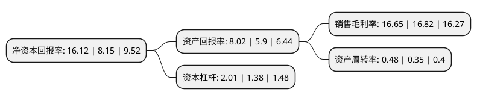

> 本页面由自动化程序生成于 2022年5月20日 01:14
> 内容可能存在错误，如有bug请提交issue至：https://github.com/Eroleice/doc-pi/issues
{.is-warning}

# 上市公司基本情况

## 基本资料

湖南中科电气股份有限公司（以下简称“中科电气”）成立于2004年04月06日，岳阳市。于2009年12月25日在深交所创业板上市。

中科电气注册资本64,236.582万元，主要产品及提供的劳务:连铸电磁搅拌成套系统(EMS)相关产品的生产，销售及相关咨询之有效的组织架构和管理架构。以下是详细信息：

- 公司名称: 湖南中科电气股份有限公司
- 股票代码: 300035.SZ
- 所在地: 湖南 - 岳阳市
- 成立日期: 2004年04月06日
- 注册资本: 64,236.582万元
- 法定代表人: 余新
- 主营业务: 主要产品及提供的劳务:连铸电磁搅拌成套系统(EMS)相关产品的生产，销售及相关咨询之有效的组织架构和管理架构
- 公司官网: www.cseco.cn
- 公司介绍: 公司是国内电磁行业上市公司，是国内电磁冶金行业品牌企业；是致力于电磁冶金整体解决方案、现代物联网整体解决方案、节能减耗整体解决方案的研发和创新，集现代制造和现代服务于一体的高新技术企业和软件企业。公司磁力装备业务涵盖电磁冶金专用设备、工业磁力设备以及锂电专用设备的研发、制造、销售及服务。主要产品为中间包通道式感应加热与精炼系统、连铸电磁搅拌(EMS)成套系统、连轧电磁感应加热系统、起重磁力设备、除铁器、磁选机、卷筒、锂电自动化电气控制设备、锂电负极材料磁分离器成套设备、锂电正极材料磁分离器成套设备等，产品可广泛应用于钢铁、交通运输、造船、机械、矿山、锂电等行业。公司秉承“创新发展、追求卓越”的经营理念，始终把科技创新作为企业可持续发展的核心动力，把握行业发展趋势，研发了一批具有国际先进水平的，打破国外技术封锁和市场垄断乃至引领行业技术发展的新产品、新技术。

## 股东及高管情况

上市公司第一大股东为余新，持股80,613,000股，占比11.14%，**疑似为**上市公司实际控制人。

截至2022年03月31日，上市公司的前十大股东中，共有2名自然人股东，2名机构股东，6个产品账户，其中5%以上大股东共有1名。上市公司前十大股东明细如下：

> 未能通过持股比例判定出上市公司实际控制人（持股30%以上）
> 可能存在通过间接持股、联合持股、协议控制等方式拥有实际控制权的主体，具体请参考上市公司定期公告！
{.is-warning}

> 截至2022年03月31日，上市公司前十大股东信息如下：

| 股东名称 | 持股数量（股） | 持股比例 |
| --- | --- | --- |
| 余新 | 80,613,000 | 11.14% |
| 中国建设银行股份有限公司-前海开源公用事业行业股票型证券投资基金 | 21,084,802 | 2.91% |
| 深圳前海凯博资本管理有限公司 | 20,984,251 | 2.9% |
| 李爱武 | 18,717,498 | 2.59% |
| 成都先进制造产业投资有限公司-成都产投先进制造产业股权投资基金合伙企业(有限合伙) | 18,382,352 | 2.54% |
| 中国邮政储蓄银行股份有限公司-东方新能源汽车主题混合型证券投资基金 | 13,709,368 | 1.89% |
| 北京金融街资本运营集团有限公司 | 11,029,411 | 1.52% |
| 中国工商银行股份有限公司-前海开源新经济灵活配置混合型证券投资基金 | 10,958,000 | 1.51% |
| 中国建设银行股份有限公司-信达澳银新能源产业股票型证券投资基金 | 9,451,226 | 1.31% |
| 招商银行股份有限公司-东方阿尔法优势产业混合型发起式证券投资基金 | 9,294,900 | 1.28% |

## 利润表分析

上市公司2021年总收入为21.93亿元，净利润为3.65亿元，实现盈利。

## 杜邦分析

> 数据列示周期：2021年 | 2020年 | 2019年
{.is-info}

上市公司的净资产收益率在近一年有所上升，上升幅度为97.79%，其变化情况分解如下：
- 上市公司的销售毛利率在近一年下降了-1.01%，可能是生产效率的下降、商品原材料价格上涨或商品价格的下跌所致。
- 上市公司的资产周转率在近一年上升了37.14%，可能是源自于更快的销售回款或库存管理效果提升。
- 上市公司的财务杠杆比率在近一年上升了45.65%，可能是增加负债扩大生产规模。

