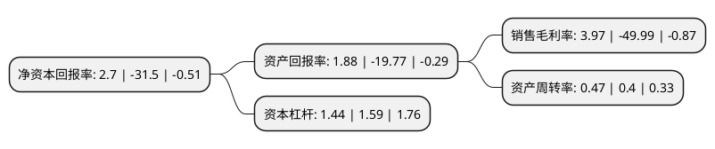

> 本页面由自动化程序生成于 2022年5月20日 01:14
> 内容可能存在错误，如有bug请提交issue至：https://github.com/Eroleice/doc-pi/issues
{.is-warning}

# 上市公司基本情况

## 基本资料

北京合康新能科技股份有限公司（以下简称“合康新能”）成立于2003年06月11日，北京市。于2010年01月20日在深交所创业板上市。

合康新能注册资本110,220.136万元，主营业务:高，中低压及防爆变频器在内的全系列变频器产品，伺服产品，新能源汽车及相关产品的研发，生产和销售。以下是详细信息：

- 公司名称: 北京合康新能科技股份有限公司
- 股票代码: 300048.SZ
- 所在地: 北京 - 北京市
- 成立日期: 2003年06月11日
- 注册资本: 110,220.136万元
- 法定代表人: 伏拥军
- 主营业务: 主营业务:高，中低压及防爆变频器在内的全系列变频器产品，伺服产品，新能源汽车及相关产品的研发，生产和销售
- 公司官网: www.hiconics.com
- 公司介绍: 公司是一家专业从事工业自动化控制和新能源装备的高新技术企业，高压变频器国家标准的主要参与制定与支持单位之一。经过多年发展公司主营业务已经从工业自动化节能设备制造领域进行延伸，形成了主要的三大业务板块：节能设备高端制造业、节能环保项目建设及运营产业、新能源汽车总成配套及运营产业。公司主营业务包括高、中低压及防爆变频器在内的全系列变频器产品、伺服产品、新能源汽车及相关产品的研发、生产和销售，产品广泛应用于火力发电、冶金、采油采矿、化工、城市供水、水泥、造纸、制药等领域，可实现对各类高压电动机驱动的风机、水泵、空气压缩机等负载的调速、节能、软启动和智能控制，综合效益十分显著。公司生产的合康HIVERT变频器已有良好的运行业绩，在产品质量和服务方面深受用户好评，并在诸多应用领域处国内领先地位。

## 股东及高管情况

上市公司第一大股东为广东美的暖通设备有限公司，持股208,685,418股，占比18.93%，**疑似为**上市公司实际控制人。

截至2022年03月31日，上市公司的前十大股东中，共有8名自然人股东，2名机构股东，其中5%以上大股东共有1名。上市公司前十大股东明细如下：

> 未能通过持股比例判定出上市公司实际控制人（持股30%以上）
> 可能存在通过间接持股、联合持股、协议控制等方式拥有实际控制权的主体，具体请参考上市公司定期公告！
{.is-warning}

> 截至2022年03月31日，上市公司前十大股东信息如下：

| 股东名称 | 持股数量（股） | 持股比例 |
| --- | --- | --- |
| 广东美的暖通设备有限公司 | 208,685,418 | 18.93% |
| 上海上丰集团有限公司 | 34,814,755 | 3.16% |
| 张燕南 | 25,200,000 | 2.29% |
| 何天涛 | 19,571,017 | 1.78% |
| 胡培红 | 11,000,003 | 1% |
| 文忠泽 | 9,575,600 | 0.87% |
| 李苹 | 8,704,000 | 0.79% |
| 叶进吾 | 7,908,975 | 0.72% |
| 罗桥胜 | 6,696,812 | 0.61% |
| 何天毅 | 6,251,107 | 0.57% |

## 利润表分析

上市公司2021年总收入为12.04亿元，净利润为0.47亿元，实现盈利。

## 杜邦分析

> 数据列示周期：2021年 | 2020年 | 2019年
{.is-info}

上市公司的净资产收益率在近一年有所下降，下降幅度为-108.57%，其变化情况分解如下：
- 上市公司的销售毛利率在近一年下降了-107.94%，可能是生产效率的下降、商品原材料价格上涨或商品价格的下跌所致。
- 上市公司的资产周转率在近一年上升了17.5%，可能是源自于更快的销售回款或库存管理效果提升。
- 上市公司的财务杠杆比率在近一年下降了-9.43%，可能是减少负债降低财务费用。

