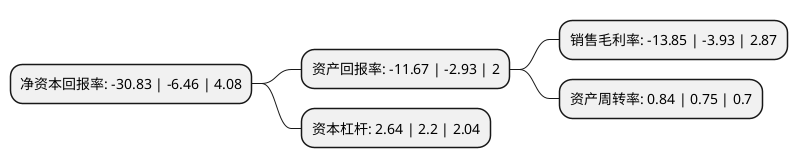

> 本页面由自动化程序生成于 2022年5月20日 01:14
> 内容可能存在错误，如有bug请提交issue至：https://github.com/Eroleice/doc-pi/issues
{.is-warning}

# 上市公司基本情况

## 基本资料

浙江南都电源动力股份有限公司（以下简称“南都电源”）成立于1997年12月08日，杭州市。于2010年04月21日在深交所创业板上市。

南都电源注册资本85,709.897万元，主要业务:通信及数据，智慧储能，新能源动力全系列产品和系统的研发，制造，销售，服务及环保型资源再生。以下是详细信息：

- 公司名称: 浙江南都电源动力股份有限公司
- 股票代码: 300068.SZ
- 所在地: 浙江 - 杭州市
- 成立日期: 1997年12月08日
- 注册资本: 85,709.897万元
- 法定代表人: 王海光
- 主营业务: 通信及数据，智慧储能，新能源动力全系列产品和系统的研发，制造，销售，服务及环保型资源再生
- 公司官网: www.naradapower.com
- 公司介绍: 公司是国家高新技术企业，一直专注于高端工业电池及新能源领域。公司提供以先进阀控密封电池、锂离子电池、燃料电池为核心的系统化产品、解决方案及运营服务，主营业务包含通信及数据、智慧储能、新能源动力全系列产品和系统的研发、制造、销售、服务及环保型资源再生，已形成“原材料－产品应用－系统解决方案－运营服务－资源再生－原材料”的全封闭产业链，并成为储能及资源再生等多个领域的领导者。目前公司已建有国家企业技术中心、国家认可实验室、国家级博士后科研工作站、院士专家工作站等，配备了国际最先进的研发试验和综合测试设备，拥有以院士为首，国内外教授、专家作为技术带头人的具有丰富理论与实践经验的研发团队。“Narada南都”为浙江省著名商标及浙江省出口名牌，在国内同行中享有较高的知名度和美誉度，是国内同行中海外市场知名度最高的企业。公司在成为中国市场通信电源主要供应商的同时，产品远销欧美、东南亚、非洲等几十个国家和地区。

## 股东及高管情况

上市公司第一大股东为杭州南都电源有限公司，持股119,016,340股，占比13.76%，**疑似为**上市公司实际控制人。

截至2022年03月31日，上市公司的前十大股东中，共有1名自然人股东，5名机构股东，4个产品账户，其中5%以上大股东共有1名。上市公司前十大股东明细如下：

> 未能通过持股比例判定出上市公司实际控制人（持股30%以上）
> 可能存在通过间接持股、联合持股、协议控制等方式拥有实际控制权的主体，具体请参考上市公司定期公告！
{.is-warning}

> 截至2022年03月31日，上市公司前十大股东信息如下：

| 股东名称 | 持股数量（股） | 持股比例 |
| --- | --- | --- |
| 杭州南都电源有限公司 | 119,016,340 | 13.76% |
| 朱保义 | 35,360,893 | 4.09% |
| 上海益都实业有限公司 | 26,289,500 | 3.04% |
| 中国工商银行股份有限公司-易方达新经济灵活配置混合型证券投资基金 | 18,006,448 | 2.08% |
| 海通证券股份有限公司 | 17,141,000 | 1.98% |
| 上海浦东发展银行股份有限公司-易方达创新未来18个月封闭运作混合型证券投资基金 | 16,280,276 | 1.88% |
| 宁波中金富盈股权投资合伙企业(有限合伙) | 14,570,128 | 1.68% |
| 中国工商银行股份有限公司-易方达科翔混合型证券投资基金 | 12,659,300 | 1.46% |
| 中国银行股份有限公司-易方达均衡成长股票型证券投资基金 | 11,215,385 | 1.3% |
| 上海南都集团有限公司 | 9,740,089 | 1.13% |

## 利润表分析

上市公司2021年总收入为118.47亿元，净利润为-16.41亿元，**未实现盈利**。

## 杜邦分析

> 数据列示周期：2021年 | 2020年 | 2019年
{.is-info}

上市公司的净资产收益率在近一年有所上升，上升幅度为377.24%，其变化情况分解如下：
- 上市公司的销售毛利率在近一年上升了252.42%，可能是生产效率的提升、商品原材料价格下跌或商品价格的上涨所致。
- 上市公司的资产周转率在近一年上升了12%，可能是源自于更快的销售回款或库存管理效果提升。
- 上市公司的财务杠杆比率在近一年上升了20%，可能是增加负债扩大生产规模。

