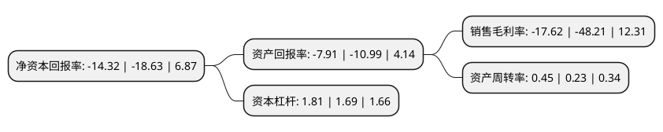

> 本页面由自动化程序生成于 2022年5月20日 01:14
> 内容可能存在错误，如有bug请提交issue至：https://github.com/Eroleice/doc-pi/issues
{.is-warning}

# 上市公司基本情况

## 基本资料

金利华电气股份有限公司（以下简称“金利华电”）成立于2003年04月15日，长治市。于2010年04月21日在深交所创业板上市。

金利华电注册资本11,700万元，主要产品:高压，超高压和特高压交，直流输电线路上用于绝缘和悬挂导线用的玻璃绝缘子及陶瓷绝缘子。主营业务:高压，超高压和特高压交，直流输变电线路上用于绝缘和悬挂导线的玻璃绝缘子的研发，生产，销售和相关技术服务。以下是详细信息：

- 公司名称: 金利华电气股份有限公司
- 股票代码: 300069.SZ
- 所在地: 山西 - 长治市
- 成立日期: 2003年04月15日
- 注册资本: 11,700万元
- 法定代表人: 韩泽帅
- 主营业务: 主要产品:高压，超高压和特高压交，直流输电线路上用于绝缘和悬挂导线用的玻璃绝缘子及陶瓷绝缘子主营业务:高压，超高压和特高压交，直流输变电线路上用于绝缘和悬挂导线的玻璃绝缘子的研发，生产，销售和相关技术服务
- 公司官网: www.jlhdq.com
- 公司介绍: 公司是国内少数拥有成熟的交、直流特高压玻璃绝缘子生产技术的厂商之一。自成立以来，公司专注于新型高强度功能玻璃制造技术的研究和特高压输变电绝缘器材开发，主营业务为高压、超高压和特高压交、直流输变电线路上用于绝缘和悬挂导线的玻璃绝缘子的研发、生产、销售和相关技术服务。主要产品为高压、超高压和特高压交、直流输电线路上用于绝缘和悬挂导线用的盘型悬式高强度玻璃绝缘子。公司通过持续的技术创新，逐步在玻璃绝缘材料制造、玻璃绝缘子产品制造和玻璃绝缘子工业外观设计领域内形成了核心专有技术,取得多项实用新型和外观设计专利。经过多年努力，公司被评为“新材料制造技术领域内的高新技术企业”、“国家火炬计划项目”、“国家重点新产品”等荣誉。同时，公司依据ISO9001质量体系标准，建有一套完善的质量管理体系，对产品设计开发、生产、销售和服务实施全过程的标准化管理和控制。

## 股东及高管情况

上市公司第一大股东为山西红太阳旅游开发有限公司，持股17,570,818股，占比15.02%，**疑似为**上市公司实际控制人。

截至2022年03月31日，上市公司的前十大股东中，共有8名自然人股东，2名机构股东，其中5%以上大股东共有3名。上市公司前十大股东明细如下：

> 未能通过持股比例判定出上市公司实际控制人（持股30%以上）
> 可能存在通过间接持股、联合持股、协议控制等方式拥有实际控制权的主体，具体请参考上市公司定期公告！
{.is-warning}

> 截至2022年03月31日，上市公司前十大股东信息如下：

| 股东名称 | 持股数量（股） | 持股比例 |
| --- | --- | --- |
| 山西红太阳旅游开发有限公司 | 17,570,818 | 15.02% |
| 北京白泽长瑞企业管理中心(有限合伙) | 16,590,100 | 14.18% |
| 赵坚 | 16,401,619 | 14.02% |
| 何杨海 | 3,205,045 | 2.74% |
| 吴玉龙 | 2,110,200 | 1.8% |
| 吴佳健 | 1,790,000 | 1.53% |
| 王克飞 | 1,692,100 | 1.45% |
| 王海波 | 1,172,500 | 1% |
| 张兆龙 | 1,095,800 | 0.94% |
| 何英姿 | 1,075,200 | 0.92% |

## 利润表分析

上市公司2021年总收入为2.29亿元，净利润为-0.41亿元，**未实现盈利**。

## 杜邦分析

> 数据列示周期：2021年 | 2020年 | 2019年
{.is-info}

上市公司的净资产收益率在近一年有所下降，下降幅度为-23.13%，其变化情况分解如下：
- 上市公司的销售毛利率在近一年下降了-63.45%，可能是生产效率的下降、商品原材料价格上涨或商品价格的下跌所致。
- 上市公司的资产周转率在近一年上升了95.65%，可能是源自于更快的销售回款或库存管理效果提升。
- 上市公司的财务杠杆比率在近一年上升了7.1%，可能是增加负债扩大生产规模。

