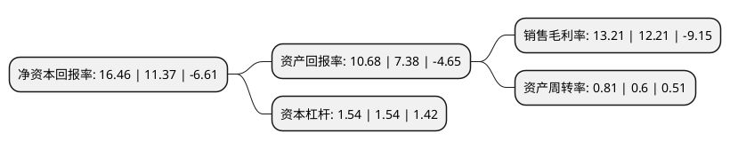

> 本页面由自动化程序生成于 2022年5月20日 01:14
> 内容可能存在错误，如有bug请提交issue至：https://github.com/Eroleice/doc-pi/issues
{.is-warning}

# 上市公司基本情况

## 基本资料

北京当升材料科技股份有限公司（以下简称“当升科技”）成立于1998年06月03日，北京市。于2010年04月27日在深交所创业板上市。

当升科技注册资本50,650.077万元，本公司的主营业务属于新能源材料领域，主要从事钴酸锂，多元材料及锰酸锂等小型锂电，动力锂电正极材料的研发，生产和销售业务。公司主要产品是小型锂电，动力锂电正极材料，包括钴酸锂，多元材料，锰酸锂三个系列。以下是详细信息：

- 公司名称: 北京当升材料科技股份有限公司
- 股票代码: 300073.SZ
- 所在地: 北京 - 北京市
- 成立日期: 1998年06月03日
- 注册资本: 50,650.077万元
- 法定代表人: 陈彦彬
- 主营业务: 本公司的主营业务属于新能源材料领域，主要从事钴酸锂，多元材料及锰酸锂等小型锂电，动力锂电正极材料的研发，生产和销售业务公司主要产品是小型锂电，动力锂电正极材料，包括钴酸锂，多元材料，锰酸锂三个系列
- 公司官网: www.easpring.com.cn
- 公司介绍: 公司是一家新能源材料研发和生产的北京市高新技术企业，国内锂电正极材料的龙头企业，主要从事钴酸锂、多元材料及锰酸锂等小型锂电、动力锂电正极材料的研发、生产和销售。公司在湿法和火法两项技术方面的集成创新能力使得公司成为国内外少数几家能快速推出系列化多元材料的公司之一，部分锂电正极材料产品的质量达到了国际先进水平。公司是国内率先出口锂电正极材料的供应商，国际前6大锂电巨头中拥有5家客户，包括三星SDI、LG化学、三洋能源、深圳比克和比亚迪等。此外，在电子陶瓷业，氧化钴、氧化铋的市场份额连续多年在国内居于领先地位。

## 股东及高管情况

上市公司第一大股东为矿冶科技集团有限公司，持股117,437,261股，占比23.19%，**疑似为**上市公司实际控制人。

截至2022年03月31日，上市公司的前十大股东中，共有4名机构股东，5个产品账户，1个海外主体，其中5%以上大股东共有2名。上市公司前十大股东明细如下：

> 未能通过持股比例判定出上市公司实际控制人（持股30%以上）
> 可能存在通过间接持股、联合持股、协议控制等方式拥有实际控制权的主体，具体请参考上市公司定期公告！
{.is-warning}

> 截至2022年03月31日，上市公司前十大股东信息如下：

| 股东名称 | 持股数量（股） | 持股比例 |
| --- | --- | --- |
| 矿冶科技集团有限公司 | 117,437,261 | 23.19% |
| 香港中央结算有限公司(陆股通) | 46,287,237 | 9.14% |
| 国新投资有限公司 | 21,774,478 | 4.3% |
| 中国工商银行股份有限公司-农银汇理新能源主题灵活配置混合型证券投资基金 | 20,745,707 | 4.1% |
| 中国建设银行股份有限公司-华夏能源革新股票型证券投资基金 | 19,102,954 | 3.77% |
| 中国邮政储蓄银行股份有限公司-东方新能源汽车主题混合型证券投资基金 | 7,978,311 | 1.58% |
| 太平人寿保险有限公司-传统-普通保险产品-022L-CT001深 | 4,557,064 | 0.9% |
| 中国银行股份有限公司-信诚新兴产业混合型证券投资基金 | 4,342,659 | 0.86% |
| 华夏人寿保险股份有限公司-自有资金 | 3,994,194 | 0.79% |
| 嘉兴聚力展业伍号股权投资合伙企业(有限合伙) | 3,529,143 | 0.7% |

## 利润表分析

上市公司2021年总收入为82.57亿元，净利润为10.9亿元，实现盈利。

## 杜邦分析

> 数据列示周期：2021年 | 2020年 | 2019年
{.is-info}

上市公司的净资产收益率在近一年有所上升，上升幅度为44.77%，其变化情况分解如下：
- 上市公司的销售毛利率在近一年上升了8.19%，可能是生产效率的提升、商品原材料价格下跌或商品价格的上涨所致。
- 上市公司的资产周转率在近一年上升了35%，可能是源自于更快的销售回款或库存管理效果提升。
- 上市公司的财务杠杆比率在近一年下降了0%，可能是减少负债降低财务费用。

