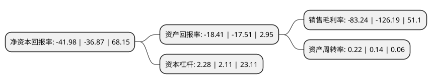

> 本页面由自动化程序生成于 2022年5月20日 01:15
> 内容可能存在错误，如有bug请提交issue至：https://github.com/Eroleice/doc-pi/issues
{.is-warning}

# 上市公司基本情况

## 基本资料

保力新能源科技股份有限公司（以下简称“保力新”）成立于2005年04月30日，西安市。于2010年09月02日在深交所创业板上市。

保力新注册资本428,108.27万元，主要产品:32650型圆柱锂电池，电池管理系统(BMS)，动力电池组及储能电池组。主要业务:锂离子动力电池，新能源汽车租售及运营以及消防工程。以下是详细信息：

- 公司名称: 保力新能源科技股份有限公司
- 股票代码: 300116.SZ
- 所在地: 陕西 - 西安市
- 成立日期: 2005年04月30日
- 注册资本: 428,108.27万元
- 法定代表人: 高保清
- 主营业务: 主要产品:32650型圆柱锂电池，电池管理系统(BMS)，动力电池组及储能电池组锂离子动力电池，新能源汽车租售及运营以及消防工程
- 公司官网: www.blivex.com
- 公司介绍: 公司是国内最早成功研发磷酸铁锂新能源汽车动力电池、汽车启动电源、储能系统解决方案并率先实现规模化生产和批量应用的动力锂电池企业之一，被中国化学与物理电源行业协会确认为中国动力锂离子电池20强企业前三强。公司主要业务是锂离子动力电池、新能源汽车租售及运营以及消防工程，主要产品为32650型圆柱锂电池、电池管理系统(BMS)、动力电池组及储能电池组。产品主要应用领域包括：纯电动大巴车、通勤车、城市物流车、移动补电车。此外，产品也应用于启动电源、储能应用、通信基站和家用电动工具等领域。公司根据公司战略发展需要，整合研发团队成立沃特玛技术研发中心，依托公司强大的资本实力和产业化能力，通过产学研合作，组织专职科研队伍开展工程化技术研发，实现基础研究与产业化的无缝对接。

## 股东及高管情况

上市公司第一大股东为常德中兴投资管理中心(有限合伙)，持股600,000,000股，占比13.56%，**疑似为**上市公司实际控制人。

截至2022年05月18日，上市公司的前十大股东中，共有4名自然人股东，3名机构股东，2个产品账户，1名其他股东，其中5%以上大股东共有2名。上市公司前十大股东明细如下：

> 未能通过持股比例判定出上市公司实际控制人（持股30%以上）
> 可能存在通过间接持股、联合持股、协议控制等方式拥有实际控制权的主体，具体请参考上市公司定期公告！
{.is-warning}

> 截至2022年05月18日，上市公司前十大股东信息如下：

| 股东名称 | 持股数量（股） | 持股比例 |
| --- | --- | --- |
| 常德中兴投资管理中心(有限合伙) | 600,000,000 | 13.56% |
| 常德中兴投资管理中心(有限合伙) | 600,000,000 | 14.02% |
| 郭鸿宝 | 195,313,951 | 4.56% |
| 国信证券股份有限公司 | 108,500,000 | 2.53% |
| 李瑶 | 106,250,290 | 2.48% |
| 中国进出口银行深圳分行 | 86,238,817 | 2.01% |
| 鑫沅资管-南京银行股份有限公司-鑫沅资产金梅花35号专项资产管理计划 | 82,288,203 | 1.92% |
| 童建明 | 56,542,450 | 1.32% |
| 国泰君安创新投资有限公司-君彤二期投资基金 | 42,428,484 | 0.99% |
| 童新建 | 42,000,000 | 0.98% |

## 利润表分析

上市公司2021年总收入为1.63亿元，净利润为-1.37亿元，**未实现盈利**。

## 杜邦分析

> 数据列示周期：2021年 | 2020年 | 2019年
{.is-info}

上市公司的净资产收益率在近一年有所上升，上升幅度为13.86%，其变化情况分解如下：
- 上市公司的销售毛利率在近一年下降了-34.04%，可能是生产效率的下降、商品原材料价格上涨或商品价格的下跌所致。
- 上市公司的资产周转率在近一年上升了57.14%，可能是源自于更快的销售回款或库存管理效果提升。
- 上市公司的财务杠杆比率在近一年上升了8.06%，可能是增加负债扩大生产规模。

