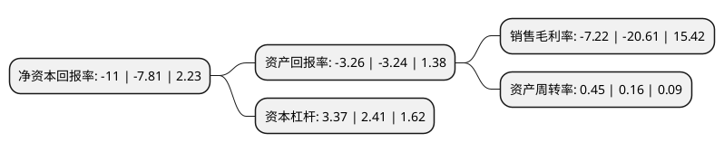

> 本页面由自动化程序生成于 2022年5月20日 01:15
> 内容可能存在错误，如有bug请提交issue至：https://github.com/Eroleice/doc-pi/issues
{.is-warning}

# 上市公司基本情况

## 基本资料

聆达集团股份有限公司（以下简称“聆达股份”）成立于2005年12月12日，大连市。于2010年10月13日在深交所创业板上市。

聆达股份注册资本26,550万元，主营业务为余热发电技术服务，工程设计，设备成套，工程总承包以及合同能源管理。以下是详细信息：

- 公司名称: 聆达集团股份有限公司
- 股票代码: 300125.SZ
- 所在地: 辽宁 - 大连市
- 成立日期: 2005年12月12日
- 注册资本: 26,550万元
- 法定代表人: 陈小禹
- 主营业务: 主营业务为余热发电技术服务，工程设计，设备成套，工程总承包以及合同能源管理
- 公司官网: www.lingdagroup.com.cn
- 公司介绍: 公司是目前中国余热发电工程领域技术领先专业从事新能源产业发展、生态环境改善和能源节约的公司。公司主要致力于余热发电系统研发、工程设计、技术服务、设备成套、工程总承包、合同能源管理的新型能源技术服务。公司在水泥、钢铁、冶金、焦化等行业拥有多项余热利用专利和专有技术。

## 股东及高管情况

上市公司第一大股东为杭州光恒昱企业管理合伙企业(有限合伙)，持股58,453,260股，占比22.02%，**疑似为**上市公司实际控制人。

截至2022年03月31日，上市公司的前十大股东中，共有5名自然人股东，1名机构股东，3个产品账户，1个海外主体，其中5%以上大股东共有1名。上市公司前十大股东明细如下：

> 未能通过持股比例判定出上市公司实际控制人（持股30%以上）
> 可能存在通过间接持股、联合持股、协议控制等方式拥有实际控制权的主体，具体请参考上市公司定期公告！
{.is-warning}

> 截至2022年03月31日，上市公司前十大股东信息如下：

| 股东名称 | 持股数量（股） | 持股比例 |
| --- | --- | --- |
| 杭州光恒昱企业管理合伙企业(有限合伙) | 58,453,260 | 22.02% |
| 黄炜 | 5,754,500 | 2.17% |
| 福建证道投资有限公司-证道1号私募证券投资基金 | 4,861,756 | 1.83% |
| 李大中 | 4,642,900 | 1.75% |
| 李葛卫 | 4,360,500 | 1.64% |
| MORGAN STANLEY & CO. INTERNATIONAL PLC. | 4,160,185 | 1.57% |
| 刘振东 | 3,274,481 | 1.23% |
| 聆达集团股份有限公司-第一期员工持股计划 | 3,215,100 | 1.21% |
| 汪清春 | 2,892,235 | 1.09% |
| 深圳市前海四创资本管理有限公司-启创三号基金 | 2,743,661 | 1.03% |

## 利润表分析

上市公司2021年总收入为10.51亿元，净利润为-0.76亿元，**未实现盈利**。

## 杜邦分析

> 数据列示周期：2021年 | 2020年 | 2019年
{.is-info}

上市公司的净资产收益率在近一年有所上升，上升幅度为40.85%，其变化情况分解如下：
- 上市公司的销售毛利率在近一年下降了-64.97%，可能是生产效率的下降、商品原材料价格上涨或商品价格的下跌所致。
- 上市公司的资产周转率在近一年上升了181.25%，可能是源自于更快的销售回款或库存管理效果提升。
- 上市公司的财务杠杆比率在近一年上升了39.83%，可能是增加负债扩大生产规模。

