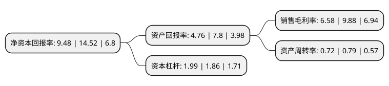

> 本页面由自动化程序生成于 2022年5月20日 01:15
> 内容可能存在错误，如有bug请提交issue至：https://github.com/Eroleice/doc-pi/issues
{.is-warning}

# 上市公司基本情况

## 基本资料

上海泰胜风能装备股份有限公司（以下简称“泰胜风能”）成立于2001年04月13日，上海市。于2010年10月19日在深交所创业板上市。

泰胜风能注册资本71,915.326万元，主营业务:风力发电设备，钢结构，化工设备制造安装，货物和技术的进出口业务，风力发电设备，辅件，零件销售等。以下是详细信息：

- 公司名称: 上海泰胜风能装备股份有限公司
- 股票代码: 300129.SZ
- 所在地: 上海 - 上海市
- 成立日期: 2001年04月13日
- 注册资本: 71,915.326万元
- 法定代表人: 张福林
- 主营业务: 主营业务:风力发电设备，钢结构，化工设备制造安装，货物和技术的进出口业务，风力发电设备，辅件，零件销售等
- 公司官网: www.shtsp.com
- 公司介绍: 公司是中国最早专业从事风机塔架制造的公司之一，也是国内外知名的风力发电机配套塔架专业制造商。公司主要产品为自主品牌的陆上风电塔架和海上风电塔架、导管架、管桩及相关辅件、零件，该产品是陆上及海上风力发电机组的主要部件之一，主要起支撑作用；海洋工程设备业务方面，目前公司主要产品为海洋工程、相关辅件、零件以及用于海洋工程的各类钢结构件，相关产品作用涵盖海洋工程的各个方面，视具体订单而有所不同。公司主营风力发电设备、钢结构、化工设备制造安装、货物和技术的进出口业务、风力发电设备、辅件、零件销售等。公司始终秉承“以市场为导向、以技术为根本、以客户为基石”的经营理念，立足国内拓展国际市场，已与VESTAS、Gamesa、GE wind、金风科技等中外知名企业建立了长期合作关系，在风电塔架行业形成了较高的知名度和良好的信誉度。公司是《风力发电机组塔架》国家标准、《风力发电机组环形锻件》国家标准、《海上风力机组设计要求》国家标准制定的参与者，获得了ISO9001:2008国际质量体系认证、OHSAS18001:2007职业健康安全管理体系认证，多次填补国内塔架行业空白，是国内资质优良、技术优势明显的行业引领者。

## 股东及高管情况

上市公司第一大股东为柳志成，持股58,158,622股，占比8.09%，**疑似为**上市公司实际控制人。

截至2022年03月31日，上市公司的前十大股东中，共有9名自然人股东，1名机构股东，其中5%以上大股东共有5名。上市公司前十大股东明细如下：

> 未能通过持股比例判定出上市公司实际控制人（持股30%以上）
> 可能存在通过间接持股、联合持股、协议控制等方式拥有实际控制权的主体，具体请参考上市公司定期公告！
{.is-warning}

> 上市公司第一大股东持股不超过10%，请检查是否存在公司控制权风险！
{.is-danger}

> 截至2022年03月31日，上市公司前十大股东信息如下：

| 股东名称 | 持股数量（股） | 持股比例 |
| --- | --- | --- |
| 柳志成 | 58,158,622 | 8.09% |
| 黄京明 | 51,966,456 | 7.23% |
| 柳志成 | 43,618,967 | 6.0653% |
| 黄京明 | 38,974,842 | 5.4195% |
| 广州凯得投资控股有限公司 | 36,033,927 | 5.0106% |
| 窦建荣 | 19,989,819 | 2.78% |
| 张锦楠 | 17,884,362 | 2.49% |
| 夏权光 | 17,673,902 | 2.46% |
| 刘赫 | 2,400,000 | 0.33% |
| 朱成光 | 2,009,000 | 0.28% |

## 利润表分析

上市公司2021年总收入为38.52亿元，净利润为2.53亿元，实现盈利。

## 杜邦分析

> 数据列示周期：2021年 | 2020年 | 2019年
{.is-info}

上市公司的净资产收益率在近一年有所下降，下降幅度为-34.71%，其变化情况分解如下：
- 上市公司的销售毛利率在近一年下降了-33.4%，可能是生产效率的下降、商品原材料价格上涨或商品价格的下跌所致。
- 上市公司的资产周转率在近一年下降了-8.86%，可能是源自于更慢的销售回款或库存管理效果下降。
- 上市公司的财务杠杆比率在近一年上升了6.99%，可能是增加负债扩大生产规模。

