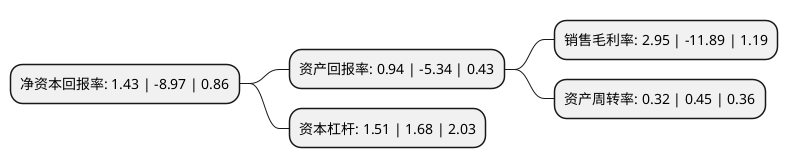

> 本页面由自动化程序生成于 2022年5月20日 01:15
> 内容可能存在错误，如有bug请提交issue至：https://github.com/Eroleice/doc-pi/issues
{.is-warning}

# 上市公司基本情况

## 基本资料

苏州工业园区和顺电气股份有限公司（以下简称“和顺电气”）成立于1998年12月22日，苏州市。于2010年11月12日在深交所创业板上市。

和顺电气注册资本25,388.46万元，主营业务:电力成套设备，新能源汽车充电桩，电力电子设备，智能配电，光伏应用及为用户提供综合性电力应用解决方案等。以下是详细信息：

- 公司名称: 苏州工业园区和顺电气股份有限公司
- 股票代码: 300141.SZ
- 所在地: 江苏 - 苏州市
- 成立日期: 1998年12月22日
- 注册资本: 25,388.46万元
- 法定代表人: 姚建华
- 主营业务: 主营业务:电力成套设备，新能源汽车充电桩，电力电子设备，智能配电，光伏应用及为用户提供综合性电力应用解决方案等
- 公司官网: www.cnheshun.com
- 公司介绍: 公司是国内同行业中一家产品面覆盖了从高压到低压、从谐波治理到无功补偿并且全部实现动态治理和补偿的企业，是国家高新技术企业。公司主要致力于高低压电器成套设备、电工器材、电力滤波装置、无功补偿装置、电力储存装置以及其它电力电子类环保节电装置的研发和制造。目前公司主营业务为电力成套设备、新能源汽车充电桩、电力电子设备、智能配电、光伏应用及为用户提供综合性电力应用解决方案等。公司研发的ZJ系列和DJ系列节电装置，消除了常规节电产品在电路切换时产生的闪烁和熄火现象，填补了国内空白。公司始终秉持“创新是灵魂、质量是保障”的价值观，通过相关质量管理认证，建立了完善的质量管理体系，制订了符合企业现状和发展需求的质量方针和质量目标，严格执行产品质量国家相关标准。

## 股东及高管情况

上市公司第一大股东为姚建华，持股73,248,229股，占比28.85%，**疑似为**上市公司实际控制人。

截至2022年03月31日，上市公司的前十大股东中，共有8名自然人股东，1名机构股东，1个产品账户，其中5%以上大股东共有3名。上市公司前十大股东明细如下：

> 未能通过持股比例判定出上市公司实际控制人（持股30%以上）
> 可能存在通过间接持股、联合持股、协议控制等方式拥有实际控制权的主体，具体请参考上市公司定期公告！
{.is-warning}

> 截至2022年03月31日，上市公司前十大股东信息如下：

| 股东名称 | 持股数量（股） | 持股比例 |
| --- | --- | --- |
| 姚建华 | 73,248,229 | 28.85% |
| 苏州绿脉电气控股(集团)有限公司 | 38,082,690 | 15% |
| 沈欣 | 19,071,400 | 7.51% |
| 中国邮政储蓄银行股份有限公司-东方新能源汽车主题混合型证券投资基金 | 11,314,670 | 4.46% |
| 杜杰 | 2,309,000 | 0.91% |
| 沈思思 | 2,018,000 | 0.79% |
| 肖岷 | 1,349,000 | 0.53% |
| 黄家蔚 | 1,092,104 | 0.43% |
| 李鑫 | 1,013,600 | 0.4% |
| 秦勇 | 840,000 | 0.33% |

## 利润表分析

上市公司2021年总收入为3.25亿元，净利润为0.09亿元，实现盈利。

## 杜邦分析

> 数据列示周期：2021年 | 2020年 | 2019年
{.is-info}

上市公司的净资产收益率在近一年有所下降，下降幅度为-115.94%，其变化情况分解如下：
- 上市公司的销售毛利率在近一年下降了-124.81%，可能是生产效率的下降、商品原材料价格上涨或商品价格的下跌所致。
- 上市公司的资产周转率在近一年下降了-28.89%，可能是源自于更慢的销售回款或库存管理效果下降。
- 上市公司的财务杠杆比率在近一年下降了-10.12%，可能是减少负债降低财务费用。

