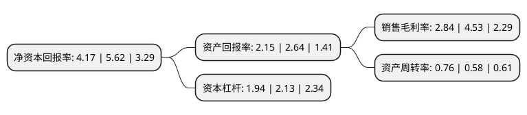

> 本页面由自动化程序生成于 2022年5月20日 01:16
> 内容可能存在错误，如有bug请提交issue至：https://github.com/Eroleice/doc-pi/issues
{.is-warning}

# 上市公司基本情况

## 基本资料

江苏通光电子线缆股份有限公司（以下简称“通光线缆”）成立于2002年01月29日，南通市。于2011年09月16日在深交所创业板上市。

通光线缆注册资本36,497.154万元，主营业务为特种线缆业务，主要从事以高压，超高压和特高压为主的输电线路用电力特种光缆和导线，航空航天用耐高温电缆，通信用高频电缆三大类十一个系列产品的研发，生产和销售。主营产品包括光纤光缆，输电线缆，装备线缆三大类别。以下是详细信息：

- 公司名称: 江苏通光电子线缆股份有限公司
- 股票代码: 300265.SZ
- 所在地: 江苏 - 南通市
- 成立日期: 2002年01月29日
- 注册资本: 36,497.154万元
- 法定代表人: 张忠
- 主营业务: 主营业务为特种线缆业务，主要从事以高压，超高压和特高压为主的输电线路用电力特种光缆和导线，航空航天用耐高温电缆，通信用高频电缆三大类十一个系列产品的研发，生产和销售主营产品包括光纤光缆，输电线缆，装备线缆三大类别
- 公司官网: www.tgjt.cn
- 公司介绍: 公司经营范围为：生产销售半导体芯片，光有源、无源器件，电子线缆，计算机软件开发；经营本企业自产产品及技术的出口业务和本企业所需的机械设备、零配件、原辅材料及技术的进口业务，主要产品为通信用高频电缆、航空航天用耐高温电缆。2006年曾被评为“江苏省高新技术企业”。专注于特种线缆技术的研究和开发，尤其在超、特高压输电线缆、航空航天用耐高温电缆、通信用高频电缆领域技术优势明显，成为国内特种线缆行业获得这两种产品软件著作权的制造企业。公司传统电力特种光缆销量一直保持稳定增长趋势，新开发的光纤复合低压电缆已进入国家电网《OPLC光纤复合低压电缆框架式采购竞争性谈判中选人名单》，节能型导线已进入市场应用期；同时，公司是国防军工装备用特种线缆的供应商，生产的航空航天用耐高温电缆作为电子设备的内部配线和外部接线被广泛应用于飞机、火箭、卫星等；公司研究开发的移动基站用半柔同轴射频电缆填补了国内空白，性能达到国际同类产品水平。

## 股东及高管情况

上市公司第一大股东为通光集团有限公司，持股182,830,000股，占比50.09%，为上市公司实际控制人。

截至2022年03月31日，上市公司的前十大股东中，共有8名自然人股东，1名机构股东，1个产品账户，其中5%以上大股东共有2名。上市公司前十大股东明细如下：

> 截至2022年03月31日，上市公司前十大股东信息如下：

| 股东名称 | 持股数量（股） | 持股比例 |
| --- | --- | --- |
| 通光集团有限公司 | 182,830,000 | 50.09% |
| 张钟 | 20,766,100 | 5.69% |
| 徐镇江 | 4,200,000 | 1.15% |
| 叶东生 | 1,692,553 | 0.46% |
| 孙丽娟 | 962,107 | 0.26% |
| 李俊岳 | 630,000 | 0.17% |
| 刘平 | 580,000 | 0.16% |
| 中国工商银行股份有限公司-国泰中证全指通信设备交易型开放式指数证券投资基金 | 529,700 | 0.15% |
| 朱亮高 | 503,400 | 0.14% |
| 张敬斌 | 466,625 | 0.13% |

## 利润表分析

上市公司2021年总收入为19.23亿元，净利润为0.54亿元，实现盈利。

## 杜邦分析

> 数据列示周期：2021年 | 2020年 | 2019年
{.is-info}

上市公司的净资产收益率在近一年有所下降，下降幅度为-25.8%，其变化情况分解如下：
- 上市公司的销售毛利率在近一年下降了-37.31%，可能是生产效率的下降、商品原材料价格上涨或商品价格的下跌所致。
- 上市公司的资产周转率在近一年上升了31.03%，可能是源自于更快的销售回款或库存管理效果提升。
- 上市公司的财务杠杆比率在近一年下降了-8.92%，可能是减少负债降低财务费用。

