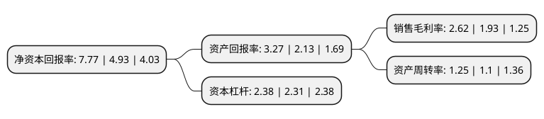

> 本页面由自动化程序生成于 2022年5月20日 01:16
> 内容可能存在错误，如有bug请提交issue至：https://github.com/Eroleice/doc-pi/issues
{.is-warning}

# 上市公司基本情况

## 基本资料

温州宏丰电工合金股份有限公司（以下简称“温州宏丰”）成立于1997年09月11日，温州市。于2012年01月10日在深交所创业板上市。

温州宏丰注册资本43,708.523万元，主营业务为电接触功能复合材料，元件及组件的研发，生产和销售。主要产品包括颗粒及纤维增强电接触功能复合材料及元件，层状复合电接触功能复合材料及元件，一体化电接触组件三大类。以下是详细信息：

- 公司名称: 温州宏丰电工合金股份有限公司
- 股票代码: 300283.SZ
- 所在地: 浙江 - 温州市
- 成立日期: 1997年09月11日
- 注册资本: 43,708.523万元
- 法定代表人: 陈晓
- 主营业务: 主营业务为电接触功能复合材料，元件及组件的研发，生产和销售主要产品包括颗粒及纤维增强电接触功能复合材料及元件，层状复合电接触功能复合材料及元件，一体化电接触组件三大类
- 公司官网: www.wzhf.com
- 公司介绍: 公司是一家专业从事高性能和高精度电工和电子合金产品研究、生产、销售、技术服务于一体的高新技术企业，国内电接触功能复合材料领域整体解决方案提供商。公司的主营业务为电接触功能复合材料、元件及组件的研发、生产和销售，主要产品包括颗粒及纤维增强电接触功能复合材料及元件、层状复合电接触功能复合材料及元件、一体化电接触组件及硬质合金四大类，产品广泛应用于工业电器、家用电器、汽车电器、交通和控制机械、信息工程、机械加工、采掘、化工等领域。公司负责或参与多项起草和修订国家标准、行业标准，产品多次荣获“中国电器工业协会质量可信产品”推介。公司被授予“国家高新技术企业”、“国家火炬计划重点高新技术企业”、“浙江省专利示范企业”和“浙江省创新型试点企业”等荣誉，是国家863计划项目、工信部重大成果转化项目、国家重点新产品、多项国家火炬计划项目和浙江省重大专项项目的承担单位，拥有国家CNAS认证试验室及省级重点企业研究院，通过了ISO14001:2015环境管理体系认证、ISO9001:2015质量管理体系认证和IATF16949:2016质量管理体系-汽车行业认证。

## 股东及高管情况

上市公司第一大股东为陈晓，持股169,183,660股，占比38.71%，为上市公司实际控制人。

截至2022年03月31日，上市公司的前十大股东中，共有10名自然人股东，其中5%以上大股东共有1名。上市公司前十大股东明细如下：

> 截至2022年03月31日，上市公司前十大股东信息如下：

| 股东名称 | 持股数量（股） | 持股比例 |
| --- | --- | --- |
| 陈晓 | 169,183,660 | 38.71% |
| 林萍 | 15,444,000 | 3.53% |
| 余金杰 | 9,010,000 | 2.06% |
| 王慷 | 2,599,375 | 0.59% |
| 陈娟 | 1,912,500 | 0.44% |
| 董国辉 | 1,578,000 | 0.36% |
| 任福良 | 1,100,000 | 0.25% |
| 马成 | 1,085,101 | 0.25% |
| 陈敏 | 921,300 | 0.21% |
| 朱善东 | 851,400 | 0.19% |

## 利润表分析

上市公司2021年总收入为23.53亿元，净利润为0.61亿元，实现盈利。

## 杜邦分析

> 数据列示周期：2021年 | 2020年 | 2019年
{.is-info}

上市公司的净资产收益率在近一年有所上升，上升幅度为57.61%，其变化情况分解如下：
- 上市公司的销售毛利率在近一年上升了35.75%，可能是生产效率的提升、商品原材料价格下跌或商品价格的上涨所致。
- 上市公司的资产周转率在近一年上升了13.64%，可能是源自于更快的销售回款或库存管理效果提升。
- 上市公司的财务杠杆比率在近一年上升了3.03%，可能是增加负债扩大生产规模。

