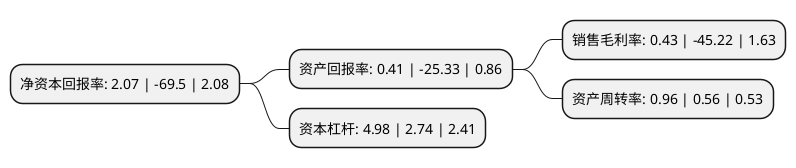

> 本页面由自动化程序生成于 2022年5月20日 01:16
> 内容可能存在错误，如有bug请提交issue至：https://github.com/Eroleice/doc-pi/issues
{.is-warning}

# 上市公司基本情况

## 基本资料

江门市科恒实业股份有限公司（以下简称“科恒股份”）成立于2000年09月12日，江门市。于2012年07月26日在深交所创业板上市。

科恒股份注册资本21,214.472万元，主要产品:节能灯用稀土发光材料和新兴领域用稀土发光材料。主要业务:锂离子电池正极材料，锂离子电池自动化生产设备，稀土发光材料等。以下是详细信息：

- 公司名称: 江门市科恒实业股份有限公司
- 股票代码: 300340.SZ
- 所在地: 广东 - 江门市
- 成立日期: 2000年09月12日
- 注册资本: 21,214.472万元
- 法定代表人: 万国江
- 主营业务: 主要产品:节能灯用稀土发光材料和新兴领域用稀土发光材料锂离子电池正极材料，锂离子电池自动化生产设备，稀土发光材料等
- 公司官网: www.keheng.com.cn
- 公司介绍: 公司是国内新材料领域知名的国家级高新技术企业，自创办之日起，始终专注于产品技术创新，并与复旦大学、中山大学展开产学研合作，多项科研成果通过产品鉴定，获得国家、省、市、区的各级奖励，部分产品列入国家火炬计划项目、星火计划项目。公司主要产品包括锂离子电池正极材料、稀土发光材料。公司锂电产品主要是锂电正极材料，包括钴酸锂和三元材料，钴酸锂主要应用于消费类电子锂电池。公司一直将研发作为保持企业核心竞争力关键，不断保证企业有效的研发能力，拥有专业的研发团队、先进的研发设备，不断引进高端技术人才，积极与高校等研究机构合作，专注于稀土功能材料、锂电材料等领域的研发工作。不断的研发投入及优秀的研发创新能力为公司产品上拥有技术优势和竞争实力，将持续为公司带来稳定的经济效益。经过多年努力，公司被认定为“广东省省级企业技术中心”，拥有百项国家专利，主持制定和修订几十项国家和行业标准。

## 股东及高管情况

上市公司第一大股东为万国江，持股30,453,975股，占比14.36%，**疑似为**上市公司实际控制人。

截至2022年03月31日，上市公司的前十大股东中，共有9名自然人股东，1名机构股东，其中5%以上大股东共有2名。上市公司前十大股东明细如下：

> 未能通过持股比例判定出上市公司实际控制人（持股30%以上）
> 可能存在通过间接持股、联合持股、协议控制等方式拥有实际控制权的主体，具体请参考上市公司定期公告！
{.is-warning}

> 截至2022年03月31日，上市公司前十大股东信息如下：

| 股东名称 | 持股数量（股） | 持股比例 |
| --- | --- | --- |
| 万国江 | 30,453,975 | 14.36% |
| 株洲高科集团有限公司 | 12,500,000 | 5.89% |
| 唐芬 | 2,706,677 | 1.28% |
| 唐维 | 1,750,000 | 0.82% |
| 万涛 | 1,740,595 | 0.82% |
| 余建隆 | 1,600,120 | 0.75% |
| 程建军 | 1,560,264 | 0.74% |
| 卿前鹏 | 1,547,000 | 0.73% |
| 陈荣 | 1,475,285 | 0.7% |
| 赵国信 | 1,233,400 | 0.58% |

## 利润表分析

上市公司2021年总收入为33.3亿元，净利润为0.14亿元，实现盈利。

## 杜邦分析

> 数据列示周期：2021年 | 2020年 | 2019年
{.is-info}

上市公司的净资产收益率在近一年有所下降，下降幅度为-102.98%，其变化情况分解如下：
- 上市公司的销售毛利率在近一年下降了-100.95%，可能是生产效率的下降、商品原材料价格上涨或商品价格的下跌所致。
- 上市公司的资产周转率在近一年上升了71.43%，可能是源自于更快的销售回款或库存管理效果提升。
- 上市公司的财务杠杆比率在近一年上升了81.75%，可能是增加负债扩大生产规模。

