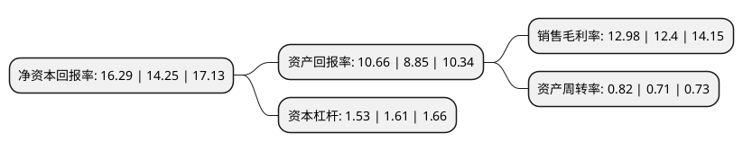

> 本页面由自动化程序生成于 2022年5月20日 01:16
> 内容可能存在错误，如有bug请提交issue至：https://github.com/Eroleice/doc-pi/issues
{.is-warning}

# 上市公司基本情况

## 基本资料

麦克奥迪(厦门)电气股份有限公司（以下简称“麦克奥迪”）成立于2002年11月04日，厦门市。于2012年07月26日在深交所创业板上市。

麦克奥迪注册资本51,016.334万元，主营业务为环氧绝缘件的研发，生产与销售，产品范围涵盖10Kv—550Kv中低压，高压，超高压等多个电压等级并具备特高压等级产品的生产技术。以下是详细信息：

- 公司名称: 麦克奥迪(厦门)电气股份有限公司
- 股票代码: 300341.SZ
- 所在地: 福建 - 厦门市
- 成立日期: 2002年11月04日
- 注册资本: 51,016.334万元
- 法定代表人: 杨文良
- 主营业务: 主营业务为环氧绝缘件的研发，生产与销售，产品范围涵盖10Kv—550Kv中低压，高压，超高压等多个电压等级并具备特高压等级产品的生产技术
- 公司官网: www.motic-electric.com
- 公司介绍: 公司是国内产销规模大、拥有国内同行业一流技术水平的环氧绝缘件专业制造商。公司一直致力于输配电设备核心部件——环氧绝缘件的研发、生产和销售，已具有多年环氧绝缘件专业制造经验，具有年产能100万件高中低压电器配套绝缘件生产能力，是亚太地区输配电设备配套绝缘部件的较大制造商。公司与ABB、施耐德、西门子、库柏、伊顿、三菱、东芝等国际知名输配电设备厂商建立起长期的合作关系。同时，公司参与了多项产品国家标准的制定，拥有国内领先的质量检测装备，是国家重点高新技术企业。

## 股东及高管情况

上市公司第一大股东为北京亦庄投资控股有限公司，持股152,997,984股，占比29.99%，**疑似为**上市公司实际控制人。

截至2022年03月31日，上市公司的前十大股东中，共有4名自然人股东，5名机构股东，1个海外主体，其中5%以上大股东共有3名。上市公司前十大股东明细如下：

> 未能通过持股比例判定出上市公司实际控制人（持股30%以上）
> 可能存在通过间接持股、联合持股、协议控制等方式拥有实际控制权的主体，具体请参考上市公司定期公告！
{.is-warning}

> 截至2022年03月31日，上市公司前十大股东信息如下：

| 股东名称 | 持股数量（股） | 持股比例 |
| --- | --- | --- |
| 北京亦庄投资控股有限公司 | 152,997,984 | 29.99% |
| 麦克奥迪控股有限公司 | 79,391,022 | 15.56% |
| 香港协励行有限公司 | 48,576,998 | 9.52% |
| 嘉兴嘉竞投资合伙企业(有限合伙) | 25,508,170 | 5% |
| 嘉兴嘉逸投资合伙企业(有限合伙) | 25,508,170 | 5% |
| 赵桂芬 | 5,699,700 | 1.12% |
| 郎华军 | 4,040,000 | 0.79% |
| 孙杰 | 3,021,400 | 0.59% |
| HJ HOLDINGS LIMITED | 2,522,040 | 0.49% |
| 潘卫星 | 2,195,000 | 0.43% |

## 利润表分析

上市公司2021年总收入为14.64亿元，净利润为1.9亿元，实现盈利。

## 杜邦分析

> 数据列示周期：2021年 | 2020年 | 2019年
{.is-info}

上市公司的净资产收益率在近一年有所上升，上升幅度为14.32%，其变化情况分解如下：
- 上市公司的销售毛利率在近一年上升了4.68%，可能是生产效率的提升、商品原材料价格下跌或商品价格的上涨所致。
- 上市公司的资产周转率在近一年上升了15.49%，可能是源自于更快的销售回款或库存管理效果提升。
- 上市公司的财务杠杆比率在近一年下降了-4.97%，可能是减少负债降低财务费用。

