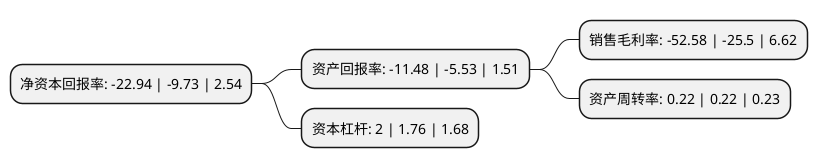

> 本页面由自动化程序生成于 2022年5月20日 01:17
> 内容可能存在错误，如有bug请提交issue至：https://github.com/Eroleice/doc-pi/issues
{.is-warning}

# 上市公司基本情况

## 基本资料

光一科技股份有限公司（以下简称“*ST光一”）成立于2000年04月18日，南京市。于2012年10月09日在深交所创业板上市。

*ST光一注册资本40,790.462万元，主要产品和服务包括低压集中抄表系统，专变采集终端，配变计量终端，手持抄表终端等。主营业务为智能用电信息采集系统的软，硬件研发，生产，销售及服务。公司以向电力行业智能用电信息采集提供全面解决方案为业务方向，以信息采集，分析，处理为技术发展重点，以软硬件相结合的终端产品带动系统集成及服务为业务特色，是国内最早从事用电信息采集系统业务的专业厂家之一。以下是详细信息：

- 公司名称: 光一科技股份有限公司
- 股票代码: 300356.SZ
- 所在地: 江苏 - 南京市
- 成立日期: 2000年04月18日
- 注册资本: 40,790.462万元
- 法定代表人: 戴晓东
- 主营业务: 主要产品和服务包括低压集中抄表系统，专变采集终端，配变计量终端，手持抄表终端等主营业务为智能用电信息采集系统的软，硬件研发，生产，销售及服务公司以向电力行业智能用电信息采集提供全面解决方案为业务方向，以信息采集，分析，处理为技术发展重点，以软硬件相结合的终端产品带动系统集成及服务为业务特色，是国内最早从事用电信息采集系统业务的专业厂家之一
- 公司官网: www.elefirst.com
- 公司介绍: 公司是国内较早从事用电信息采集系统业务的专业厂家之一。主营业务为智能用电信息采集系统的软、硬件研发、生产、销售及服务。公司以向电力行业智能用电信息采集提供全面解决方案为业务方向，以信息采集、分析、处理为技术发展重点，以软硬件相结合的终端产品带动系统集成及服务为业务特色。公司“光一用户用电抄表管理系统V1.0”产品被中国软件行业协会认定为“中国优秀软件产品”，同时获得“第十一届中国国际软件博览会金奖”。公司是“高新技术企业”、“江苏省规划布局内重点软件企业”、“中国软件自主创新排行榜入选企业”等。

## 股东及高管情况

上市公司第一大股东为江苏光一投资管理有限责任公司，持股57,910,193股，占比14.2%，**疑似为**上市公司实际控制人。

截至2022年03月31日，上市公司的前十大股东中，共有7名自然人股东，3名机构股东，其中5%以上大股东共有2名。上市公司前十大股东明细如下：

> 未能通过持股比例判定出上市公司实际控制人（持股30%以上）
> 可能存在通过间接持股、联合持股、协议控制等方式拥有实际控制权的主体，具体请参考上市公司定期公告！
{.is-warning}

> 截至2022年03月31日，上市公司前十大股东信息如下：

| 股东名称 | 持股数量（股） | 持股比例 |
| --- | --- | --- |
| 江苏光一投资管理有限责任公司 | 57,910,193 | 14.2% |
| 湖北乾瀚投资有限公司 | 34,017,327 | 8.34% |
| 汤晶媚 | 15,064,079 | 3.69% |
| 龙昌明 | 9,025,029 | 2.21% |
| 任昌兆 | 6,981,540 | 1.71% |
| 李德伟 | 3,886,234 | 0.95% |
| 新疆旭卓德驰科技有限公司 | 3,380,000 | 0.83% |
| 陈哲 | 2,209,000 | 0.54% |
| 陈柏霖 | 1,984,300 | 0.49% |
| 范琴 | 1,650,000 | 0.4% |

## 利润表分析

上市公司2021年总收入为3.84亿元，净利润为-2.03亿元，**未实现盈利**。

## 杜邦分析

> 数据列示周期：2021年 | 2020年 | 2019年
{.is-info}

上市公司的净资产收益率在近一年有所上升，上升幅度为135.77%，其变化情况分解如下：
- 上市公司的销售毛利率在近一年上升了106.2%，可能是生产效率的提升、商品原材料价格下跌或商品价格的上涨所致。
- 上市公司的资产周转率在近一年下降了0%，可能是源自于更慢的销售回款或库存管理效果下降。
- 上市公司的财务杠杆比率在近一年上升了13.64%，可能是增加负债扩大生产规模。

