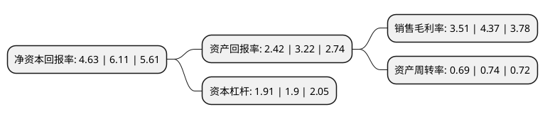

> 本页面由自动化程序生成于 2022年5月20日 01:17
> 内容可能存在错误，如有bug请提交issue至：https://github.com/Eroleice/doc-pi/issues
{.is-warning}

# 上市公司基本情况

## 基本资料

天津凯发电气股份有限公司（以下简称“凯发电气”）成立于2000年01月25日，天津市。于2014年12月03日在深交所创业板上市。

凯发电气注册资本30,509.638万元，公司主营业务为铁路供电及城市轨道交通自动化设备和系统的研发，生产，销售与技术服务。主要产品:主要产品和服务:铁路供电自动化系统，城市轨道交通自动化系统，轨道交通供电检测装备，技术咨询服务及其他。以下是详细信息：

- 公司名称: 天津凯发电气股份有限公司
- 股票代码: 300407.SZ
- 所在地: 天津 - 天津市
- 成立日期: 2000年01月25日
- 注册资本: 30,509.638万元
- 法定代表人: 孔祥洲
- 主营业务: 公司主营业务为铁路供电及城市轨道交通自动化设备和系统的研发，生产，销售与技术服务主要产品:主要产品和服务:铁路供电自动化系统，城市轨道交通自动化系统，轨道交通供电检测装备，技术咨询服务及其他
- 公司官网: www.keyvia.cn
- 公司介绍: 公司主营业务涵盖电气化铁路、城市轨道交通两个领域，其中包括牵引供配电自动化系统、调度及综合监控系统、工业自动化系统、机车车辆辅助控制系统、监测及诊断系统、软件产品的研发、制造、销售、工程安装和服务；计算机及机电一体化系统集成；技术咨询服务；进出口业务等。在电气化铁路领域，产品已成功应用于广深线、大秦线、京沪线、沪杭线、浙赣线、京九线、京津城际、甬台温客运专线、郑西客运线专线、石太客运专线等几十项国家重点工程项目中；在城市轨道交通领域，为广州地铁、津滨轻轨、天津地铁一号线、重庆轻轨、广佛轻轨、北京首都机场线、北京15号线等大中型城市的轨道交通工程提供产品和服务。其产品质量、性能指标及优质的售后技术支持与服务都得到了全国用户的认可和信赖，逐步成长为为轨道交通提供全套自动化解决方案的专业化高科技企业。

## 股东及高管情况

上市公司第一大股东为孔祥洲，持股53,616,220股，占比17.57%，**疑似为**上市公司实际控制人。

截至2022年03月31日，上市公司的前十大股东中，共有8名自然人股东，2名机构股东，其中5%以上大股东共有3名。上市公司前十大股东明细如下：

> 未能通过持股比例判定出上市公司实际控制人（持股30%以上）
> 可能存在通过间接持股、联合持股、协议控制等方式拥有实际控制权的主体，具体请参考上市公司定期公告！
{.is-warning}

> 截至2022年03月31日，上市公司前十大股东信息如下：

| 股东名称 | 持股数量（股） | 持股比例 |
| --- | --- | --- |
| 孔祥洲 | 53,616,220 | 17.57% |
| 中国铁路通信信号集团有限公司 | 36,686,852 | 12.02% |
| 王伟 | 17,386,960 | 5.7% |
| 王勇 | 9,000,000 | 2.95% |
| 郭坚强 | 8,562,100 | 2.81% |
| 褚飞 | 7,390,600 | 2.42% |
| 陈正灿 | 6,660,000 | 2.18% |
| 张忠杰 | 5,683,320 | 1.86% |
| 张刚 | 5,505,400 | 1.8% |
| 信承瑞技术有限公司 | 5,287,700 | 1.73% |

## 利润表分析

上市公司2021年总收入为18.99亿元，净利润为0.66亿元，实现盈利。

## 杜邦分析

> 数据列示周期：2021年 | 2020年 | 2019年
{.is-info}

上市公司的净资产收益率在近一年有所下降，下降幅度为-24.22%，其变化情况分解如下：
- 上市公司的销售毛利率在近一年下降了-19.68%，可能是生产效率的下降、商品原材料价格上涨或商品价格的下跌所致。
- 上市公司的资产周转率在近一年下降了-6.76%，可能是源自于更慢的销售回款或库存管理效果下降。
- 上市公司的财务杠杆比率在近一年上升了0.53%，可能是增加负债扩大生产规模。

