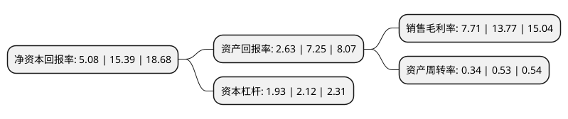

> 本页面由自动化程序生成于 2022年5月20日 01:17
> 内容可能存在错误，如有bug请提交issue至：https://github.com/Eroleice/doc-pi/issues
{.is-warning}

# 上市公司基本情况

## 基本资料

昇辉智能科技股份有限公司（以下简称“昇辉科技”）成立于2003年12月11日，烟台市。于2015年02月17日在深交所创业板上市。

昇辉科技注册资本49,842.419万元，公司主营业务是电气成套设备的研发设计，生产与销售。以下是详细信息：

- 公司名称: 昇辉智能科技股份有限公司
- 股票代码: 300423.SZ
- 所在地: 山东 - 烟台市
- 成立日期: 2003年12月11日
- 注册资本: 49,842.419万元
- 法定代表人: 纪法清
- 主营业务: 公司主营业务是电气成套设备的研发设计，生产与销售
- 公司官网: www.sunflytech.com
- 公司介绍: 公司是专业从事高低压电气成套设备研发、生产和销售的高新技术企业。拥有多个现代化综合厂房，拥有日本进口具有国际先进水平的数控加工中心(多工位转塔式冲床、数控折弯机、数控剪板机)、自动喷涂处理流水线、静电粉末喷涂流水线、自动母线加工系统、激光切割机、氩弧焊机以及一流的检测设备,配以研发、设计、工艺、生产工序的计算机辅助设计生产系统，具有较强的技术研发和生产制造能力。公司的各类产品分别通过国家检测中心的型式试验、中国质量认证中心的产品认证(CCC)。公司通过IS09001：2008质量管理体系认证、GB/T24001-2004/ISO14001：2004环境管理体系认证、GB/T28001-2011/OHSAS18001：2007职业健康安全管理体系认证。公司已先后开发了一系列智能化成套设备，其中四个系列产品已通过省级科技成果鉴定，两个系列产品列入省级科技发展计划，一个系列产品列入国家火炬计划，技术达到国内领先水平。公司产品被认定为“山东省名牌产品”。

## 股东及高管情况

上市公司第一大股东为李昭强，持股115,194,849股，占比23.11%，**疑似为**上市公司实际控制人。

截至2022年03月31日，上市公司的前十大股东中，共有8名自然人股东，2名机构股东，其中5%以上大股东共有3名。上市公司前十大股东明细如下：

> 未能通过持股比例判定出上市公司实际控制人（持股30%以上）
> 可能存在通过间接持股、联合持股、协议控制等方式拥有实际控制权的主体，具体请参考上市公司定期公告！
{.is-warning}

> 截至2022年03月31日，上市公司前十大股东信息如下：

| 股东名称 | 持股数量（股） | 持股比例 |
| --- | --- | --- |
| 李昭强 | 115,194,849 | 23.11% |
| 纪法清 | 106,567,621 | 21.38% |
| 广西微红企业管理有限公司 | 25,106,075 | 5.04% |
| 宋叶 | 22,561,502 | 4.53% |
| 贾启超 | 8,036,241 | 1.61% |
| 柳云鹏 | 3,699,045 | 0.74% |
| 嘉兴凯胜投资合伙企业(有限合伙) | 3,401,036 | 0.68% |
| 张义 | 3,167,224 | 0.64% |
| 王少成 | 3,103,400 | 0.62% |
| 何永波 | 2,499,800 | 0.5% |

## 利润表分析

上市公司2021年总收入为27.09亿元，净利润为2.08亿元，实现盈利。

## 杜邦分析

> 数据列示周期：2021年 | 2020年 | 2019年
{.is-info}

上市公司的净资产收益率在近一年有所下降，下降幅度为-66.99%，其变化情况分解如下：
- 上市公司的销售毛利率在近一年下降了-44.01%，可能是生产效率的下降、商品原材料价格上涨或商品价格的下跌所致。
- 上市公司的资产周转率在近一年下降了-35.85%，可能是源自于更慢的销售回款或库存管理效果下降。
- 上市公司的财务杠杆比率在近一年下降了-8.96%，可能是减少负债降低财务费用。

