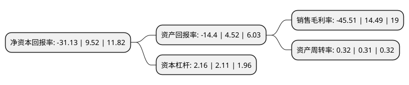

> 本页面由自动化程序生成于 2022年5月20日 01:17
> 内容可能存在错误，如有bug请提交issue至：https://github.com/Eroleice/doc-pi/issues
{.is-warning}

# 上市公司基本情况

## 基本资料

红相股份有限公司（以下简称“红相股份”）成立于2005年07月29日，厦门市。于2015年02月17日在深交所创业板上市。

红相股份注册资本36,022.421万元，公司主要产品包括电力设备状态检测，监测产品和电能表两大类。本公司主要从事电力设备状态检测，监测产品和电能表的研发，生产和销售，并提供相关技术服务。以下是详细信息：

- 公司名称: 红相股份有限公司
- 股票代码: 300427.SZ
- 所在地: 福建 - 厦门市
- 成立日期: 2005年07月29日
- 注册资本: 36,022.421万元
- 法定代表人: 杨成
- 主营业务: 公司主要产品包括电力设备状态检测，监测产品和电能表两大类本公司主要从事电力设备状态检测，监测产品和电能表的研发，生产和销售，并提供相关技术服务
- 公司官网: www.redphase.com.cn
- 公司介绍: 公司是一家国家级高新技术企业，长期致力于电力系统状态检修技术的研究与应用，能够为客户提供电网状态检修和智能化运营的综合解决方案。公司主要从事电力检测及电力设备、铁路与轨道交通牵引供电装备、军工电子等产品的研发、生产、销售以及相关技术服务，新能源项目。目前公司已形成电力、军工以及铁路与轨道交通三大业务板块协同发展的战略布局。公司始终以技术创新和服务营销作为发展的根基，坚持每年将大量的人力物力投入到新产品、新技术的研发，在澳大利亚和中国设有产品生产基地和技术研究所，以获取国际前端资讯技术，不断创新，为世界各地的电力客户提供优质的咨询、产品及服务，不断推出众多具有国际领先技术的产品。在探索电力设备状态检修实施方案的领域里，公司一直保持稳健的步伐，致力于智能变电站和智能电网运行状态检修设备及系统的研发、生产和经营，坚持不懈地推动电力设备状态检修技术在中国的发展与应用。

## 股东及高管情况

上市公司第一大股东为杨保田，持股59,780,469股，占比16.6%，**疑似为**上市公司实际控制人。

截至2022年03月31日，上市公司的前十大股东中，共有8名自然人股东，1名机构股东，1个产品账户，其中5%以上大股东共有4名。上市公司前十大股东明细如下：

> 未能通过持股比例判定出上市公司实际控制人（持股30%以上）
> 可能存在通过间接持股、联合持股、协议控制等方式拥有实际控制权的主体，具体请参考上市公司定期公告！
{.is-warning}

> 截至2022年03月31日，上市公司前十大股东信息如下：

| 股东名称 | 持股数量（股） | 持股比例 |
| --- | --- | --- |
| 杨保田 | 59,780,469 | 16.6% |
| 卧龙电气驱动集团股份有限公司 | 45,013,368 | 12.5% |
| 杨成 | 27,039,835 | 7.51% |
| 厦门务时私募基金管理有限公司-务时峰鲍一号私募证券投资基金 | 25,215,694 | 7% |
| 吴志阳 | 8,197,958 | 2.28% |
| 杨力 | 7,320,211 | 2.03% |
| 张青 | 6,314,332 | 1.75% |
| 朱雅娟 | 3,700,000 | 1.03% |
| 周云五 | 3,436,600 | 0.95% |
| 陈爱金 | 2,531,320 | 0.7% |

## 利润表分析

上市公司2021年总收入为13.94亿元，净利润为-6.35亿元，**未实现盈利**。

## 杜邦分析

> 数据列示周期：2021年 | 2020年 | 2019年
{.is-info}

上市公司的净资产收益率在近一年有所下降，下降幅度为-427%，其变化情况分解如下：
- 上市公司的销售毛利率在近一年下降了-414.08%，可能是生产效率的下降、商品原材料价格上涨或商品价格的下跌所致。
- 上市公司的资产周转率在近一年上升了3.23%，可能是源自于更快的销售回款或库存管理效果提升。
- 上市公司的财务杠杆比率在近一年上升了2.37%，可能是增加负债扩大生产规模。

