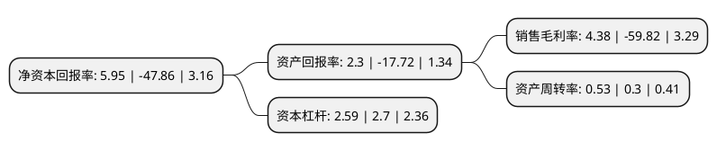

> 本页面由自动化程序生成于 2022年5月20日 01:18
> 内容可能存在错误，如有bug请提交issue至：https://github.com/Eroleice/doc-pi/issues
{.is-warning}

# 上市公司基本情况

## 基本资料

北京合纵科技股份有限公司（以下简称“合纵科技”）成立于1997年04月15日，北京市。于2015年06月10日在深交所创业板上市。

合纵科技注册资本107,712.757万元，公司主营业务是面向国内电网，市政建设，铁路，城市轨道交通等诸多领域，生产和销售户外中高压配电和控制设备，产品主要包括环网柜，箱式变电站，柱上开关，变压器，电缆附件，其他开关等，共计六大类二十个系列。以下是详细信息：

- 公司名称: 北京合纵科技股份有限公司
- 股票代码: 300477.SZ
- 所在地: 北京 - 北京市
- 成立日期: 1997年04月15日
- 注册资本: 107,712.757万元
- 法定代表人: 刘泽刚
- 主营业务: 公司主营业务是面向国内电网，市政建设，铁路，城市轨道交通等诸多领域，生产和销售户外中高压配电和控制设备，产品主要包括环网柜，箱式变电站，柱上开关，变压器，电缆附件，其他开关等，共计六大类二十个系列
- 公司官网: www.hezong-tech.com
- 公司介绍: 公司是从事配电及控制设备制造及相关技术服务的高科技企业，主营面向国内电力网络、市政建设、铁路、城市轨道交通等诸多领域，生产和销售户外中高压配电和控制设备，产品主要包括环网柜、箱式变电站、柱上开关、变压器、故障指示器及智能配电终端、电缆附件、其他开关等。业务专注于户外配电产品市场，经过十多年的发展，积累了丰富的户外配电产品制造经验，逐步形成了技术创新优势、市场优势和团队管理优势。公司研发的电网用指示器系列、预铸式电缆连接件、全绝缘户外环网开关柜等产品，获多项国家专利，被国家经贸委认定为国家重点新产品，获得科技部中小企业创新基金及地方匹配资金支持；全绝缘户外环网开关柜被认定为国家发改委产业化项目。公司拥有多项专利权，并先后通过了ISO9001质量管理体系认证、中国国家强制性产品“CCC”认证、CQC、PCCC、AAA资信等级认证，获得多项荣誉证书。

## 股东及高管情况

上市公司第一大股东为刘泽刚，持股127,142,120股，占比11.8%，**疑似为**上市公司实际控制人。

截至2022年03月31日，上市公司的前十大股东中，共有7名自然人股东，2名机构股东，1个产品账户，其中5%以上大股东共有3名。上市公司前十大股东明细如下：

> 未能通过持股比例判定出上市公司实际控制人（持股30%以上）
> 可能存在通过间接持股、联合持股、协议控制等方式拥有实际控制权的主体，具体请参考上市公司定期公告！
{.is-warning}

> 截至2022年03月31日，上市公司前十大股东信息如下：

| 股东名称 | 持股数量（股） | 持股比例 |
| --- | --- | --- |
| 刘泽刚 | 127,142,120 | 11.8% |
| 信达证券-招商银行-证券行业支持民企发展系列之信达证券合赢1号分级集合资产管理计划 | 85,990,049 | 7.98% |
| 韦强 | 63,723,615 | 5.92% |
| 张仁增 | 22,764,433 | 2.11% |
| 何昀 | 17,602,707 | 1.63% |
| 赣州合纵投资管理合伙企业(有限合伙) | 13,384,612 | 1.24% |
| 刘长羽 | 9,207,200 | 0.85% |
| 高星 | 6,779,192 | 0.63% |
| 琚存旭 | 6,142,489 | 0.57% |
| 宁波容百新能源科技股份有限公司 | 5,963,986 | 0.55% |

## 利润表分析

上市公司2021年总收入为24.3亿元，净利润为1.06亿元，实现盈利。

## 杜邦分析

> 数据列示周期：2021年 | 2020年 | 2019年
{.is-info}

上市公司的净资产收益率在近一年有所下降，下降幅度为-112.43%，其变化情况分解如下：
- 上市公司的销售毛利率在近一年下降了-107.32%，可能是生产效率的下降、商品原材料价格上涨或商品价格的下跌所致。
- 上市公司的资产周转率在近一年上升了76.67%，可能是源自于更快的销售回款或库存管理效果提升。
- 上市公司的财务杠杆比率在近一年下降了-4.07%，可能是减少负债降低财务费用。

