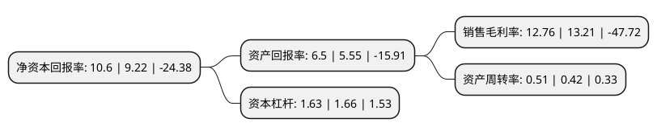

> 本页面由自动化程序生成于 2022年5月20日 01:18
> 内容可能存在错误，如有bug请提交issue至：https://github.com/Eroleice/doc-pi/issues
{.is-warning}

# 上市公司基本情况

## 基本资料

深圳市蓝海华腾技术股份有限公司（以下简称“蓝海华腾”）成立于2006年02月05日，深圳市。于2016年03月22日在深交所创业板上市。

蓝海华腾注册资本20,800万元，主要从事工业自动化控制产品的研发，生产和销售，主要产品为中低压变频器，电动汽车电机控制器和伺服驱动器。以下是详细信息：

- 公司名称: 深圳市蓝海华腾技术股份有限公司
- 股票代码: 300484.SZ
- 所在地: 广东 - 深圳市
- 成立日期: 2006年02月05日
- 注册资本: 20,800万元
- 法定代表人: 邱文渊
- 主营业务: 主要从事工业自动化控制产品的研发，生产和销售，主要产品为中低压变频器，电动汽车电机控制器和伺服驱动器
- 公司官网: www.v-t.net.cn
- 公司介绍: 深圳市蓝海华腾技术股份有限公司是一家拥有完全自主知识产权，专业致力于中低压变频器、伺服驱动器、电动汽车电机控制器、逆变器等电力电子产品的研发、制造、销售和服务的国家级高新技术企业和软件企业。

## 股东及高管情况

上市公司第一大股东为邱文渊，持股28,844,224股，占比13.87%，**疑似为**上市公司实际控制人。

截至2022年03月31日，上市公司的前十大股东中，共有8名自然人股东，2名机构股东，其中5%以上大股东共有2名。上市公司前十大股东明细如下：

> 未能通过持股比例判定出上市公司实际控制人（持股30%以上）
> 可能存在通过间接持股、联合持股、协议控制等方式拥有实际控制权的主体，具体请参考上市公司定期公告！
{.is-warning}

> 截至2022年03月31日，上市公司前十大股东信息如下：

| 股东名称 | 持股数量（股） | 持股比例 |
| --- | --- | --- |
| 邱文渊 | 28,844,224 | 13.87% |
| 徐学海 | 16,259,648 | 7.82% |
| 平潭蓝海华腾投资有限公司 | 9,197,300 | 4.42% |
| 姜仲文 | 8,406,272 | 4.04% |
| 傅颖 | 8,034,100 | 3.86% |
| 时仁帅 | 6,006,619 | 2.89% |
| 王洪妹 | 5,784,500 | 2.78% |
| 平潭蓝海中腾投资有限公司 | 3,147,500 | 1.51% |
| 王震 | 2,337,200 | 1.12% |
| 黄主明 | 1,800,000 | 0.87% |

## 利润表分析

上市公司2021年总收入为5.11亿元，净利润为0.65亿元，实现盈利。

## 杜邦分析

> 数据列示周期：2021年 | 2020年 | 2019年
{.is-info}

上市公司的净资产收益率在近一年有所上升，上升幅度为14.97%，其变化情况分解如下：
- 上市公司的销售毛利率在近一年下降了-3.41%，可能是生产效率的下降、商品原材料价格上涨或商品价格的下跌所致。
- 上市公司的资产周转率在近一年上升了21.43%，可能是源自于更快的销售回款或库存管理效果提升。
- 上市公司的财务杠杆比率在近一年下降了-1.81%，可能是减少负债降低财务费用。

