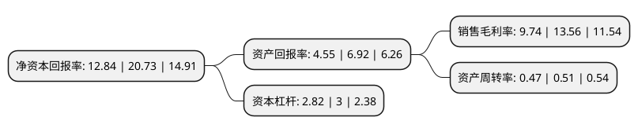

> 本页面由自动化程序生成于 2022年5月20日 01:18
> 内容可能存在错误，如有bug请提交issue至：https://github.com/Eroleice/doc-pi/issues
{.is-warning}

# 上市公司基本情况

## 基本资料

青岛天能重工股份有限公司（以下简称“天能重工”）成立于2006年03月03日，青岛市。于2016年11月25日在深交所创业板上市。

天能重工注册资本79,738.626万元，主营业务:风机塔架的制造和销售;主要产品:风力发电用风机塔架。以下是详细信息：

- 公司名称: 青岛天能重工股份有限公司
- 股票代码: 300569.SZ
- 所在地: 山东 - 青岛市
- 成立日期: 2006年03月03日
- 注册资本: 79,738.626万元
- 法定代表人: 欧辉生
- 主营业务: 主营业务:风机塔架的制造和销售;主要产品:风力发电用风机塔架
- 公司官网: www.qdtnp.com
- 公司介绍: 公司自成立以来一直从事风机塔架的制造和销售，是国内专业的风机塔架生产商，主要包括1.5MW、1.8MW、2.0MW、2.2MW、2.3MW、2.5MW、3.0MW及以上等风机塔架、海上风塔柱桩等。公司持有压力容器D1、D2级别制造许可证；通过了ISO9001质量管理体系认证、ISO14001环境管理体系和职业健康安全管理体系认证，以及1000KW、3000KW、6000KW电能产品认证。公司汇聚了大批优秀的专业技术人才，包括多年从业经验的钢结构专家、焊接工程师、结构防腐工程师和无损探伤工程师。公司自成立以来不断研究和改进塔架生产工艺，在塔架设计和制造方面取得了十多项国家发明专利，并被认定为高新技术企业。公司以先进的设备、一流的工艺流程、丰富的制造经验、过硬的产品质量、完善的售后服务、良好的市场信誉，得到了客户的一致认可，在行业内建立了较高的知名度。现已获得代表世界风力发电前沿技术的VESTAS、GAMESA、GE、SIEMENS公司的产品制造许可。

## 股东及高管情况

上市公司第一大股东为珠海港控股集团有限公司，持股231,316,952股，占比28.65%，**疑似为**上市公司实际控制人。

截至2022年03月31日，上市公司的前十大股东中，共有5名自然人股东，1名机构股东，4个产品账户，其中5%以上大股东共有3名。上市公司前十大股东明细如下：

> 未能通过持股比例判定出上市公司实际控制人（持股30%以上）
> 可能存在通过间接持股、联合持股、协议控制等方式拥有实际控制权的主体，具体请参考上市公司定期公告！
{.is-warning}

> 截至2022年03月31日，上市公司前十大股东信息如下：

| 股东名称 | 持股数量（股） | 持股比例 |
| --- | --- | --- |
| 珠海港控股集团有限公司 | 231,316,952 | 28.65% |
| 郑旭 | 109,729,687 | 13.59% |
| 张世启 | 57,253,872 | 7.09% |
| 兴业银行股份有限公司-南方兴润价值一年持有期混合型证券投资基金 | 25,123,264 | 3.11% |
| 中国工商银行股份有限公司-海富通改革驱动灵活配置混合型证券投资基金 | 18,384,989 | 2.28% |
| 中国工商银行-南方绩优成长股票型证券投资基金 | 10,045,435 | 1.24% |
| 骆原 | 8,583,300 | 1.06% |
| 赵永娟 | 5,583,684 | 0.69% |
| 童中平 | 5,000,021 | 0.62% |
| 中国银行股份有限公司-西部利得碳中和混合型发起式证券投资基金 | 3,999,827 | 0.5% |

## 利润表分析

上市公司2021年总收入为40.8亿元，净利润为3.97亿元，实现盈利。

## 杜邦分析

> 数据列示周期：2021年 | 2020年 | 2019年
{.is-info}

上市公司的净资产收益率在近一年有所下降，下降幅度为-38.06%，其变化情况分解如下：
- 上市公司的销售毛利率在近一年下降了-28.17%，可能是生产效率的下降、商品原材料价格上涨或商品价格的下跌所致。
- 上市公司的资产周转率在近一年下降了-7.84%，可能是源自于更慢的销售回款或库存管理效果下降。
- 上市公司的财务杠杆比率在近一年下降了-6%，可能是减少负债降低财务费用。

