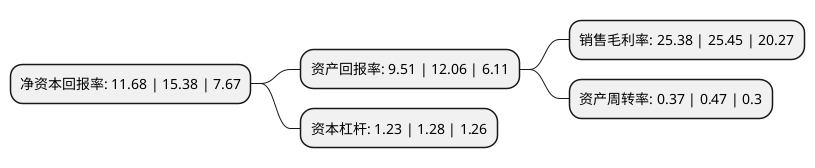

> 本页面由自动化程序生成于 2022年5月20日 01:19
> 内容可能存在错误，如有bug请提交issue至：https://github.com/Eroleice/doc-pi/issues
{.is-warning}

# 上市公司基本情况

## 基本资料

江苏安靠智能输电工程科技股份有限公司（以下简称“安靠智电”）成立于2004年05月20日，常州市。于2017年02月28日在深交所创业板上市。

安靠智电注册资本16,799.664万元，公司主要从事高压及超高压电缆连接件的研发，生产，销售及地下智能输电系统整体方案的提供。公司的主要产品为电缆连接件，并可为客户提供地下智能输电系统整体方案。以下是详细信息：

- 公司名称: 江苏安靠智能输电工程科技股份有限公司
- 股票代码: 300617.SZ
- 所在地: 江苏 - 常州市
- 成立日期: 2004年05月20日
- 注册资本: 16,799.664万元
- 法定代表人: 陈晓晖
- 主营业务: 公司主要从事高压及超高压电缆连接件的研发，生产，销售及地下智能输电系统整体方案的提供公司的主要产品为电缆连接件，并可为客户提供地下智能输电系统整体方案
- 公司官网: www.ankura.com.cn
- 公司介绍: 公司主要致力于高压及超高压电缆连接件、GIL及相关产品的研发和生产，并以此为基础，为客户提供地下智能输电系统整体解决方案和电力工程勘察设计及施工。公司的主要产品为电缆连接件及GIL，并可为客户提供地下智能输电系统整体解决方案。公司是国家级高新技术企业，成功研发了适应大容量地下输电330kV-1000kV气体管道母线(GIL),填补国内和国际空白，为实现绿色、智能、安全、可靠的国产化输电系统提供更多选择。公司目前已建成国内具规模的国家战略新兴产业重点研发平台——超、特高压地下输电研发中心(包括超高压试验大厅，特高压试验大厅，户外试验场，电气试验室，材料试验室，工程试验室)和城市输电科学研究院。公司被评为“江苏省科技小巨人企业”、“常州市质量管理先进单位”、“常州市守合同重信用企业”。

## 股东及高管情况

上市公司第一大股东为陈晓晖，持股37,050,000股，占比22.05%，**疑似为**上市公司实际控制人。

截至2022年03月31日，上市公司的前十大股东中，共有7名自然人股东，2名机构股东，1个产品账户，其中5%以上大股东共有2名。上市公司前十大股东明细如下：

> 未能通过持股比例判定出上市公司实际控制人（持股30%以上）
> 可能存在通过间接持股、联合持股、协议控制等方式拥有实际控制权的主体，具体请参考上市公司定期公告！
{.is-warning}

> 截至2022年03月31日，上市公司前十大股东信息如下：

| 股东名称 | 持股数量（股） | 持股比例 |
| --- | --- | --- |
| 陈晓晖 | 37,050,000 | 22.05% |
| 陈晓凌 | 35,700,600 | 21.25% |
| 陈晓鸣 | 6,423,000 | 3.82% |
| 圣安集团有限公司 | 5,826,903 | 3.47% |
| 江苏平陵建设投资集团有限公司 | 5,238,344 | 3.12% |
| 唐虎林 | 3,900,000 | 2.32% |
| 中金期货有限公司-中金期货-融汇1号资产管理计划 | 3,552,737 | 2.11% |
| 张希兰 | 3,378,200 | 2.01% |
| 姜仁旭 | 2,233,000 | 1.33% |
| 李常岭 | 2,114,609 | 1.26% |

## 利润表分析

上市公司2021年总收入为8.05亿元，净利润为2.04亿元，实现盈利。

## 杜邦分析

> 数据列示周期：2021年 | 2020年 | 2019年
{.is-info}

上市公司的净资产收益率在近一年有所下降，下降幅度为-24.06%，其变化情况分解如下：
- 上市公司的销售毛利率在近一年下降了-0.28%，可能是生产效率的下降、商品原材料价格上涨或商品价格的下跌所致。
- 上市公司的资产周转率在近一年下降了-21.28%，可能是源自于更慢的销售回款或库存管理效果下降。
- 上市公司的财务杠杆比率在近一年下降了-3.91%，可能是减少负债降低财务费用。

