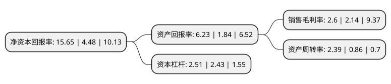

> 本页面由自动化程序生成于 2022年5月20日 01:19
> 内容可能存在错误，如有bug请提交issue至：https://github.com/Eroleice/doc-pi/issues
{.is-warning}

# 上市公司基本情况

## 基本资料

太龙电子股份有限公司（以下简称“太龙股份”）成立于2007年09月11日，漳州市。于2017年05月03日在深交所创业板上市。

太龙股份注册资本12,857.444万元，主要产品包括照明器具，LED显示屏和光电标识等三类，主营业务:提供集照明设计，开发制造，系统综合服务于一体的商业照明整体解决方案。以下是详细信息：

- 公司名称: 太龙电子股份有限公司
- 股票代码: 300650.SZ
- 所在地: 福建 - 漳州市
- 成立日期: 2007年09月11日
- 注册资本: 12,857.444万元
- 法定代表人: 庄占龙
- 主营业务: 主要产品包括照明器具，LED显示屏和光电标识等三类，主营业务:提供集照明设计，开发制造，系统综合服务于一体的商业照明整体解决方案
- 公司官网: www.tecnon.net
- 公司介绍: 公司专注于为品牌客户提供商业照明整体解决方案，专业为客户提供集照明设计、开发制造、系统综合服务于一体的商业照明整体解决方案。公司主营业务为提供集照明设计、开发制造、系统综合服务于一体的商业照明整体解决方案，主要产品包括照明器具、LED显示屏和光电标识等三类。

## 股东及高管情况

上市公司第一大股东为庄占龙，持股48,238,860股，占比22.1%，**疑似为**上市公司实际控制人。

截至2022年05月05日，上市公司的前十大股东中，共有9名自然人股东，1名机构股东，其中5%以上大股东共有6名。上市公司前十大股东明细如下：

> 未能通过持股比例判定出上市公司实际控制人（持股30%以上）
> 可能存在通过间接持股、联合持股、协议控制等方式拥有实际控制权的主体，具体请参考上市公司定期公告！
{.is-warning}

> 截至2022年05月05日，上市公司前十大股东信息如下：

| 股东名称 | 持股数量（股） | 持股比例 |
| --- | --- | --- |
| 庄占龙 | 48,238,860 | 22.1% |
| 庄占龙 | 28,375,800 | 12.9988% |
| 庄占龙 | 28,375,800 | 22.07% |
| 黄国荣 | 18,600,720 | 8.52% |
| 黄国荣 | 10,941,600 | 8.51% |
| 向潜 | 7,080,000 | 5.51% |
| 招商证券国际有限公司-客户资金 | 2,526,528 | 1.97% |
| 吴玉妹 | 1,036,000 | 0.81% |
| 丁根龙 | 1,017,410 | 0.79% |
| 郑淑华 | 972,011 | 0.76% |

## 利润表分析

上市公司2021年总收入为49.47亿元，净利润为1.28亿元，实现盈利。

## 杜邦分析

> 数据列示周期：2021年 | 2020年 | 2019年
{.is-info}

上市公司的净资产收益率在近一年有所上升，上升幅度为249.33%，其变化情况分解如下：
- 上市公司的销售毛利率在近一年上升了21.5%，可能是生产效率的提升、商品原材料价格下跌或商品价格的上涨所致。
- 上市公司的资产周转率在近一年上升了177.91%，可能是源自于更快的销售回款或库存管理效果提升。
- 上市公司的财务杠杆比率在近一年上升了3.29%，可能是增加负债扩大生产规模。

